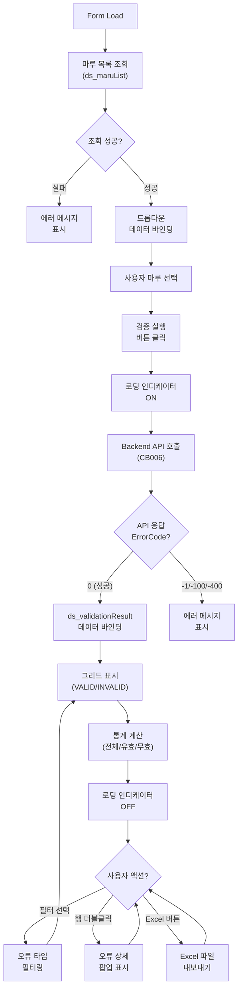
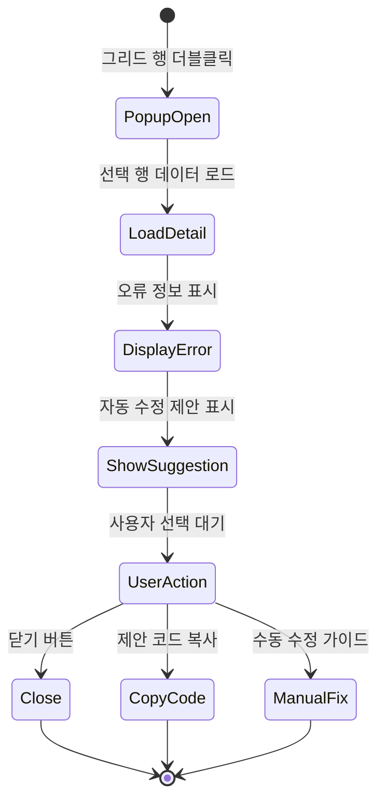
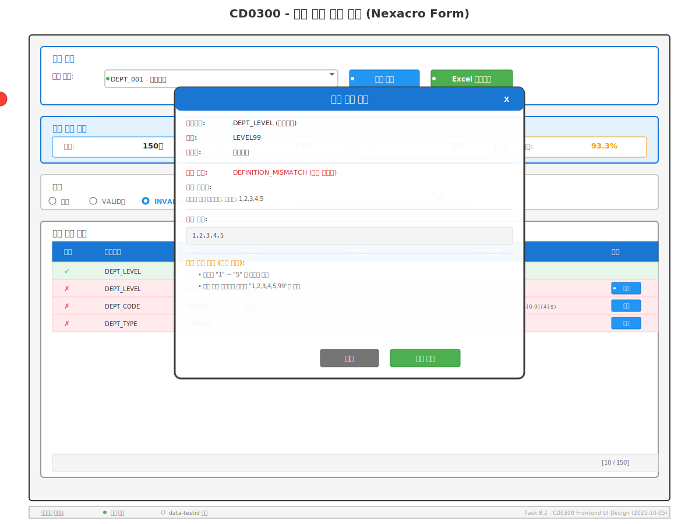

# 📄 Task-8-2.CD0300-Frontend-UI-구현 상세설계서

**Template Version:** 1.3.0 — **Last Updated:** 2025-10-05

---

## 0. 문서 메타데이터

* **문서명**: `Task-8-2.CD0300-Frontend-UI-구현(상세설계).md`
* **버전/작성일/작성자**: v1.0 / 2025-10-05 / Claude Code
* **참조 문서**:
  * `./docs/project/maru/00.foundation/02.design-baseline/4. ui-design.md`
  * `./docs/project/maru/00.foundation/02.design-baseline/5. program-list.md`
  * `./docs/project/maru/10.design/12.detail-design/Task-8-1.CD0300-Backend-API-구현(상세설계).md`
* **위치**: `./docs/project/maru/10.design/12.detail-design/`
* **관련 이슈/티켓**: Task 8.2 - CD0300 Frontend UI 구현
* **상위 요구사항 문서/ID**: BRD UC-007 데이터 검증
* **요구사항 추적 담당자**: Frontend Developer
* **추적성 관리 도구**: tasks.md (Project Charter)

---

## 1. 목적 및 범위

### 1.1 목적
MARU 시스템의 코드 검증 관리 화면(CD0300)을 Nexacro N v24 기반으로 설계하고 구현한다. 코드 카테고리 정의와 실제 코드 기본값 간의 일치성 검증 결과를 사용자 친화적으로 표시하고, 오류 상세 정보를 제공한다.

### 1.2 범위

**포함**:
- Nexacro Form 생성 (frmCD0300.xfdl)
- 검증 결과 표시 그리드
- 오류 상세 정보 팝업
- 자동 수정 제안 기능 (UI 가이드만, 실제 수정은 향후)
- Backend API 연동 (Task 8.1의 CB006 API)
- Dataset 구조 및 데이터 바인딩

**제외**:
- Backend API 구현 (Task 8.1에서 처리)
- 실제 자동 수정 로직 (향후 고도화)
- 배치 검증 기능 (향후 고도화)

---

## 2. 요구사항 & 승인 기준 (Acceptance Criteria)

### 2.1. 요구사항

* **요구사항 원본 링크**: BRD UC-007 데이터 검증, UI 기본설계서 섹션 5

**기능 요구사항**:

| 요구사항 ID | 요구사항 설명 | 우선순위 |
|-------------|---------------|----------|
| [REQ-UI-001] | 마루 선택 기능 (드롭다운) | High |
| [REQ-UI-002] | 검증 실행 버튼 및 진행 상태 표시 | High |
| [REQ-UI-003] | 검증 결과 그리드 표시 (VALID/INVALID 구분) | High |
| [REQ-UI-004] | 오류 타입별 필터링 (DEFINITION_MISMATCH, REGEX_MISMATCH, DUPLICATE_CODE) | Medium |
| [REQ-UI-005] | 오류 상세 정보 팝업 (오류 메시지, 코드 정의, 개선 제안) | High |
| [REQ-UI-006] | 검증 결과 통계 표시 (전체/유효/무효 건수) | Medium |
| [REQ-UI-007] | 자동 수정 제안 표시 (향후 자동 적용 기능 준비) | Low |
| [REQ-UI-008] | 검증 결과 Excel 내보내기 | Low |

**비기능 요구사항**:

| 요구사항 ID | 요구사항 설명 | 측정 기준 |
|-------------|---------------|-----------|
| [REQ-UI-NF-001] | 사용성: 직관적인 UI, 최소 클릭으로 검증 실행 | 사용자 피드백 |
| [REQ-UI-NF-002] | 성능: 1000개 코드 검증 결과 표시 5초 이내 | 렌더링 시간 < 5초 |
| [REQ-UI-NF-003] | 접근성: 키보드 네비게이션, 포커스 표시 | WCAG 2.1 AA 준수 |
| [REQ-UI-NF-004] | 반응형: 최소 1024x768 해상도 지원 | 화면 캡처 검증 |

**승인 기준**:

- [ ] frmCD0300.xfdl Form 정상 로드
- [ ] 마루 선택 드롭다운 정상 동작
- [ ] 검증 실행 버튼 클릭 시 Backend API 호출 성공
- [ ] 검증 결과 그리드 정상 표시 (ErrorCode 0 응답)
- [ ] 오류 상세 팝업 정상 동작
- [ ] 키보드 네비게이션 정상 동작 (Tab, Enter)
- [ ] E2E 테스트 통과율 90% 이상

### 2.2. 요구사항-설계 추적 매트릭스

| 요구사항 ID | 요구사항 설명 | 설계 섹션/아티팩트 | 테스트 케이스 ID | 상태 | 비고 |
|-------------|---------------|--------------------|------------------|------|------|
| [REQ-UI-001] | 마루 선택 기능 | §6 UI 설계 / §7.1 Dataset | TC-UI-001 | 초안 | |
| [REQ-UI-002] | 검증 실행 버튼 | §6 UI 설계 / §5 프로세스 | TC-UI-002 | 초안 | |
| [REQ-UI-003] | 검증 결과 그리드 | §6 UI 설계 / §7.1 Dataset | TC-UI-003 | 초안 | |
| [REQ-UI-004] | 오류 타입 필터링 | §6 UI 설계 / §5 프로세스 | TC-UI-004 | 초안 | |
| [REQ-UI-005] | 오류 상세 팝업 | §6 UI 설계 | TC-UI-005 | 초안 | |
| [REQ-UI-006] | 검증 결과 통계 | §6 UI 설계 / §7.1 Dataset | TC-UI-006 | 초안 | |
| [REQ-UI-007] | 자동 수정 제안 | §6 UI 설계 | TC-UI-007 | 초안 | |
| [REQ-UI-008] | Excel 내보내기 | §5 프로세스 | TC-UI-008 | 초안 | |

---

## 3. 용어/가정/제약

### 3.1 용어 정의

| 용어 | 정의 |
|------|------|
| **Nexacro Form** | Nexacro N Framework의 화면 단위 (*.xfdl 파일) |
| **Dataset** | Nexacro의 데이터 저장 객체, 서버와의 데이터 교환 단위 |
| **Div** | Nexacro의 컨테이너 컴포넌트, 영역 구분 용도 |
| **Grid** | Nexacro의 테이블 형태 데이터 표시 컴포넌트 |
| **VALIDATION_STATUS** | 검증 결과 상태 (VALID/INVALID) |
| **ERROR_TYPE** | 오류 유형 (DEFINITION_MISMATCH/REGEX_MISMATCH/DUPLICATE_CODE) |

### 3.2 가정 (Assumptions)

- Backend API (CB006)가 정상 동작한다고 가정
- 마루 헤더는 이미 생성되어 있다고 가정
- Nexacro N v24 환경이 구성되어 있다고 가정
- 사용자는 코드 카테고리와 코드 기본값 개념을 이해하고 있다고 가정
- 단일 관리자만 사용하는 PoC 환경 (권한 체크 생략)

### 3.3 제약 (Constraints)

- PoC 단계로 대량 데이터 검증은 UI에서 제한 (최대 1000개 권장)
- 자동 수정 기능은 UI 가이드만 제공 (실제 적용은 향후)
- Excel 내보내기는 Nexacro 표준 기능 활용 (추가 개발 최소화)
- 브라우저는 Chrome 최신 버전 기준 (IE 미지원)

---

## 4. 시스템/모듈 개요

### 4.1 역할 및 책임

**CD0300 Frontend UI (코드 검증 관리)**:
- 마루 선택 드롭다운 제공
- 검증 실행 버튼 및 진행 상태 표시
- Backend API 호출 및 응답 처리
- 검증 결과 그리드 표시 (VALID/INVALID)
- 오류 타입별 필터링
- 오류 상세 정보 팝업 표시
- 검증 결과 통계 표시
- Excel 내보내기 기능

### 4.2 외부 의존성

| 의존성 | 용도 | 버전 |
|--------|------|------|
| Nexacro N Framework | UI 렌더링 및 컴포넌트 | v24 |
| Backend API (CB006) | 코드 검증 실행 | Task 8.1 |
| Nexacro Dataset XML Parser | API 응답 파싱 | Nexacro 내장 |

### 4.3 상호작용 개요

```
User → Nexacro Form → Dataset → HTTP Request → Backend API (CB006)
                                                        ↓
User ← Nexacro Form ← Dataset ← Nexacro XML Response ← Backend
```

---

## 5. 프로세스 흐름

### 5.1 프로세스 설명 [REQ-UI-002, REQ-UI-003]

**코드 검증 UI 프로세스**:

1. **화면 초기화**: Form Load 시 마루 목록 조회 및 드롭다운 설정
2. **마루 선택**: 사용자가 드롭다운에서 검증 대상 마루 선택 [REQ-UI-001]
3. **검증 실행**: "검증 실행" 버튼 클릭 시 Backend API 호출 [REQ-UI-002]
4. **진행 상태 표시**: 로딩 인디케이터 표시 및 버튼 비활성화
5. **응답 수신**: Nexacro Dataset XML 파싱 및 ds_validationResult에 바인딩
6. **결과 표시**: 그리드에 검증 결과 표시 (VALID/INVALID) [REQ-UI-003]
7. **통계 업데이트**: 전체/유효/무효 건수 표시 [REQ-UI-006]
8. **필터링**: 오류 타입별 필터 적용 시 그리드 갱신 [REQ-UI-004]
9. **상세 조회**: 그리드 행 더블클릭 시 오류 상세 팝업 표시 [REQ-UI-005]
10. **Excel 내보내기**: "Excel 내보내기" 버튼 클릭 시 파일 저장 [REQ-UI-008]

### 5.2. 프로세스 설계 개념도 (Mermaid)

#### 코드 검증 UI 프로세스 흐름도



#### 오류 상세 팝업 프로세스



---

## 6. UI 레이아웃 설계 (Text Art + SVG)

### 6.1. UI 설계 (Text Art)

```
┌────────────────────────────────────────────────────────────────────┐
│ CD0300 - 코드 검증 관리                                              │
├────────────────────────────────────────────────────────────────────┤
│ [검색 조건]                                                          │
│ 마루 선택: [DEPT_001 - 부서코드        ▼]  [검증 실행] [Excel 내보내기] │
├────────────────────────────────────────────────────────────────────┤
│ [검증 결과 통계]                                                     │
│ 전체: 150건  │  유효: 140건  │  무효: 10건  │  검증율: 93.3%         │
├────────────────────────────────────────────────────────────────────┤
│ [필터]                                                               │
│ ○ 전체  ○ VALID만  ● INVALID만                                      │
│ 오류 타입: [전체 ▼]  [DEFINITION_MISMATCH / REGEX_MISMATCH / DUPLICATE_CODE]│
├────────────────────────────────────────────────────────────────────┤
│ [검증 결과 목록]                                                     │
│ ┌────┬────────┬──────┬──────────┬────────┬────────────┬─────────┐ │
│ │상태│카테고리│코드  │코드명     │오류타입 │오류메시지   │상세보기 │ │
│ ├────┼────────┼──────┼──────────┼────────┼────────────┼─────────┤ │
│ │ ✓ │DEPT_LVL│  1   │1급       │        │            │         │ │
│ │ ✗ │DEPT_LVL│LEVEL9│최고레벨  │정의불일치│허용값 아님  │[상세]   │ │
│ │ ✗ │DEPT_CD │dept01│경영지원팀│정규식불일치│패턴 미일치│[상세]   │ │
│ │ ✗ │DEPT_TP │TYPE1 │사업부    │중복코드 │2개 발견    │[상세]   │ │
│ │ ...                                                              │ │
│ └────┴────────┴──────┴──────────┴────────┴────────────┴─────────┘ │
│                                                          [10/150]   │
└────────────────────────────────────────────────────────────────────┘
```

### 6.2. UI 설계(SVG) **[필수 생성]**

> **SVG 파일**: `Task-8-2.CD0300-Frontend-UI-구현_UI설계.svg`
>
> **생성 규칙**: 실제 화면 레이아웃 및 컴포넌트 배치 시각화



### 6.3. 반응형/접근성/상호작용 가이드

**반응형**:
* `≥ 1920px (Desktop)`: 그리드 전체 컬럼 표시, 통계 카드 가로 배치
* `1024px - 1919px (Tablet)`: 그리드 주요 컬럼만 표시, 통계 카드 세로 배치
* `< 1024px`: 지원하지 않음 (최소 해상도 제한)

**접근성**:
* **포커스 순서**: 마루 선택 → 검증 실행 → 필터 → 그리드 → 상세 버튼
* **키보드 네비게이션**:
  - Tab: 다음 요소로 이동
  - Shift+Tab: 이전 요소로 이동
  - Enter: 검증 실행 / 상세 팝업 표시
  - Space: 필터 선택 / 체크박스 토글
  - Arrow Keys: 그리드 내 행 이동
* **스크린리더 지원**: 모든 컴포넌트에 aria-label 속성 추가

**상호작용**:
* **마루 선택**: 드롭다운 선택 시 자동으로 카테고리 목록 조회 (준비 상태)
* **검증 실행**: 버튼 클릭 → 로딩 표시 → API 호출 → 결과 표시 (2-5초)
* **필터링**: 라디오 버튼 / 드롭다운 변경 시 즉시 그리드 갱신
* **상세 팝업**: 그리드 행 더블클릭 또는 [상세] 버튼 클릭
* **Excel 내보내기**: 버튼 클릭 → 파일 다운로드 대화상자

---

## 7. 데이터/메시지 구조 (개념 수준)

### 7.1. 입력 데이터 구조 (Nexacro Dataset)

#### ds_maruList (마루 목록)

```javascript
{
  columns: [
    { id: "MARU_ID", type: "STRING", size: 50 },
    { id: "MARU_NAME", type: "STRING", size: 200 },
    { id: "MARU_TYPE", type: "STRING", size: 10 },
    { id: "MARU_STATUS", type: "STRING", size: 20 }
  ],
  rows: [
    { MARU_ID: "DEPT_001", MARU_NAME: "부서코드", MARU_TYPE: "CODE", MARU_STATUS: "INUSE" },
    { MARU_ID: "RULE_001", MARU_NAME: "급여계산룰", MARU_TYPE: "RULE", MARU_STATUS: "INUSE" }
  ]
}
```

#### ds_searchCondition (검색 조건)

```javascript
{
  columns: [
    { id: "MARU_ID", type: "STRING", size: 50 },
    { id: "FILTER_STATUS", type: "STRING", size: 20 },  // ALL / VALID / INVALID
    { id: "ERROR_TYPE", type: "STRING", size: 50 }      // ALL / DEFINITION_MISMATCH / REGEX_MISMATCH / DUPLICATE_CODE
  ],
  rows: [
    { MARU_ID: "DEPT_001", FILTER_STATUS: "INVALID", ERROR_TYPE: "ALL" }
  ]
}
```

### 7.2. 출력 데이터 구조 (Nexacro Dataset)

#### ds_validationResult (검증 결과)

```javascript
{
  columns: [
    { id: "CATEGORY_ID", type: "STRING", size: 50 },
    { id: "CATEGORY_NAME", type: "STRING", size: 200 },
    { id: "CODE", type: "STRING", size: 100 },
    { id: "CODE_NAME", type: "STRING", size: 200 },
    { id: "VALIDATION_STATUS", type: "STRING", size: 20 },  // VALID / INVALID
    { id: "ERROR_TYPE", type: "STRING", size: 50 },
    { id: "ERROR_MESSAGE", type: "STRING", size: 500 },
    { id: "CODE_DEFINITION", type: "STRING", size: 4000 }
  ],
  rows: [
    {
      CATEGORY_ID: "DEPT_LEVEL",
      CATEGORY_NAME: "부서레벨",
      CODE: "LEVEL99",
      CODE_NAME: "최고레벨",
      VALIDATION_STATUS: "INVALID",
      ERROR_TYPE: "DEFINITION_MISMATCH",
      ERROR_MESSAGE: "허용된 값이 아닙니다. 허용값: 1,2,3,4,5",
      CODE_DEFINITION: "1,2,3,4,5"
    }
  ]
}
```

#### ds_statistics (검증 결과 통계)

```javascript
{
  columns: [
    { id: "TOTAL_COUNT", type: "INT", size: 10 },
    { id: "VALID_COUNT", type: "INT", size: 10 },
    { id: "INVALID_COUNT", type: "INT", size: 10 },
    { id: "VALIDATION_RATE", type: "STRING", size: 10 }  // "93.3%"
  ],
  rows: [
    { TOTAL_COUNT: 150, VALID_COUNT: 140, INVALID_COUNT: 10, VALIDATION_RATE: "93.3%" }
  ]
}
```

### 7.3. 시스템간 I/F 데이터 구조 (HTTP Request/Response)

**요청 (POST /api/v1/maru-headers/{maruId}/validate-codes)**:

```javascript
// Nexacro에서 자동 생성 (Dataset → HTTP Body)
// 선택적 요청 본문 (현재는 전체 검증으로 생략)
```

**응답 (Nexacro Dataset XML)**:

```xml
<?xml version="1.0" encoding="UTF-8"?>
<Dataset>
  <ErrorCode>0</ErrorCode>
  <ErrorMsg></ErrorMsg>
  <SuccessRowCount>3</SuccessRowCount>
  <ColumnInfo>
    <Column id="CATEGORY_ID" type="STRING" size="50"/>
    <Column id="CODE" type="STRING" size="100"/>
    <Column id="VALIDATION_STATUS" type="STRING" size="20"/>
    <Column id="ERROR_TYPE" type="STRING" size="50"/>
    <Column id="ERROR_MESSAGE" type="STRING" size="500"/>
    ...
  </ColumnInfo>
  <Rows>
    <Row>...</Row>
  </Rows>
</Dataset>
```

---

## 8. 인터페이스 계약(Contract)

### 8.1. Nexacro Event: fn_validate() [REQ-UI-002]

**트리거**: "검증 실행" 버튼 클릭

**사전 조건**:
- 마루가 선택되어 있어야 함 (ds_searchCondition.MARU_ID != "")

**실행 단계**:
1. 마루 선택 검증 (없으면 알림 표시 후 종료)
2. 로딩 인디케이터 표시 (`this.setWaitCursor(true)`)
3. ds_validationResult 초기화
4. Backend API 호출 (`gfn_transaction("validateCodes", ...)`)
5. 콜백 함수 대기 (`fn_validateCallback`)

**성공 조건**:
- ErrorCode == 0
- ds_validationResult에 데이터 바인딩 성공
- 통계 계산 완료

**오류 처리**:
| ErrorCode | 처리 방안 |
|-----------|-----------|
| -1 | "마루 헤더를 찾을 수 없습니다." 알림 표시 |
| -100 | "정규식 패턴이 올바르지 않습니다." 알림 표시 |
| -200 | "시스템 오류가 발생했습니다." 알림 표시 |
| -400 | "입력값이 올바르지 않습니다." 알림 표시 |

### 8.2. Nexacro Event: fn_showDetail() [REQ-UI-005]

**트리거**: 그리드 행 더블클릭 또는 [상세] 버튼 클릭

**사전 조건**:
- 그리드에서 행이 선택되어 있어야 함
- VALIDATION_STATUS == "INVALID" (유효한 코드는 상세 팝업 불필요)

**실행 단계**:
1. 선택 행 데이터 추출 (`this.ds_validationResult.getColumn(row, "CODE")`)
2. 팝업 파라미터 구성 (CATEGORY_ID, CODE, ERROR_TYPE, ERROR_MESSAGE, CODE_DEFINITION)
3. 팝업 창 열기 (`gfn_openPopup("popCD0300Detail", ...)`)
4. 팝업 콜백 함수 등록

**팝업 레이아웃**:

```
┌──────────────────────────────────────────┐
│ 오류 상세 정보                            │
├──────────────────────────────────────────┤
│ 카테고리: DEPT_LEVEL (부서레벨)           │
│ 코드: LEVEL99                            │
│ 코드명: 최고레벨                          │
├──────────────────────────────────────────┤
│ 오류 타입: DEFINITION_MISMATCH           │
│ 오류 메시지:                              │
│ 허용된 값이 아닙니다. 허용값: 1,2,3,4,5   │
├──────────────────────────────────────────┤
│ 코드 정의:                                │
│ 1,2,3,4,5                                │
├──────────────────────────────────────────┤
│ [자동 수정 제안] (향후 기능)              │
│ • 코드를 "1" ~ "5" 중 하나로 변경         │
│ • 또는 코드 카테고리 정의를 "1,2,3,4,5,99"로 수정│
├──────────────────────────────────────────┤
│                    [닫기]  [제안 복사]    │
└──────────────────────────────────────────┘
```

---

## 9. 오류/예외/경계조건

### 9.1. 예상 오류 상황 및 처리 방안

| 오류 시나리오 | 원인 | 처리 방안 | UI 메시지 |
|---------------|------|-----------|-----------|
| 마루 미선택 | 드롭다운 선택 없이 검증 실행 | 알림 표시 후 포커스 이동 | "마루를 선택해주세요." |
| API 호출 실패 | 네트워크 오류, 서버 응답 없음 | 에러 알림 표시, 재시도 버튼 제공 | "서버와 연결할 수 없습니다. 재시도하시겠습니까?" |
| ErrorCode -1 | 마루 헤더 없음 | 에러 메시지 표시 | "마루 헤더를 찾을 수 없습니다." |
| ErrorCode -100 | 정규식 패턴 오류 | 에러 메시지 표시 | "코드 카테고리의 정규식 패턴이 올바르지 않습니다." |
| 대량 데이터 (>1000개) | 코드가 너무 많음 | 경고 메시지 표시, 진행 여부 확인 | "코드가 1000개 이상입니다. 검증에 시간이 걸릴 수 있습니다. 계속하시겠습니까?" |
| Dataset 파싱 오류 | 잘못된 XML 형식 | 에러 로그 기록, 사용자 알림 | "응답 데이터 형식이 올바르지 않습니다." |

### 9.2. 복구 전략 및 사용자 메시지

**복구 전략**:

1. **네트워크 오류**: 재시도 (최대 3회, 사용자 확인)
2. **데이터 오류**: 에러 로그 기록, 관리자 문의 안내
3. **대량 데이터**: 배치 처리 권장 메시지 표시

**사용자 메시지 (한글)**:

- "검증 완료: {총건수}개 중 {유효건수}개 유효, {무효건수}개 무효"
- "검증 중입니다... ({진행률}%)"
- "검증 결과를 Excel 파일로 내보냈습니다."
- "오류가 발생했습니다. 다시 시도해주세요."

---

## 10. 보안/품질 고려

### 10.1 보안

**입력 검증**:
- 마루 ID 형식 검증 (1-50자, 영숫자/언더스코어)
- XSS 방지: Nexacro 자동 이스케이프 처리

**권한 관리**:
- PoC 단계로 권한 체크 생략
- 향후 JWT 기반 인증 적용 예정

**민감 정보 처리**:
- 코드 검증 결과는 민감 정보 아님
- 로그 기록 시 개인정보 마스킹 불필요

### 10.2 품질

**코드 품질**:
- Nexacro 코딩 가이드 준수
- 함수 단위 분리 (검증 실행, 통계 계산, 필터링)
- 주석 작성 (업무 로직 설명)

**사용자 경험**:
- 직관적인 UI 레이아웃
- 명확한 오류 메시지
- 빠른 응답 시간 (로딩 인디케이터)

**접근성**:
- 키보드 네비게이션 지원
- 충분한 색상 대비 (4.5:1 이상)
- 포커스 표시 명확화

---

## 11. 성능 및 확장성(개념)

### 11.1 목표/지표

| 성능 지표 | 목표 값 | 측정 방법 |
|-----------|---------|-----------|
| 화면 로드 시간 | < 2초 | Form Load 이벤트 → 마루 목록 표시 |
| 검증 실행 응답 | < 5초 (1000개 코드) | 버튼 클릭 → 그리드 표시 완료 |
| 그리드 렌더링 | < 1초 (1000행) | Dataset 바인딩 → 화면 표시 |
| 필터링 응답 | < 500ms | 필터 변경 → 그리드 갱신 |

### 11.2 병목 예상 지점과 완화 전략

**병목 지점**:

1. **대량 데이터 그리드 렌더링**: 1000개 이상 행 표시 시 느림
   - **완화**: 페이징 또는 가상 스크롤 적용 (Nexacro Grid 내장 기능)
2. **API 응답 대기**: Backend 검증 로직이 느릴 수 있음
   - **완화**: 로딩 인디케이터 + 진행률 표시, 타임아웃 설정 (30초)
3. **Excel 내보내기**: 대량 데이터 파일 생성 시 느림
   - **완화**: 백그라운드 처리 + 완료 알림

**캐시 전략**:
- 마루 목록은 캐싱 (Form Load 시 1회만 조회)
- 검증 결과는 캐싱하지 않음 (실시간 데이터 보장)

### 11.3 부하/장애 시나리오 대응

**부하 시나리오**:
- 1000개 이상 코드 검증 시 "배치 처리 권장" 메시지 표시
- 동시 다중 검증 요청 방지 (버튼 비활성화)

**장애 시나리오**:
- API 타임아웃 시 에러 메시지 + 재시도 버튼
- Dataset 파싱 오류 시 에러 로그 + 관리자 문의 안내

---

## 12. 테스트 전략 (TDD 계획)

### 12.1 단위 테스트 시나리오

**Nexacro 함수 단위 테스트** (개념):

| 테스트 ID | 시나리오 | 예상 결과 |
|-----------|----------|-----------|
| UT-UI-001 | fn_validate() 호출 (마루 미선택) | 알림 표시, API 호출 안 함 |
| UT-UI-002 | fn_validate() 호출 (마루 선택) | API 호출, ds_validationResult 바인딩 |
| UT-UI-003 | fn_calculateStatistics() 호출 | ds_statistics 정확히 계산 |
| UT-UI-004 | fn_filterResult() 호출 (INVALID만) | 그리드에 INVALID 행만 표시 |
| UT-UI-005 | fn_showDetail() 호출 | 팝업 창 정상 표시 |
| UT-UI-006 | fn_exportExcel() 호출 | Excel 파일 다운로드 |

**최소 구현 (Green)**:

1. **마루 목록 조회**: gfn_transaction() 호출 → ds_maruList 바인딩
2. **검증 실행**: POST 요청 → ds_validationResult 바인딩
3. **통계 계산**: ds_validationResult 순회 → 건수 집계
4. **필터링**: Dataset 필터 함수 적용
5. **팝업 표시**: gfn_openPopup() 호출
6. **Excel 내보내기**: Nexacro exportExcel() 함수

**리팩터링 포인트 (Refactor)**:

- 공통 함수 분리 (gfn_showLoading, gfn_hideLoading)
- Dataset 유틸리티 함수 분리 (gfn_filterDataset, gfn_calculateSum)
- 에러 처리 공통화 (gfn_handleApiError)

---

## 13. UI 테스트케이스 **[UI 설계 시 필수]**

### 13-1. UI 컴포넌트 테스트케이스

| 테스트 ID | 컴포넌트 | 테스트 시나리오 | 실행 단계 | 예상 결과 | 검증 기준 | 요구사항 | 우선순위 |
|-----------|----------|-----------------|-----------|-----------|-----------|----------|----------|
| TC-UI-001 | 마루 선택 드롭다운 | 마루 목록 조회 및 선택 | 1. Form Load<br/>2. 드롭다운 클릭<br/>3. 마루 선택 | 마루 목록 표시, 선택 시 ds_searchCondition 업데이트 | 드롭다운 데이터 != null, 선택값 바인딩 확인 | [REQ-UI-001] | High |
| TC-UI-002 | 검증 실행 버튼 | 검증 실행 및 로딩 표시 | 1. 마루 선택<br/>2. 검증 실행 버튼 클릭 | 로딩 인디케이터 표시, API 호출, 버튼 비활성화 | API 호출 확인, 버튼 disabled=true | [REQ-UI-002] | High |
| TC-UI-003 | 검증 결과 그리드 | 검증 결과 표시 | 1. 검증 실행<br/>2. API 응답 수신 | 그리드에 결과 표시, VALID/INVALID 구분 표시 | 그리드 rowcount > 0, VALIDATION_STATUS 컬럼 표시 | [REQ-UI-003] | High |
| TC-UI-004 | 필터 라디오 버튼 | INVALID만 필터링 | 1. 검증 완료<br/>2. "INVALID만" 선택 | 그리드에 INVALID 행만 표시 | 그리드 모든 행 VALIDATION_STATUS="INVALID" | [REQ-UI-004] | Medium |
| TC-UI-005 | 오류 상세 버튼 | 오류 상세 팝업 표시 | 1. INVALID 행 선택<br/>2. [상세] 버튼 클릭 | 팝업 창 표시, 오류 정보 표시 | 팝업 창 열림, ERROR_MESSAGE 표시 | [REQ-UI-005] | High |
| TC-UI-006 | 통계 표시 영역 | 검증 결과 통계 계산 | 1. 검증 실행<br/>2. 응답 수신 | 전체/유효/무효 건수, 검증율 표시 | 통계 값 정확성 검증 | [REQ-UI-006] | Medium |
| TC-UI-007 | 자동 수정 제안 | 제안 표시 및 복사 | 1. 오류 상세 팝업<br/>2. [제안 복사] 버튼 클릭 | 제안 코드 클립보드 복사 | 클립보드 내용 확인 | [REQ-UI-007] | Low |
| TC-UI-008 | Excel 내보내기 버튼 | 검증 결과 Excel 다운로드 | 1. 검증 완료<br/>2. [Excel 내보내기] 버튼 클릭 | 파일 다운로드 대화상자, Excel 파일 생성 | 파일 생성 확인, 데이터 일치성 검증 | [REQ-UI-008] | Low |

### 13-2. 사용자 시나리오 테스트케이스

| 시나리오 ID | 시나리오 명 | 사전 조건 | 실행 단계 | 예상 결과 | 후처리 | 요구사항 | 실행 방법 |
|-------------|-------------|-----------|-----------|-----------|--------|----------|-----------|
| TS-001 | 코드 검증 전체 플로우 (정상) | 마루 헤더 존재, 코드 존재 | 1. Form Load<br/>2. 마루 선택<br/>3. 검증 실행<br/>4. 결과 확인 | 검증 완료 메시지, 그리드에 결과 표시 | - | [REQ-UI-001~003] | MCP 권장 |
| TS-002 | 코드 검증 + 오류 상세 조회 | 검증 완료, INVALID 코드 존재 | 1. INVALID 행 선택<br/>2. [상세] 버튼 클릭<br/>3. 팝업 내용 확인 | 팝업 표시, 오류 정보 정확 | 팝업 닫기 | [REQ-UI-005] | Manual |
| TS-003 | 필터링 + Excel 내보내기 | 검증 완료 | 1. "INVALID만" 선택<br/>2. [Excel 내보내기] 클릭<br/>3. 파일 저장 | INVALID 코드만 Excel 파일 생성 | 파일 삭제 | [REQ-UI-004, 008] | MCP 권장 |
| TS-004 | 마루 미선택 시 검증 실행 | Form Load 완료 | 1. 마루 선택 안 함<br/>2. 검증 실행 버튼 클릭 | "마루를 선택해주세요." 알림 표시 | - | [REQ-UI-002] | Manual |
| TS-005 | API 오류 처리 | Backend 서버 중지 | 1. 마루 선택<br/>2. 검증 실행 버튼 클릭 | 에러 메시지 표시, 재시도 버튼 | 서버 재시작 | §9 오류 처리 | Manual |

### 13-3. 반응형 및 접근성 테스트케이스

| 테스트 ID | 테스트 대상 | 테스트 조건 | 검증 방법 | 합격 기준 | 도구/방법 |
|-----------|-------------|-------------|-----------|-----------|-----------|
| TC-RWD-001 | 반응형 레이아웃 | Desktop (1920px) | 화면 캡처 비교 | 모든 요소 정상 표시, 그리드 전체 컬럼 표시 | Playwright 스크린샷 |
| TC-RWD-002 | 반응형 레이아웃 | Tablet (1024px) | 화면 캡처 비교 | 주요 컬럼만 표시, 통계 카드 세로 배치 | Playwright 스크린샷 |
| TC-A11Y-001 | 키보드 네비게이션 | Tab 키 순차 이동 | 포커스 순서 확인 | 논리적 순서 유지 (드롭다운 → 버튼 → 그리드) | 수동 테스트 |
| TC-A11Y-002 | Enter 키 동작 | 그리드 행 선택 후 Enter | 오류 상세 팝업 표시 | 팝업 정상 표시 | 수동 테스트 |
| TC-A11Y-003 | 색상 대비 | 전체 화면 | 대비 측정 도구 | WCAG 2.1 AA 기준 충족 (4.5:1 이상) | Axe DevTools |

### 13-4. 성능 및 로드 테스트케이스

| 테스트 ID | 성능 지표 | 측정 방법 | 목표 기준 | 측정 도구 | 실행 조건 |
|-----------|-----------|-----------|-----------|-----------|-----------|
| TC-PERF-001 | Form 로드 시간 | 초기 렌더링 완료 | 2초 이내 | Playwright Performance API | 표준 네트워크 |
| TC-PERF-002 | 검증 실행 응답 | 버튼 클릭 후 그리드 표시 | 5초 이내 (1000개 코드) | Performance Observer | 최대 데이터셋 |
| TC-PERF-003 | 그리드 렌더링 | Dataset 바인딩 후 화면 표시 | 1초 이내 (1000행) | Performance Observer | 대량 데이터 |
| TC-PERF-004 | 필터링 응답 | 필터 변경 후 그리드 갱신 | 500ms 이내 | Performance Observer | 일반 사용 패턴 |

### 13-5. MCP Playwright 자동화 스크립트 가이드

> **MCP 활용 가이드**: Playwright MCP를 사용한 E2E 테스트 자동화

**기본 실행 패턴**:

```javascript
// 1. 화면 로드 및 대기
await page.goto('http://localhost:9000/maru.html?CD0300');
await page.waitForLoadState('networkidle');

// 2. 마루 선택 (data-testid 기반)
await page.click('[data-testid="cmb-maru-select"]');
await page.click('text=DEPT_001 - 부서코드');

// 3. 검증 실행
await page.click('[data-testid="btn-validate"]');
await page.waitForSelector('[data-testid="grid-validation-result"]', { state: 'visible' });

// 4. 결과 검증
const gridRows = await page.locator('[data-testid="grid-validation-result"] tbody tr');
const rowCount = await gridRows.count();
expect(rowCount).toBeGreaterThan(0);

// 5. 오류 상세 팝업
await page.dblclick('[data-testid="grid-validation-result"] tbody tr:first-child');
await expect(page.locator('[data-testid="popup-detail"]')).toBeVisible();

// 6. 스크린샷 캡처
await page.screenshot({ path: 'cd0300-validation-result.png' });
```

**추천 MCP 명령어**:
- `mcp__playwright__browser_navigate`: 화면 이동
- `mcp__playwright__browser_click`: 요소 클릭
- `mcp__playwright__browser_select_option`: 드롭다운 선택
- `mcp__playwright__browser_take_screenshot`: 화면 캡처
- `mcp__playwright__browser_snapshot`: 접근성 스냅샷
- `mcp__playwright__browser_wait_for`: 요소 대기

### 13-6. 수동 테스트 체크리스트

> **수동 테스트 가이드**: 사람이 직접 실행하는 테스트 절차

**일반 UI 검증**:
- [ ] 모든 버튼이 클릭 가능하고 적절한 피드백 제공
- [ ] 드롭다운 선택 시 데이터 정상 표시
- [ ] 로딩 인디케이터가 적절한 타이밍에 표시/숨김
- [ ] 그리드 행 선택 및 더블클릭 정상 동작
- [ ] 팝업 창 열기/닫기 정상 동작

**접근성 검증**:
- [ ] Tab 키로 모든 interactive 요소 접근 가능
- [ ] 포커스 표시가 명확하고 일관됨
- [ ] Enter 키로 기본 액션 수행 가능 (검증 실행, 팝업 표시)
- [ ] ESC 키로 팝업 닫기 가능

**크로스 브라우저 검증**:
- [ ] Chrome 최신 버전에서 정상 동작
- [ ] Firefox 최신 버전에서 정상 동작 (옵션)
- [ ] Edge 최신 버전에서 정상 동작 (옵션)

---

**승인**

| 역할 | 이름 | 서명 | 날짜 |
|------|------|------|------|
| Frontend 설계자 | Claude Code | ✓ | 2025-10-05 |
| UI/UX 검토자 | | | |
| 품질 관리자 | | | |
