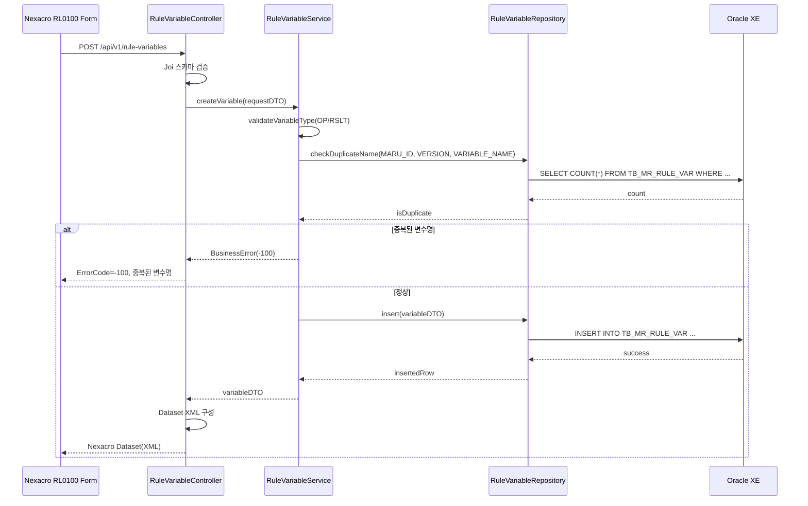
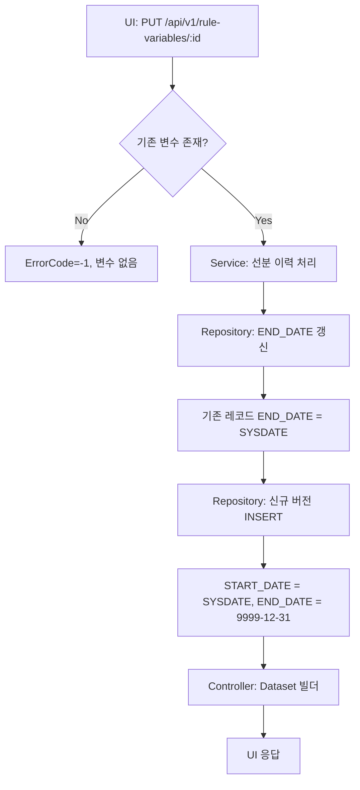
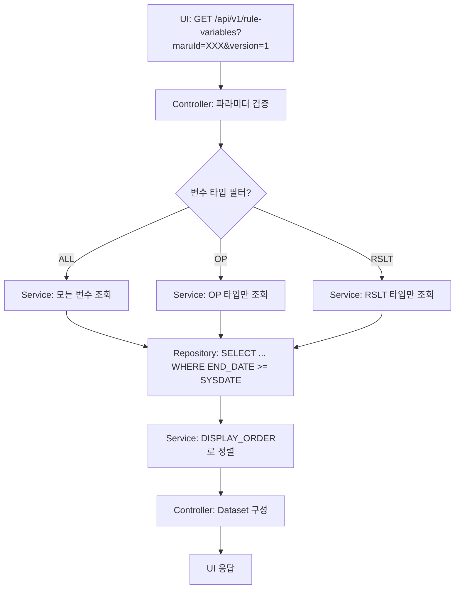

# MARU 상세 설계 – Task 9.1 RL0100 Backend API 구현

**Template Version:** 1.3.0  **Last Updated:** 2025-10-05

> **설계 규칙(필수 준수)**
>
> * 기능 중심 설계에 집중한다.
> * 실제 소스코드(전체 또는 일부)는 포함하지 않는다.
> * 선행 과업(기본 설계)과 상충할 경우 차이를 즉시 식별하고 근거를 명시한다.

---

## 0. 문서 메타데이터
- 문서명: `Task 9.1 RL0100 Backend API 구현 - 룰 변수 관리.md`
- 버전/작성: v1.0 / 2025-10-05 / Claude Code (architect persona)
- 참조 문서:
  - `docs/project/maru/00.foundation/01.project-charter/tasks.md`
  - `docs/project/maru/10.design/12.detail-design/Task-4-1.MR0200-Backend-API-구현(상세설계).md`
- 위치: `docs/project/maru/10.design/12.detail-design/`
- 관련 태스크/이슈: Task 9.1 RL0100 Backend API 구현
- 요구사항 추적: BRD UC-004 룰 변수 정의

---

## 1. 목적 & 범위
### 목적
- RL0100(룰 변수 관리) 화면이 요구하는 룰 변수 데이터 서비스를 백엔드에서 구현하기 위한 상세 설계 정의
- 룰 변수 CRUD API(RV001~RV005) 구현을 통한 비즈니스 룰 실행 기반 데이터 제공
- 변수 타입(OP: 조건, RSLT: 결과)별 차등 검증 및 데이터 무결성 확보
- 선분 이력 모델 기반 버전 관리 및 시점별 조회 지원

### 범위
**포함**
- 룰 변수 CRUD API 설계 및 구현 (RV001~RV005)
- 변수 타입별 검증 로직 (OP: 조건 타입 필수, RSLT: 선택)
- 데이터 타입 검증 (String, Number, Boolean)
- 변수 위치 관리 (1~20 범위)
- 변수명 중복 검증
- 선분 이력 모델 적용 (START_DATE, END_DATE)

**제외**
- Nexacro UI 폼(frmRL0100.xfdl) 구현 세부 사항
- 룰 레코드 관리 (RL0200)
- 룰 실행 엔진 구현 (RL0300)
- 인증/권한 및 운영 환경 배포 자동화

---

## 2. 요구사항 & 승인 기준 (Acceptance Criteria)
- 요구사항 원본 링크: `docs/project/maru/00.foundation/01.project-charter/tasks.md` Task 9.1 섹션

### 2.1 기능 요구사항
1. **[REQ-RL0100-API-001]** 룰 변수 생성 API는 MARU_ID, VERSION과 함께 변수 정보를 입력받아 TB_MR_RULE_VAR에 저장해야 한다.
2. **[REQ-RL0100-API-002]** 룰 변수 조회 API는 MARU_ID, VERSION, VARIABLE_TYPE, VARIABLE_POSITION을 기준으로 단건 조회를 지원해야 한다.
3. **[REQ-RL0100-API-003]** 룰 변수 목록 조회 API는 특정 MARU_ID와 VERSION의 모든 변수를 조회하고, 변수 타입별 필터링을 지원해야 한다.
4. **[REQ-RL0100-API-004]** 룰 변수 수정 API는 선분 이력 모델을 적용하여 기존 레코드의 END_DATE를 갱신하고 새 버전을 생성해야 한다.
5. **[REQ-RL0100-API-005]** 룰 변수 삭제 API는 논리 삭제 방식으로 END_DATE를 현재 시점으로 갱신해야 한다.
6. **[REQ-RL0100-API-006]** OP 타입 변수는 CONDITION_TYPE이 필수이며, 허용값(Equal, One, Two)을 검증해야 한다.
7. **[REQ-RL0100-API-007]** 변수명(VARIABLE_NAME)은 동일 MARU_ID, VERSION 내에서 중복을 허용하지 않아야 한다.
8. **[REQ-RL0100-API-008]** 변수 위치(VARIABLE_POSITION)는 1~20 범위 내에서 관리되어야 한다.

### 2.2 비기능 요구사항
- **[REQ-RL0100-NFR-001]** 단건 조회 응답 시간 < 200ms, 목록 조회 < 500ms
- **[REQ-RL0100-NFR-002]** 입력 검증 실패 시 `ErrorCode=-400`, 비즈니스 위반 시 `ErrorCode=-100`으로 통일
- **[REQ-RL0100-NFR-003]** 모든 API에 대한 단위/통합 테스트를 작성하여 90% 이상 커버리지 확보

### 2.3 승인 기준
- RV001~RV005 API 정상 동작 확인 (생성, 조회, 수정, 삭제)
- 변수 타입별 검증 로직 테스트 통과 (OP: CONDITION_TYPE 필수, RSLT: 선택)
- 변수명 중복 검증 테스트 통과
- 선분 이력 모델 적용 검증 (수정/삭제 시 END_DATE 갱신)
- Swagger API 문서화 완료

### 2-1. 요구사항-설계 추적 매트릭스
| 요구사항 ID | 설계 섹션 | 테스트 ID (초안) | 상태 | 비고 |
|-------------|-----------|------------------|------|------|
| REQ-RL0100-API-001 | §6.1 | TC-RL0100-BE-001 | 초안 | 변수 생성 |
| REQ-RL0100-API-002 | §6.2 | TC-RL0100-BE-002 | 초안 | 단건 조회 |
| REQ-RL0100-API-003 | §6.3 | TC-RL0100-BE-003 | 초안 | 목록 조회 |
| REQ-RL0100-API-004 | §6.4 | TC-RL0100-BE-004 | 초안 | 변수 수정 |
| REQ-RL0100-API-005 | §6.5 | TC-RL0100-BE-005 | 초안 | 변수 삭제 |
| REQ-RL0100-API-006 | §8.1 | TC-RL0100-BE-006 | 초안 | OP 타입 검증 |
| REQ-RL0100-API-007 | §8.2 | TC-RL0100-BE-007 | 초안 | 변수명 중복 검증 |
| REQ-RL0100-API-008 | §8.3 | TC-RL0100-BE-008 | 초안 | 변수 위치 범위 검증 |
| REQ-RL0100-NFR-001 | §11 | TC-RL0100-PERF-001 | 초안 | 성능 테스트 |
| REQ-RL0100-NFR-002 | §9 | TC-RL0100-ERR-001 | 초안 | 에러 코드 |
| REQ-RL0100-NFR-003 | §12 | TC-RL0100-UNIT-SET | 초안 | 커버리지 |

---

## 3. 용어 / 가정 / 제약
### 3.1 용어 정의
- **룰 변수**: 비즈니스 룰 실행 시 사용되는 조건(OP) 또는 결과(RSLT) 변수
- **변수 타입**: OP(조건 변수) 또는 RSLT(결과 변수)
- **변수 위치**: 룰 레코드에서 변수가 사용되는 위치 (1~20)
- **조건 타입**: OP 타입 변수의 비교 연산자 (Equal, One, Two)
- **선분 이력**: START_DATE와 END_DATE로 관리되는 시간 기반 버전 관리 모델

### 3.2 가정(Assumptions)
- TB_MR_RULE_VAR 테이블이 생성되어 있으며, 제약조건 및 인덱스가 적용되어 있음
- TB_MR_HEAD 테이블과 FK 관계가 설정되어 있어 참조 무결성이 보장됨
- Task 3.1, 4.1에서 구축된 Controller-Service-Repository 구조를 재사용 가능
- Nexacro 클라이언트는 XML 응답을 JSON으로 변환하는 기존 헬퍼를 공유

### 3.3 제약(Constraints)
- 변수 위치는 최대 20개로 제한 (OP_1~OP_20, RSLT_1~RSLT_20)
- HTTP 응답 코드는 Nexacro 호환을 위해 200 고정, 오류 구분은 `ErrorCode` 필드에 의존
- PoC 범위 내에서 인증/권한 미적용, 단일 사용자 시나리오 가정
- Oracle XE 환경에서 성능 최적화 범위는 인덱스 튜닝으로 제한

---

## 4. 시스템 모듈 개요
| 계층 | 책임 | 신규/변경 요소 |
|------|------|----------------|
| Router | `/api/v1/rule-variables` 라우팅 | `backend/src/routes/ruleVariables.js`(신규) |
| Controller | 요청 파라미터 검증, Dataset 빌더 호출, 오류 매핑 | `RuleVariableController` (신규) |
| Service | 비즈니스 규칙, 변수 타입별 검증, 중복 검증, 선분 이력 처리 | `RuleVariableService` (신규) |
| Repository | SQL 빌더, CRUD 쿼리, 선분 이력 관리 쿼리 | `RuleVariableRepository` (신규) |
| Utility | Nexacro Dataset 생성, 날짜 처리 | `nexacroResponseHelper`, `dateHelper` 재사용 |

모듈 간 호출 순서: Router → Controller → Service → Repository → Oracle → (Service) → Controller → Response Helper.

---

## 5. 프로세스 & 시퀀스 설계
### 5.1 룰 변수 생성 시퀀스


### 5.2 룰 변수 수정 플로우 (선분 이력)


### 5.3 룰 변수 목록 조회 플로우


---

## 6. API 상세 설계
### 6.1 룰 변수 생성 (RV001)
- **Endpoint**: `POST /api/v1/rule-variables`
- **Request Body**
  | 필드 | 타입 | 필수 | 설명 |
  |------|------|------|------|
  | `maruId` | string | Y | 마루 헤더 ID (max 50) |
  | `version` | number | Y | 버전 번호 |
  | `variableType` | string | Y | `OP` 또는 `RSLT` |
  | `variablePosition` | number | Y | 변수 위치 (1~20) |
  | `variableName` | string | Y | 변수명 (max 100) |
  | `variableDataType` | string | Y | `String`, `Number`, `Boolean` |
  | `conditionType` | string | N | `Equal`, `One`, `Two` (OP일 때 필수) |
  | `scaleValue` | number | N | 스케일 값 |
  | `displayOrder` | number | Y | 표시 순서 |

- **입력 검증 (Joi 스니펫)**
```javascript
const schema = Joi.object({
  maruId: Joi.string().max(50).required(),
  version: Joi.number().integer().min(1).required(),
  variableType: Joi.string().valid('OP', 'RSLT').required(),
  variablePosition: Joi.number().integer().min(1).max(20).required(),
  variableName: Joi.string().max(100).required(),
  variableDataType: Joi.string().valid('String', 'Number', 'Boolean').required(),
  conditionType: Joi.string().valid('Equal', 'One', 'Two').when('variableType', {
    is: 'OP',
    then: Joi.required(),
    otherwise: Joi.optional().allow(null)
  }),
  scaleValue: Joi.number().integer().optional().allow(null),
  displayOrder: Joi.number().integer().min(1).required()
});
```

- **응답 Dataset**
```xml
<Dataset>
  <ErrorCode>0</ErrorCode>
  <ErrorMsg></ErrorMsg>
  <SuccessRowCount>1</SuccessRowCount>
  <ColumnInfo>
    <Column id="MARU_ID" type="STRING" size="50"/>
    <Column id="VARIABLE_TYPE" type="STRING" size="10"/>
    <Column id="VARIABLE_POSITION" type="INT" size="4"/>
    <Column id="VERSION" type="INT" size="4"/>
    <Column id="VARIABLE_NAME" type="STRING" size="100"/>
    <Column id="VARIABLE_DATA_TYPE" type="STRING" size="20"/>
    <Column id="CONDITION_TYPE" type="STRING" size="20"/>
    <Column id="DISPLAY_ORDER" type="INT" size="4"/>
  </ColumnInfo>
  <Rows>
    <Row>
      <Col id="MARU_ID">DEPT_RULE_001</Col>
      <Col id="VARIABLE_TYPE">OP</Col>
      <Col id="VARIABLE_POSITION">1</Col>
      <Col id="VERSION">1</Col>
      <Col id="VARIABLE_NAME">부서코드</Col>
      <Col id="VARIABLE_DATA_TYPE">String</Col>
      <Col id="CONDITION_TYPE">Equal</Col>
      <Col id="DISPLAY_ORDER">1</Col>
    </Row>
  </Rows>
</Dataset>
```

### 6.2 룰 변수 조회 (RV002)
- **Endpoint**: `GET /api/v1/rule-variables/:maruId/:version/:variableType/:variablePosition`
- **Path Parameters**
  | 파라미터 | 타입 | 설명 |
  |----------|------|------|
  | `maruId` | string | 마루 헤더 ID |
  | `version` | number | 버전 번호 |
  | `variableType` | string | `OP` 또는 `RSLT` |
  | `variablePosition` | number | 변수 위치 (1~20) |

- **응답**: 6.1과 동일한 Dataset 구조 (단건)

### 6.3 룰 변수 목록 조회 (RV003)
- **Endpoint**: `GET /api/v1/rule-variables`
- **Query Parameters**
  | 파라미터 | 타입 | 필수 | 설명 |
  |----------|------|------|------|
  | `maruId` | string | Y | 마루 헤더 ID |
  | `version` | number | Y | 버전 번호 |
  | `variableType` | string | N | `OP`, `RSLT`, `ALL` (default: ALL) |
  | `asOfDate` | ISO date | N | 시점 조회 (default: 현재) |

- **응답**: 6.1과 동일한 Dataset 구조 (다건)

### 6.4 룰 변수 수정 (RV004)
- **Endpoint**: `PUT /api/v1/rule-variables/:maruId/:version/:variableType/:variablePosition`
- **Request Body**: 6.1과 동일 (단, PK 필드 제외)
- **처리 로직**:
  1. 기존 레코드의 `END_DATE`를 `SYSDATE`로 갱신
  2. 새 레코드를 `START_DATE = SYSDATE`, `END_DATE = TO_DATE('9999-12-31', 'YYYY-MM-DD')`로 INSERT
- **응답**: 6.1과 동일한 Dataset 구조

### 6.5 룰 변수 삭제 (RV005)
- **Endpoint**: `DELETE /api/v1/rule-variables/:maruId/:version/:variableType/:variablePosition`
- **처리 로직**: 논리 삭제 - `END_DATE = SYSDATE`로 갱신
- **응답**:
```xml
<Dataset>
  <ErrorCode>0</ErrorCode>
  <ErrorMsg>변수가 삭제되었습니다.</ErrorMsg>
  <SuccessRowCount>1</SuccessRowCount>
</Dataset>
```

### 6.6 API 오류 응답 템플릿
```xml
<Dataset>
  <ErrorCode>-400</ErrorCode>
  <ErrorMsg>유효하지 않은 변수 타입입니다.</ErrorMsg>
  <SuccessRowCount>0</SuccessRowCount>
  <ColumnInfo/>
  <Rows/>
</Dataset>
```

---

## 7. 데이터 모델 매핑
### 7.1 룰 변수 생성 쿼리
```sql
INSERT INTO TB_MR_RULE_VAR (
    MARU_ID,
    VARIABLE_TYPE,
    VARIABLE_POSITION,
    VERSION,
    DISPLAY_ORDER,
    VARIABLE_NAME,
    VARIABLE_DATA_TYPE,
    CONDITION_TYPE,
    SCALE_VALUE,
    START_DATE,
    END_DATE
) VALUES (
    :maruId,
    :variableType,
    :variablePosition,
    :version,
    :displayOrder,
    :variableName,
    :variableDataType,
    :conditionType,
    :scaleValue,
    SYSTIMESTAMP,
    TO_TIMESTAMP('9999-12-31 23:59:59', 'YYYY-MM-DD HH24:MI:SS')
)
```

### 7.2 룰 변수 목록 조회 쿼리
```sql
SELECT /* RL0100 변수 목록 */
       MARU_ID,
       VARIABLE_TYPE,
       VARIABLE_POSITION,
       VERSION,
       DISPLAY_ORDER,
       VARIABLE_NAME,
       VARIABLE_DATA_TYPE,
       CONDITION_TYPE,
       SCALE_VALUE,
       START_DATE,
       END_DATE
  FROM TB_MR_RULE_VAR
 WHERE MARU_ID = :maruId
   AND VERSION = :version
   AND (:variableType = 'ALL' OR VARIABLE_TYPE = :variableType)
   AND END_DATE >= :asOfDate
 ORDER BY DISPLAY_ORDER, VARIABLE_TYPE, VARIABLE_POSITION
```

### 7.3 룰 변수 수정 쿼리 (선분 이력)
```sql
-- Step 1: 기존 레코드 종료
UPDATE TB_MR_RULE_VAR
   SET END_DATE = SYSTIMESTAMP
 WHERE MARU_ID = :maruId
   AND VERSION = :version
   AND VARIABLE_TYPE = :variableType
   AND VARIABLE_POSITION = :variablePosition
   AND END_DATE >= SYSTIMESTAMP;

-- Step 2: 신규 버전 생성
INSERT INTO TB_MR_RULE_VAR (
    MARU_ID, VARIABLE_TYPE, VARIABLE_POSITION, VERSION,
    DISPLAY_ORDER, VARIABLE_NAME, VARIABLE_DATA_TYPE,
    CONDITION_TYPE, SCALE_VALUE,
    START_DATE, END_DATE
) VALUES (
    :maruId, :variableType, :variablePosition, :version,
    :displayOrder, :variableName, :variableDataType,
    :conditionType, :scaleValue,
    SYSTIMESTAMP, TO_TIMESTAMP('9999-12-31 23:59:59', 'YYYY-MM-DD HH24:MI:SS')
);
```

### 7.4 인덱스 활용
- **PK_TB_MR_RULE_VAR**: 단건 조회 시 활용
- **IDX_TB_MR_RULE_VAR_01** (END_DATE, START_DATE, MARU_ID): 선분 이력 조회 최적화
- **UK_RULE_VAR_NAME** (MARU_ID, VERSION, VARIABLE_NAME): 변수명 중복 검증 최적화

---

## 8. 검증 로직 정의
### 8.1 변수 타입별 검증
```javascript
function validateVariableByType(dto) {
  if (dto.variableType === 'OP') {
    // OP 타입: CONDITION_TYPE 필수
    if (!dto.conditionType) {
      throw new ValidationError('OP 타입 변수는 조건 타입이 필수입니다.');
    }
    if (!['Equal', 'One', 'Two'].includes(dto.conditionType)) {
      throw new ValidationError('유효하지 않은 조건 타입입니다.');
    }
  } else if (dto.variableType === 'RSLT') {
    // RSLT 타입: CONDITION_TYPE은 NULL 허용
    dto.conditionType = null;
  }
}
```

### 8.2 변수명 중복 검증
```javascript
async function checkDuplicateVariableName(maruId, version, variableName) {
  const count = await repository.countByName(maruId, version, variableName);
  if (count > 0) {
    throw new BusinessError(-100, '동일한 변수명이 이미 존재합니다.');
  }
}
```

### 8.3 변수 위치 범위 검증
```javascript
function validateVariablePosition(position) {
  if (position < 1 || position > 20) {
    throw new ValidationError('변수 위치는 1~20 범위 내에서 지정해야 합니다.');
  }
}
```

### 8.4 FK 참조 무결성 검증
```javascript
async function validateMaruExists(maruId, version) {
  const exists = await maruHeaderRepository.existsByIdAndVersion(maruId, version);
  if (!exists) {
    throw new BusinessError(-100, '존재하지 않는 마루 헤더입니다.');
  }
}
```

---

## 9. 오류/예외/경계 조건
| 시나리오 | ErrorCode | ErrorMsg | 처리 |
|----------|-----------|----------|------|
| 잘못된 파라미터 | -400 | `유효하지 않은 요청입니다.` | Joi ValidationError → Controller |
| OP 타입에 조건 타입 누락 | -400 | `OP 타입 변수는 조건 타입이 필수입니다.` | Service 검증 |
| 변수명 중복 | -100 | `동일한 변수명이 이미 존재합니다.` | Service 중복 검증 |
| 변수 위치 범위 초과 | -400 | `변수 위치는 1~20 범위입니다.` | Joi 검증 |
| 존재하지 않는 마루 헤더 | -100 | `존재하지 않는 마루 헤더입니다.` | FK 검증 |
| 변수 없음 (조회 실패) | -1 | `조회된 변수가 없습니다.` | Repository empty result |
| DB 연결 오류 | -200 | `시스템 오류가 발생했습니다.` | Repository catch 후 재던짐 |

경계 조건:
- 변수 위치 1~20 범위 검증
- 동일 마루 헤더 내 변수명 중복 검증
- 선분 이력 처리 시 트랜잭션 보장 (UPDATE + INSERT 원자성)
- 시점 조회 시 `asOfDate` 기본값 현재 시각

---

## 10. 보안 & 품질 고려
- **입력 검증**: Joi 스키마 + 커스텀 validator (변수 타입별 검증)
- **SQL Injection 방지**: Knex 바인딩 사용, 파라미터 화이트리스트
- **로깅**: morgan + requestId(기존 공통 미들웨어) 활용, 변수 생성/수정/삭제 시 INFO 로그
- **감사**: 변수 변경 이력은 선분 이력 모델로 자동 추적
- **트랜잭션**: 수정/삭제 시 선분 이력 처리는 트랜잭션으로 보장
- **i18n**: ErrorMsg 한글 기본, ErrorCode로 클라이언트 측 메시지 매핑 가능

---

## 11. 성능 & 확장 전략
- **단건 조회**: PK 활용으로 O(1) 성능 (< 200ms 목표)
- **목록 조회**: IDX_TB_MR_RULE_VAR_01 활용으로 선분 이력 필터링 최적화 (< 500ms 목표)
- **동시성**: 선분 이력 수정 시 트랜잭션 격리 수준(READ COMMITTED) 유지
- **확장성**: 변수 위치 최대 20개 제약, 추후 확장 시 TB_MR_RULE_VAR 구조 재검토 필요
- **캐싱**: PoC 단계에서는 미적용, 향후 자주 조회되는 변수 정의는 Redis 캐싱 고려

---

## 12. 테스트 전략 (TDD 계획)
- **단위 테스트**
  - Service: 변수 타입별 검증 (OP: CONDITION_TYPE 필수, RSLT: 선택)
  - Service: 변수명 중복 검증
  - Service: 변수 위치 범위 검증
  - Repository: SQL 빌더 스냅샷, 선분 이력 처리 검증

- **통합 테스트**
  - Controller + Express supertest: 정상 생성/조회/수정/삭제 시나리오
  - Controller: 파라미터 검증 오류 시나리오
  - Service + Repository: 선분 이력 트랜잭션 검증

- **계약 테스트**
  - Nexacro Dataset 구조 검증: XML Schema 검증 헬퍼

- **성능 테스트**
  - k6: 단건 조회 100 RPS, 목록 조회 50 RPS → 응답 시간 SLA 충족 확인

테스트 케이스와 요구사항 맵핑은 §2-1 추적 매트릭스에 의해 관리.

---

## 13. 리스크 & 완화 계획
| 리스크 | 영향 | 완화 전략 |
|--------|------|-----------|
| 선분 이력 트랜잭션 실패 | 높음 | UPDATE + INSERT를 단일 트랜잭션으로 묶고, 롤백 처리 |
| 변수 위치 충돌 | 중간 | PK 제약조건으로 자동 방지, UI에서 사전 검증 |
| 변수명 중복 | 중간 | UK 제약조건 + Service 레벨 사전 검증 |
| Nexacro XML 파싱 오류 | 낮음 | 응답 스키마 테스트, 샘플 데이터로 UI와 사전 검증 |

---

## 14. 변경 이력
| 버전 | 일자 | 작성/검토 | 주요 내용 |
|------|------|-----------|-----------|
| v1.0 | 2025-10-05 | Claude Code | 초안 작성 (요구사항 정리, API/쿼리 설계, 검증 로직) |

---

## 15. 기존 설계 대비 분석
- Task 3.1, 4.1 상세 설계와 동일한 모듈 구조(Controller-Service-Repository)를 유지하여 재사용 극대화
- 차이점: 룰 변수는 마루 헤더와 달리 변수 타입별 차등 검증 로직 필요
- 영향: 신규 테이블(TB_MR_RULE_VAR)이므로 기존 API와 충돌 없음
- 추가 고려사항: 룰 레코드(RL0200)와의 연계는 추후 Task에서 처리

---

## 16. Swagger API 문서화 계획
- **RV001**: `POST /api/v1/rule-variables` - 룰 변수 생성
- **RV002**: `GET /api/v1/rule-variables/:maruId/:version/:variableType/:variablePosition` - 룰 변수 조회
- **RV003**: `GET /api/v1/rule-variables` - 룰 변수 목록 조회
- **RV004**: `PUT /api/v1/rule-variables/:maruId/:version/:variableType/:variablePosition` - 룰 변수 수정
- **RV005**: `DELETE /api/v1/rule-variables/:maruId/:version/:variableType/:variablePosition` - 룰 변수 삭제

각 API에 대한 Request/Response 스키마, 예시, 오류 코드 상세 명세 포함.

---

*본 문서는 Task 9.1 상세 설계 최초 버전이며, 구현 진행 중 변경 발생 시 §14 변경 이력과 추적 매트릭스를 갱신한다.*
