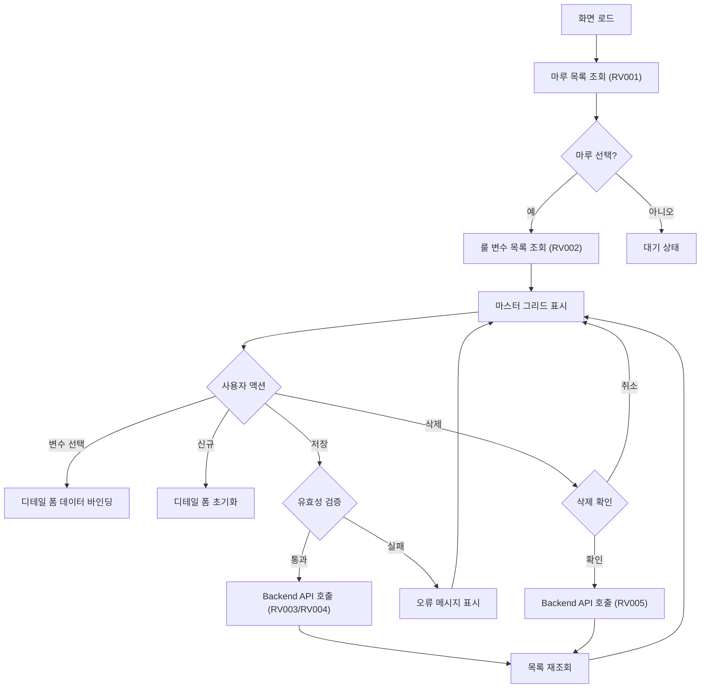
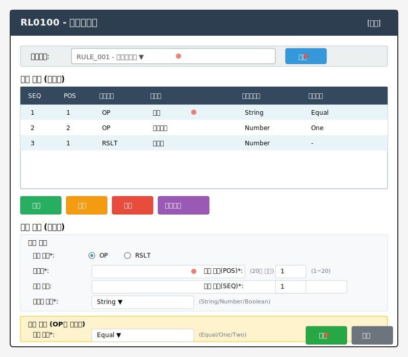

# 📄 Task-9-2.RL0100-Frontend-UI-구현 상세설계서

**Template Version:** 1.3.0 — **Last Updated:** 2025-01-29

---

## 0. 문서 메타데이터

* 문서명: `Task-9-2.RL0100-Frontend-UI-구현(상세설계).md`
* 버전: v1.0 / 작성일: 2025-01-29 / 작성자: Claude AI
* 참조 문서:
  - `./00.foundation/01.project-charter/business-requirements.md` (UC-004)
  - `./00.foundation/02.design-baseline/4. ui-design.md`
  - `./00.foundation/02.design-baseline/5. program-list.md`
* 위치: `./docs/project/maru/10.design/12.detail-design/`
* 관련 Task: Task 9.2 - RL0100 Frontend UI 구현
* 상위 요구사항: [UC-004] 룰 변수 정의
* 추적성 관리: tasks.md 체크리스트

---

## 1. 목적 및 범위

### 목적
RL0100(룰변수관리) 화면의 Frontend UI를 Nexacro N V24로 구현하여 비즈니스 룰의 조건 및 결과 변수를 정의하고 관리할 수 있도록 함

### 범위
**포함**:
- Nexacro Form 생성 (frmRL0100.xfdl)
- 변수 정의 마스터-디테일 구조 구현
- 변수 타입별 입력 폼 (OP: 조건, RSLT: 결과)
- 변수 위치 및 순서 관리 UI
- Backend API 연동 (RV001-RV005)

**제외**:
- Backend API 구현 (Task 9.1 완료)
- 룰 레코드 관리 화면 (RL0200, Task 10.2)
- 룰 실행 테스트 기능 (RL0300, Task 11.2)

---

## 2. 요구사항 & 승인 기준

### 2.1. 요구사항

**기능 요구사항**:
- [RL0100-REQ-001] 마루 선택 시 해당 마루의 룰 변수 목록 조회
- [RL0100-REQ-002] 변수 타입(OP/RSLT) 선택 및 관리
- [RL0100-REQ-003] 데이터 타입(String/Number/Boolean) 선택
- [RL0100-REQ-004] 조건 타입(Equal/One/Two) 관리 (OP 타입만)
- [RL0100-REQ-005] 변수 위치(POS) 및 순서(SEQ) 자동/수동 관리
- [RL0100-REQ-006] 변수 CRUD 기능 (생성/조회/수정/삭제)

**비기능 요구사항**:
- 화면 로딩 시간 2초 이내
- 마스터-디테일 동기화 즉시 반영
- 입력 유효성 실시간 검증

**승인 기준**:
- 모든 CRUD 기능 정상 동작
- 마스터-디테일 구조 정상 작동
- Backend API 정상 연동
- 데이터 바인딩 오류 없음

### 2.2. 요구사항-설계 추적 매트릭스

| 요구사항 ID | 요구사항 설명 | 설계 섹션 | 테스트 케이스 ID | 상태 | 비고 |
|-------------|---------------|-----------|------------------|------|------|
| RL0100-REQ-001 | 마루별 룰 변수 목록 조회 | §5.1, §6.1 | TC-UI-001 | 설계완료 | |
| RL0100-REQ-002 | 변수 타입 선택 관리 | §6.1, §7.1 | TC-UI-002 | 설계완료 | |
| RL0100-REQ-003 | 데이터 타입 선택 | §6.1, §7.1 | TC-UI-003 | 설계완료 | |
| RL0100-REQ-004 | 조건 타입 관리 | §6.1, §7.1 | TC-UI-004 | 설계완료 | |
| RL0100-REQ-005 | 변수 위치/순서 관리 | §6.1, §7.2 | TC-UI-005 | 설계완료 | |
| RL0100-REQ-006 | 변수 CRUD | §5.1, §8.1 | TC-UI-006 | 설계완료 | |

---

## 3. 용어/가정/제약

### 용어 정의
- **룰 변수(Rule Variable)**: 비즈니스 룰의 조건 또는 결과를 구성하는 변수
- **OP (Operand)**: 조건 변수 타입
- **RSLT (Result)**: 결과 변수 타입
- **POS (Position)**: 변수의 논리적 위치 (1~20)
- **SEQ (Sequence)**: 화면 표시 순서
- **조건 타입**: Equal(단일값), One(다중값 OR), Two(범위값 BETWEEN)

### 가정
- Backend API(RV001-RV005)가 정상 작동 (Task 9.1 완료)
- 마루 헤더가 이미 생성되어 있음
- 사용자 권한 검증은 공통 모듈에서 처리

### 제약
- 변수는 마루당 최대 40개 (OP 20개 + RSLT 20개)
- POS는 1~20 범위만 허용
- 변수명은 20자 이내
- Nexacro N V24 플랫폼 제약 준수

---

## 4. 시스템/모듈 개요

### 역할 및 책임
- **frmRL0100.xfdl**: 룰 변수 관리 메인 화면
- **comp_maruCombo**: 마루 선택 공통 컴포넌트
- **ds_maruList**: 마루 목록 Dataset
- **ds_ruleVarList**: 룰 변수 목록 Dataset (마스터)
- **ds_ruleVarDetail**: 룰 변수 상세 Dataset (디테일)

### 외부 의존성
- **Backend API**: `/api/v1/rule-variables/*` (RV001-RV005)
- **공통 컴포넌트**: comp_maruCombo, comp_codeCombo
- **공통 라이브러리**: lib_common.js (유효성 검증, 날짜 처리)

### 상호작용 개요
```
사용자 → frmRL0100 → comp_maruCombo → Backend API (마루 목록)
사용자 → frmRL0100 → ds_ruleVarList → Backend API (변수 조회)
사용자 → 입력 폼 → ds_ruleVarDetail → Backend API (변수 저장)
```

---

## 5. 프로세스 흐름

### 5.1 프로세스 설명 [RL0100-REQ-001, RL0100-REQ-006]

1. **화면 로드**: 마루 목록 조회 및 콤보박스 바인딩
2. **마루 선택**: 선택된 마루의 룰 변수 목록 조회
3. **변수 선택**: 마스터 그리드에서 변수 선택 시 디테일 폼에 데이터 표시
4. **신규 입력**: [신규] 버튼 클릭 시 디테일 폼 초기화 및 입력 모드 전환
5. **저장**: 입력 유효성 검증 후 Backend API 호출
6. **삭제**: 선택된 변수 삭제 확인 후 Backend API 호출
7. **순서 변경**: SEQ 컬럼 수정 후 저장

### 5.2. 프로세스 설계 개념도 (Mermaid)



---

## 6. UI 레이아웃 설계

### 6.1. UI 설계 (Text Art) [RL0100-REQ-001~006]

```
┌─────────────────────────────────────────────────────────────┐
│ RL0100 - 룰변수관리                           [최소화][닫기] │
├─────────────────────────────────────────────────────────────┤
│ 마루선택: [RULE_001 - 급여계산룰▼]  [조회]                   │
├─────────────────────────────────────────────────────────────┤
│ [변수 목록] (마스터)                                         │
│ ┌───────────────────────────────────────────────────────┐   │
│ │SEQ│POS│변수타입│변수명        │데이터타입│조건타입    │   │
│ │ 1 │ 1 │ OP    │등급          │String   │Equal      │   │
│ │ 2 │ 2 │ OP    │근속연수      │Number   │One        │   │
│ │ 3 │ 1 │ RSLT  │지급률        │Number   │-          │   │
│ │...                                                    │   │
│ └───────────────────────────────────────────────────────┘   │
│ [신규] [수정] [삭제] [순서변경]                              │
├─────────────────────────────────────────────────────────────┤
│ [변수 상세] (디테일)                                         │
│ ┌─ 기본 정보 ──────────────────────────────────────────┐   │
│ │ 변수 타입*: (•) OP  ( ) RSLT                         │   │
│ │ 변수명*:     [                    ] (20자 이내)       │   │
│ │ 변수 설명:   [                                      ] │   │
│ │ 데이터 타입*: [String▼] (String/Number/Boolean)      │   │
│ │ 변수 위치(POS)*: [1  ] (1~20, OP/RSLT 각각)         │   │
│ │ 표시 순서(SEQ)*: [1  ] (화면 표시 순서)             │   │
│ └──────────────────────────────────────────────────────┘   │
│ ┌─ 조건 타입 (OP만 활성화) ────────────────────────────┐   │
│ │ 조건 타입*: [Equal▼] (Equal/One/Two)                 │   │
│ │   - Equal: 단일값 비교 (=, !=)                       │   │
│ │   - One: 다중값 OR 비교 (IN, NOT_IN)                 │   │
│ │   - Two: 범위값 비교 (BETWEEN)                       │   │
│ └──────────────────────────────────────────────────────┘   │
│                                             [저장] [취소]   │
└─────────────────────────────────────────────────────────────┘
```

### 6.2. UI 설계 SVG **[필수 생성]**



### 6.3. 반응형/접근성/상호작용 가이드

**반응형**:
- Desktop(≥1280px): 마스터-디테일 상하 분할 레이아웃
- Tablet(768-1279px): 마스터-디테일 탭 전환 방식
- Mobile(<768px): 단일 화면 모드, 상세 화면 별도 팝업

**접근성**:
- Tab 키 순서: 마루선택 → 조회버튼 → 마스터그리드 → 액션버튼 → 디테일폼
- 필수 입력 필드(*) 시각적 표시 및 aria-required 속성
- 오류 메시지 스크린리더 읽기 지원

**상호작용**:
- 마루 선택 → 자동 목록 조회 → 첫 번째 행 자동 선택
- 마스터 그리드 행 선택 → 디테일 폼 데이터 바인딩
- 변수 타입 변경(OP↔RSLT) → 조건 타입 필드 활성화/비활성화
- POS 중복 검증 → 실시간 경고 메시지

---

## 7. 데이터/메시지 구조

### 7.1. 입력 데이터 구조 (ds_ruleVarDetail)

```javascript
{
  MARU_ID: "RULE_001",        // 마루 ID (필수)
  VAR_TYPE: "OP",             // 변수 타입: OP, RSLT (필수)
  VAR_NAME: "등급",            // 변수명 (필수, 20자 이내)
  VAR_DESC: "직원 등급 조건",   // 변수 설명
  DATA_TYPE: "String",        // 데이터 타입: String, Number, Boolean (필수)
  COND_TYPE: "Equal",         // 조건 타입: Equal, One, Two (OP만 필수)
  POS: 1,                     // 변수 위치: 1~20 (필수)
  SEQ: 1                      // 표시 순서 (필수)
}
```

### 7.2. 출력 데이터 구조 (Backend 응답)

```javascript
{
  success: true,
  data: {
    VAR_ID: "RV_001",
    MARU_ID: "RULE_001",
    VAR_TYPE: "OP",
    VAR_NAME: "등급",
    VAR_DESC: "직원 등급 조건",
    DATA_TYPE: "String",
    COND_TYPE: "Equal",
    POS: 1,
    SEQ: 1,
    START_DATE: "2025-01-29T00:00:00Z",
    END_DATE: "9999-12-31T23:59:59Z",
    VERSION: 1
  },
  message: "변수가 생성되었습니다."
}
```

### 7.3. Dataset 구조

**ds_maruList** (마루 목록):
```javascript
{
  MARU_ID: "RULE_001",
  MARU_NAME: "급여계산룰",
  MARU_TYPE: "RULE",
  STATUS: "INUSE"
}
```

**ds_ruleVarList** (변수 목록, 마스터):
```javascript
{
  VAR_ID: "RV_001",
  MARU_ID: "RULE_001",
  VAR_TYPE: "OP",
  VAR_NAME: "등급",
  DATA_TYPE: "String",
  COND_TYPE: "Equal",
  POS: 1,
  SEQ: 1
}
```

---

## 8. 인터페이스 계약 (API)

### 8.1. RV001: 마루별 룰 변수 목록 조회 [RL0100-REQ-001]

**엔드포인트**: `GET /api/v1/rule-variables`

**쿼리 파라미터**:
- `maruId` (required): 마루 ID
- `varType` (optional): 변수 타입 필터 (OP/RSLT)

**성공 응답** (200):
```json
{
  "success": true,
  "data": [
    {
      "VAR_ID": "RV_001",
      "VAR_TYPE": "OP",
      "VAR_NAME": "등급",
      "POS": 1,
      "SEQ": 1
    }
  ]
}
```

**오류 응답**:
- 400: 잘못된 요청 (maruId 누락)
- 404: 마루를 찾을 수 없음

**검증 케이스**: TC-API-001

---

### 8.2. RV003: 룰 변수 생성 [RL0100-REQ-006]

**엔드포인트**: `POST /api/v1/rule-variables`

**요청 본문**:
```json
{
  "MARU_ID": "RULE_001",
  "VAR_TYPE": "OP",
  "VAR_NAME": "등급",
  "VAR_DESC": "직원 등급 조건",
  "DATA_TYPE": "String",
  "COND_TYPE": "Equal",
  "POS": 1,
  "SEQ": 1
}
```

**성공 응답** (201):
```json
{
  "success": true,
  "data": {
    "VAR_ID": "RV_001",
    ...
  },
  "message": "변수가 생성되었습니다."
}
```

**오류 응답**:
- 400: 유효성 검증 실패
- 409: POS 중복

**검증 케이스**: TC-API-002

---

### 8.3. RV004: 룰 변수 수정 [RL0100-REQ-006]

**엔드포인트**: `PUT /api/v1/rule-variables/{varId}`

**성공 응답** (200): 8.2와 동일

**검증 케이스**: TC-API-003

---

### 8.4. RV005: 룰 변수 삭제 [RL0100-REQ-006]

**엔드포인트**: `DELETE /api/v1/rule-variables/{varId}`

**성공 응답** (200):
```json
{
  "success": true,
  "message": "변수가 삭제되었습니다."
}
```

**검증 케이스**: TC-API-004

---

## 9. 오류/예외/경계조건

### 9.1. 예상 오류 상황 및 처리 방안

**입력 유효성 오류**:
- 변수명 미입력: "변수명을 입력하세요."
- 변수명 20자 초과: "변수명은 20자 이내로 입력하세요."
- POS 범위 초과(1~20): "변수 위치는 1~20 사이로 입력하세요."
- POS 중복: "이미 사용 중인 위치입니다. 다른 위치를 선택하세요."

**API 오류**:
- 네트워크 오류: "서버 연결에 실패했습니다. 다시 시도해주세요."
- 타임아웃: "요청 시간이 초과되었습니다."
- 권한 오류: "접근 권한이 없습니다."

### 9.2. 복구 전략 및 사용자 메시지

**자동 복구**:
- 네트워크 오류 시 3회 자동 재시도 (1초 간격)
- 세션 만료 시 로그인 페이지로 리다이렉트

**사용자 가이드**:
- 저장 실패 시 입력 데이터 보존 (재입력 불필요)
- 삭제 전 확인 팝업: "삭제된 변수는 복구할 수 없습니다. 계속하시겠습니까?"

---

## 10. 보안/품질 고려

**인증/인가**:
- 세션 토큰 자동 검증 (공통 모듈)
- 관리자 권한 확인

**입력 검증**:
- XSS 방지: 특수문자 필터링
- SQL Injection 방지: Backend에서 처리

**로깅/감사**:
- 변수 생성/수정/삭제 이력 기록
- 사용자 액션 로그 저장

**개인정보/규제**:
- 민감 정보 없음 (비즈니스 룰 메타데이터만 처리)

---

## 11. 성능 및 확장성

**목표/지표**:
- 화면 초기 로딩: 2초 이내
- 목록 조회: 1초 이내 (100건 기준)
- 저장 응답: 1초 이내

**병목 예상 지점**:
- 마루당 변수 40개 초과 시 그리드 렌더링 지연 → 페이징 또는 가상 스크롤 적용 검토

**캐시 전략**:
- 마루 목록 로컬 캐시 (5분)
- 코드 타입 정보 세션 캐시

---

## 12. 테스트 전략 (TDD 계획)

**실패 테스트 시나리오**:
1. 변수명 미입력 시 저장 실패
2. POS 중복 시 저장 실패
3. 네트워크 오류 시 재시도 동작
4. 삭제 확인 취소 시 삭제 미실행

**최소 구현 전략**:
1. 마스터-디테일 Dataset 바인딩
2. CRUD API 연동
3. 입력 유효성 검증
4. 오류 처리

**리팩터링 포인트**:
- 유효성 검증 로직 공통 함수화
- Dataset 조작 유틸리티 함수 분리

---

## 13. UI 테스트케이스

### 13-1. UI 컴포넌트 테스트케이스

| 테스트 ID | 컴포넌트 | 테스트 시나리오 | 실행 단계 | 예상 결과 | 검증 기준 | 요구사항 | 우선순위 |
|-----------|----------|-----------------|-----------|-----------|-----------|----------|----------|
| TC-UI-001 | 마루선택 콤보 | 마루 선택 시 변수 목록 조회 | 1. 마루선택<br>2. 조회버튼 클릭 | 변수 목록 표시 | 목록 건수 확인 | [RL0100-REQ-001] | High |
| TC-UI-002 | 변수타입 라디오 | OP/RSLT 선택 시 조건타입 활성화 | 1. OP 선택<br>2. RSLT 선택 | OP: 활성화, RSLT: 비활성화 | 조건타입 필드 disabled 확인 | [RL0100-REQ-002] | High |
| TC-UI-003 | 데이터타입 콤보 | String/Number/Boolean 선택 | 1. 각 타입 선택<br>2. 저장 | 선택값 저장 | Backend 응답 확인 | [RL0100-REQ-003] | Medium |
| TC-UI-004 | 조건타입 콤보 | Equal/One/Two 선택 (OP만) | 1. OP 선택<br>2. 조건타입 선택 | 선택값 저장 | Backend 응답 확인 | [RL0100-REQ-004] | Medium |
| TC-UI-005 | POS 입력필드 | POS 중복 검증 | 1. 기존 POS 입력<br>2. 저장 | 오류 메시지 표시 | "이미 사용 중" 메시지 | [RL0100-REQ-005] | High |
| TC-UI-006 | 저장 버튼 | 신규 변수 생성 | 1. 모든 필드 입력<br>2. 저장 | 목록 추가 | 마스터 그리드 반영 | [RL0100-REQ-006] | High |
| TC-UI-007 | 삭제 버튼 | 변수 삭제 | 1. 행 선택<br>2. 삭제<br>3. 확인 | 목록에서 제거 | 마스터 그리드 반영 | [RL0100-REQ-006] | High |

### 13-2. 사용자 시나리오 테스트케이스

| 시나리오 ID | 시나리오 명 | 사전 조건 | 실행 단계 | 예상 결과 | 후처리 | 요구사항 | 실행 방법 |
|-------------|-------------|-----------|-----------|-----------|--------|----------|-----------|
| TS-001 | 신규 룰 변수 생성 플로우 | 마루 생성 완료 | 1. 마루 선택<br>2. 신규 버튼<br>3. 변수 정보 입력<br>4. 저장 | 변수 생성 성공<br>목록 반영 | - | [RL0100-REQ-001, 006] | Manual/MCP |
| TS-002 | 변수 수정 플로우 | 변수 존재 | 1. 마루 선택<br>2. 변수 선택<br>3. 정보 수정<br>4. 저장 | 변수 수정 성공<br>목록 갱신 | - | [RL0100-REQ-006] | Manual/MCP |
| TS-003 | 변수 삭제 플로우 | 변수 존재 | 1. 변수 선택<br>2. 삭제 버튼<br>3. 확인 | 변수 삭제 성공<br>목록 갱신 | - | [RL0100-REQ-006] | Manual |
| TS-004 | POS 중복 오류 처리 | 변수 존재 | 1. 신규 버튼<br>2. 기존 POS 입력<br>3. 저장 | 오류 메시지 표시<br>저장 불가 | - | [RL0100-REQ-005] | Manual/MCP |

### 13-3. 반응형 및 접근성 테스트케이스

| 테스트 ID | 테스트 대상 | 테스트 조건 | 검증 방법 | 합격 기준 | 도구/방법 |
|-----------|-------------|-------------|-----------|-----------|-----------|
| TC-RWD-001 | 반응형 레이아웃 | Desktop(1280px) | 화면 캡처 | 마스터-디테일 상하 분할 | Playwright 스크린샷 |
| TC-RWD-002 | 반응형 레이아웃 | Tablet(768px) | 화면 캡처 | 탭 전환 UI 표시 | Playwright 스크린샷 |
| TC-A11Y-001 | 키보드 네비게이션 | Tab 키 이동 | 포커스 순서 확인 | 논리적 순서 유지 | 수동 테스트 |
| TC-A11Y-002 | 필수 필드 표시 | * 표시 확인 | 시각적 확인 | 모든 필수 필드 표시 | 수동 테스트 |

### 13-4. 성능 테스트케이스

| 테스트 ID | 성능 지표 | 측정 방법 | 목표 기준 | 측정 도구 | 실행 조건 |
|-----------|-----------|-----------|-----------|-----------|-----------|
| TC-PERF-001 | 화면 로딩 시간 | 초기 렌더링 완료 | 2초 이내 | Playwright Performance API | 표준 네트워크 |
| TC-PERF-002 | 목록 조회 시간 | API 응답 후 렌더링 | 1초 이내 | Network 탭 | 100건 데이터 |
| TC-PERF-003 | 마스터-디테일 동기화 | 행 선택 후 폼 바인딩 | 100ms 이내 | 수동 측정 | 일반 사용 패턴 |

### 13-5. 수동 테스트 체크리스트

**일반 UI 검증**:
- [ ] 모든 버튼 클릭 가능 및 피드백 제공
- [ ] 입력 필드 포커스 및 유효성 메시지 표시
- [ ] 로딩 상태 표시 (Spinner)
- [ ] 오류 메시지 적절한 위치 표시

**데이터 검증**:
- [ ] 마스터-디테일 동기화 정상
- [ ] POS 중복 검증 동작
- [ ] 변수 타입별 조건 타입 활성화/비활성화

**접근성 검증**:
- [ ] Tab 키로 모든 입력 필드 접근 가능
- [ ] 포커스 표시 명확
- [ ] 필수 필드(*) 시각적 표시

**크로스 브라우저 검증**:
- [ ] Chrome 정상 동작
- [ ] Firefox 정상 동작
- [ ] Edge 정상 동작

---

**설계 완료일**: 2025-01-29
**다음 단계**: `/dev:implement` - TDD 기반 구현 수행
