# 📋 Task 1: Document Viewer Implementation - Complete Workflow

## 📊 Executive Summary

**Task**: WBS Task 1 - 문서 뷰어 구현
**Priority**: ⭐⭐⭐⭐⭐ CRITICAL
**Estimated Duration**: 2-3 days (16-24 hours)
**Dependencies**: None (독립적 개발 가능)
**Team Size**: 1 Frontend Developer
**Complexity**: Medium-High

---

## 🎯 Implementation Strategy: Systematic Approach

### Phase Overview

```mermaid
gantt
    title Document Viewer Implementation Timeline
    dateFormat  HH:mm
    section Phase 1: Setup
    Environment & Dependencies    :a1, 00:00, 2h
    Project Structure             :a2, after a1, 1h

    section Phase 2: Core Components
    Markdown Viewer               :b1, after a2, 4h
    File Navigator                :b2, after b1, 3h

    section Phase 3: Backend API
    Document API Endpoints        :c1, after a2, 3h
    File System Integration       :c2, after c1, 2h

    section Phase 4: Integration
    Issue Detail Modal            :d1, after b2, 3h
    Component Integration         :d2, after d1, 2h

    section Phase 5: Polish
    Testing & Bug Fixes           :e1, after d2, 4h
    Documentation                 :e2, after e1, 1h
```


---

## 📦 Phase 1: Environment Setup & Dependencies (3 hours)

### 1.1 Install Required Packages (30 min)

**Frontend Dependencies:**
```bash
cd frontend
npm install react-markdown remark-gfm rehype-highlight rehype-katex remark-math mermaid lucide-react
```

**Package Breakdown:**
- `react-markdown` (^9.0.0) - Core Markdown rendering
- `remark-gfm` (^4.0.0) - GitHub Flavored Markdown support
- `rehype-highlight` (^7.0.0) - Code syntax highlighting
- `rehype-katex` (^7.0.0) - Math formula rendering
- `remark-math` (^6.0.0) - Math formula parsing
- `mermaid` (^10.0.0) - Diagram rendering
- `lucide-react` (already installed) - Icons for file navigator

**Acceptance Criteria:**
- [ ] All packages installed without peer dependency warnings
- [ ] TypeScript definitions available for all libraries
- [ ] No version conflicts with existing dependencies

---

### 1.2 Create Feature Directory Structure (30 min)

```bash
mkdir -p frontend/src/features/doc-viewer/{ui,hooks,api,types}
mkdir -p frontend/src/features/doc-viewer/ui/{components}
```

**File Structure:**
```
frontend/src/features/doc-viewer/
├── ui/
│   ├── MarkdownViewer.tsx        # Main markdown rendering component
│   ├── FileNavigator.tsx         # Tree view for document navigation
│   ├── DocumentPanel.tsx         # Container component
│   └── components/
│       ├── CodeBlock.tsx         # Custom code block with copy button
│       ├── MermaidDiagram.tsx    # Mermaid diagram wrapper
│       └── FileTree.tsx          # Recursive tree component
├── hooks/
│   ├── useDocumentContent.ts     # Fetch & cache document content
│   └── useFileTree.ts            # File tree state management
├── api/
│   └── documentApi.ts            # API calls for documents
└── types/
    └── document.types.ts         # TypeScript interfaces
```

**Acceptance Criteria:**
- [ ] Directory structure matches design spec
- [ ] All files created with basic TypeScript scaffolding
- [ ] Import paths configured correctly

---

### 1.3 Backend API Endpoint Setup (2 hours)

**Backend Task: Create Document Module**

```bash
cd backend
nest g module document
nest g service document
nest g controller document
```

**Implementation Steps:**

#### Step 1: Create DocumentService (1 hour)

**File**: `backend/src/document/document.service.ts`

```typescript
@Injectable()
export class DocumentService {
  constructor(
    private prisma: PrismaService,
    @Inject('FILE_SYSTEM') private fs: FileSystem
  ) {}

  async getIssueDocuments(issueId: string) {
    // 1. Get issue doc_path from database
    const issue = await this.prisma.issue.findUnique({
      where: { id: issueId },
      select: { docPath: true }
    });

    // 2. List all files in doc_path directory
    // 3. Return file tree structure
  }

  async getDocumentContent(path: string) {
    // 1. Validate path (security check)
    // 2. Read file from filesystem
    // 3. Return content with metadata
  }
}
```

**Key Considerations:**
- **Security**: Path traversal attack prevention
- **Performance**: File caching for frequently accessed docs
- **Error Handling**: Graceful handling of missing files

#### Step 2: Create Document Controller (30 min)

**File**: `backend/src/document/document.controller.ts`

```typescript
@Controller('documents')
@ApiTags('documents')
export class DocumentController {
  @Get('issues/:issueId/documents')
  @ApiOperation({ summary: 'Get issue documents' })
  async getIssueDocuments(@Param('issueId') issueId: string) {
    return this.documentService.getIssueDocuments(issueId);
  }

  @Get('content')
  @ApiOperation({ summary: 'Get document content' })
  async getDocumentContent(@Query('path') path: string) {
    return this.documentService.getDocumentContent(path);
  }
}
```

#### Step 3: Update AppModule (10 min)

Add `DocumentModule` to `app.module.ts` imports.

**Acceptance Criteria:**
- [ ] API endpoints return proper JSON responses
- [ ] Path traversal attacks blocked (test with `../../etc/passwd`)
- [ ] Swagger documentation generated correctly
- [ ] Error responses follow standard format

---

## 🎨 Phase 2: Core Frontend Components (7 hours)

### 2.1 Markdown Viewer Component (4 hours)

**File**: `frontend/src/features/doc-viewer/ui/MarkdownViewer.tsx`

**Implementation Breakdown:**

#### Step 1: Basic Markdown Rendering (1 hour)

```typescript
import ReactMarkdown from 'react-markdown';
import remarkGfm from 'remark-gfm';
import remarkMath from 'remark-math';
import rehypeKatex from 'rehype-katex';
import rehypeHighlight from 'rehype-highlight';
import 'katex/dist/katex.min.css';
import 'highlight.js/styles/github-dark.css';

interface MarkdownViewerProps {
  content: string;
  className?: string;
}

export function MarkdownViewer({ content, className }: MarkdownViewerProps) {
  return (
    <div className={cn("markdown-viewer prose prose-invert max-w-none", className)}>
      <ReactMarkdown
        remarkPlugins={[remarkGfm, remarkMath]}
        rehypePlugins={[rehypeKatex, rehypeHighlight]}
        components={{
          code: CodeBlock,
          pre: CustomPre,
        }}
      >
        {content}
      </ReactMarkdown>
    </div>
  );
}
```

**Key Features:**
- GitHub Flavored Markdown support (tables, task lists, strikethrough)
- Math formula rendering with KaTeX
- Code syntax highlighting with highlight.js
- Dark mode compatible

#### Step 2: Custom Code Block Component (1 hour)

**File**: `frontend/src/features/doc-viewer/ui/components/CodeBlock.tsx`

```typescript
export function CodeBlock({ children, className, ...props }: CodeProps) {
  const [copied, setCopied] = useState(false);
  const language = className?.replace('language-', '');

  const handleCopy = () => {
    navigator.clipboard.writeText(String(children));
    setCopied(true);
    setTimeout(() => setCopied(false), 2000);
  };

  return (
    <div className="relative group">
      <button
        onClick={handleCopy}
        className="absolute top-2 right-2 opacity-0 group-hover:opacity-100"
      >
        {copied ? <Check size={16} /> : <Copy size={16} />}
      </button>
      <code className={className} {...props}>
        {children}
      </code>
    </div>
  );
}
```

**Features:**
- Copy to clipboard button
- Language indicator badge
- Line numbers (optional)
- Syntax highlighting via highlight.js

#### Step 3: Mermaid Diagram Support (1.5 hours)

**File**: `frontend/src/features/doc-viewer/ui/components/MermaidDiagram.tsx`

```typescript
import mermaid from 'mermaid';

export function MermaidDiagram({ chart }: { chart: string }) {
  const elementRef = useRef<HTMLDivElement>(null);
  const [svg, setSvg] = useState<string>('');

  useEffect(() => {
    mermaid.initialize({
      theme: 'dark',
      startOnLoad: false
    });

    mermaid.render('mermaid-' + Date.now(), chart)
      .then(({ svg }) => setSvg(svg))
      .catch(console.error);
  }, [chart]);

  return <div dangerouslySetInnerHTML={{ __html: svg }} />;
}
```

**Integration with MarkdownViewer:**
```typescript
components={{
  code: ({ className, children }) => {
    if (className === 'language-mermaid') {
      return <MermaidDiagram chart={String(children)} />;
    }
    return <CodeBlock className={className}>{children}</CodeBlock>;
  }
}}
```

#### Step 4: Table of Contents Generation (30 min)

```typescript
function extractHeadings(markdown: string): TocItem[] {
  const headingRegex = /^(#{1,6})\s+(.+)$/gm;
  const headings: TocItem[] = [];
  let match;

  while ((match = headingRegex.exec(markdown)) !== null) {
    headings.push({
      level: match[1].length,
      text: match[2],
      id: slugify(match[2])
    });
  }

  return headings;
}
```

**Acceptance Criteria:**
- [ ] Renders GFM properly (tables, task lists, emojis)
- [ ] Math formulas display correctly (inline & block)
- [ ] Code blocks have syntax highlighting for 10+ languages
- [ ] Copy button works on all code blocks
- [ ] Mermaid diagrams render without errors
- [ ] TOC links scroll to correct sections

---

### 2.2 File Navigator Component (3 hours)

**File**: `frontend/src/features/doc-viewer/ui/FileNavigator.tsx`

#### Step 1: File Tree Data Structure (45 min)

```typescript
interface FileNode {
  name: string;
  path: string;
  type: 'file' | 'folder';
  children?: FileNode[];
  modified?: Date;
}

function buildFileTree(files: string[]): FileNode {
  // Convert flat file list to hierarchical tree
  // Sort folders first, then files
  // Add metadata (file size, modified date)
}
```

#### Step 2: Recursive Tree Component (1.5 hours)

**File**: `frontend/src/features/doc-viewer/ui/components/FileTree.tsx`

```typescript
function FileTree({ node, level = 0, onFileClick }: FileTreeProps) {
  const [expanded, setExpanded] = useState(level < 2);

  if (node.type === 'file') {
    return (
      <div
        className="flex items-center gap-2 hover:bg-gray-800 cursor-pointer"
        onClick={() => onFileClick(node.path)}
      >
        <FileText size={16} />
        <span>{node.name}</span>
      </div>
    );
  }

  return (
    <div>
      <div
        className="flex items-center gap-2 cursor-pointer"
        onClick={() => setExpanded(!expanded)}
      >
        {expanded ? <ChevronDown size={16} /> : <ChevronRight size={16} />}
        <Folder size={16} />
        <span>{node.name}</span>
      </div>
      {expanded && (
        <div className="ml-4">
          {node.children?.map(child => (
            <FileTree key={child.path} node={child} level={level + 1} />
          ))}
        </div>
      )}
    </div>
  );
}
```

**Features:**
- Collapsible folders
- File type icons (markdown, pdf, image)
- Current file highlighting
- Keyboard navigation (arrow keys)

#### Step 3: Search & Filter (45 min)

```typescript
function FileNavigator({ issueId }: FileNavigatorProps) {
  const [searchQuery, setSearchQuery] = useState('');
  const { data: files } = useQuery({
    queryKey: ['issue-documents', issueId],
    queryFn: () => documentApi.getIssueDocuments(issueId)
  });

  const filteredFiles = useMemo(() => {
    if (!searchQuery) return files;
    return files.filter(f =>
      f.name.toLowerCase().includes(searchQuery.toLowerCase())
    );
  }, [files, searchQuery]);

  return (
    <div className="flex flex-col h-full">
      <input
        placeholder="Search files..."
        value={searchQuery}
        onChange={e => setSearchQuery(e.target.value)}
      />
      <FileTree node={buildFileTree(filteredFiles)} />
    </div>
  );
}
```

**Acceptance Criteria:**
- [ ] Folder expand/collapse animations smooth
- [ ] Search filters files in real-time
- [ ] Recent files list shows last 5 accessed
- [ ] File click loads content in viewer
- [ ] Keyboard shortcuts work (Cmd+P for search)

---

## 🔌 Phase 3: API Integration & State Management (2 hours)

### 3.1 Document API Client (1 hour)

**File**: `frontend/src/features/doc-viewer/api/documentApi.ts`

```typescript
const API_URL = 'http://localhost:3000';

export const documentApi = {
  getIssueDocuments: async (issueId: string): Promise<FileNode> => {
    const { data } = await axios.get(
      `${API_URL}/documents/issues/${issueId}/documents`
    );
    return data;
  },

  getDocumentContent: async (path: string): Promise<DocumentContent> => {
    const { data } = await axios.get(
      `${API_URL}/documents/content`,
      { params: { path } }
    );
    return data;
  },

  createDocument: async (payload: CreateDocumentDto) => {
    const { data } = await axios.post(`${API_URL}/documents`, payload);
    return data;
  }
};
```

### 3.2 Custom Hooks (1 hour)

**File**: `frontend/src/features/doc-viewer/hooks/useDocumentContent.ts`

```typescript
export function useDocumentContent(path: string | null) {
  return useQuery({
    queryKey: ['document-content', path],
    queryFn: () => documentApi.getDocumentContent(path!),
    enabled: !!path,
    staleTime: 5 * 60 * 1000, // Cache for 5 minutes
    retry: 2
  });
}
```

**File**: `frontend/src/features/doc-viewer/hooks/useFileTree.ts`

```typescript
export function useFileTree(issueId: string) {
  const [selectedFile, setSelectedFile] = useState<string | null>(null);
  const [expandedFolders, setExpandedFolders] = useState<Set<string>>(new Set());

  const { data: files, isLoading } = useQuery({
    queryKey: ['issue-documents', issueId],
    queryFn: () => documentApi.getIssueDocuments(issueId)
  });

  return {
    files,
    isLoading,
    selectedFile,
    setSelectedFile,
    expandedFolders,
    toggleFolder: (path: string) => {
      setExpandedFolders(prev => {
        const next = new Set(prev);
        next.has(path) ? next.delete(path) : next.add(path);
        return next;
      });
    }
  };
}
```

**Acceptance Criteria:**
- [ ] TanStack Query handles caching properly
- [ ] Loading states displayed during fetch
- [ ] Error handling shows user-friendly messages
- [ ] Stale data refetched on window focus

---

## 🎭 Phase 4: Integration with Existing UI (5 hours)

### 4.1 Issue Detail Modal/Panel (3 hours)

**File**: `frontend/src/features/kanban-board/ui/IssueDetailModal.tsx`

```typescript
export function IssueDetailModal({ issueId, onClose }: Props) {
  const [activeTab, setActiveTab] = useState<'info' | 'documents'>('info');
  const { data: issue } = useQuery({
    queryKey: ['issue', issueId],
    queryFn: () => issueApi.getById(issueId)
  });

  return (
    <Dialog open onOpenChange={onClose}>
      <DialogContent className="max-w-6xl h-[80vh]">
        <DialogHeader>
          <DialogTitle>{issue?.title}</DialogTitle>
          <Tabs value={activeTab} onValueChange={setActiveTab}>
            <TabsList>
              <TabsTrigger value="info">기본 정보</TabsTrigger>
              <TabsTrigger value="documents">문서</TabsTrigger>
            </TabsList>
          </Tabs>
        </DialogHeader>

        <div className="flex-1 overflow-auto">
          {activeTab === 'info' && <IssueInfoTab issue={issue} />}
          {activeTab === 'documents' && (
            <DocumentPanel issueId={issueId} />
          )}
        </div>
      </DialogContent>
    </Dialog>
  );
}
```

### 4.2 Document Panel Integration (2 hours)

**File**: `frontend/src/features/doc-viewer/ui/DocumentPanel.tsx`

```typescript
export function DocumentPanel({ issueId }: { issueId: string }) {
  const {
    files,
    selectedFile,
    setSelectedFile
  } = useFileTree(issueId);

  const { data: content, isLoading } = useDocumentContent(selectedFile);

  return (
    <div className="grid grid-cols-[300px_1fr] gap-4 h-full">
      {/* Left: File Navigator */}
      <div className="border-r border-gray-700 overflow-auto">
        <FileNavigator
          issueId={issueId}
          selectedFile={selectedFile}
          onFileSelect={setSelectedFile}
        />
      </div>

      {/* Right: Document Viewer */}
      <div className="overflow-auto">
        {isLoading && <LoadingSpinner />}
        {content && <MarkdownViewer content={content.text} />}
        {!selectedFile && (
          <EmptyState message="Select a document to view" />
        )}
      </div>
    </div>
  );
}
```

**Acceptance Criteria:**
- [ ] Modal opens when clicking issue card
- [ ] Tab switching works smoothly
- [ ] Document panel shows file tree + viewer
- [ ] Modal is responsive (mobile friendly)
- [ ] Keyboard shortcuts work (Esc to close)

---

## 🧪 Phase 5: Testing & Quality Assurance (4 hours)

### 5.1 Unit Tests (2 hours)

**Test Coverage:**

```typescript
// MarkdownViewer.test.tsx
describe('MarkdownViewer', () => {
  it('renders basic markdown correctly', () => {
    render(<MarkdownViewer content="# Hello World" />);
    expect(screen.getByRole('heading', { level: 1 })).toHaveTextContent('Hello World');
  });

  it('renders code blocks with syntax highlighting', () => {
    const code = '```js\nconst x = 1;\n```';
    render(<MarkdownViewer content={code} />);
    expect(screen.getByText('const')).toHaveClass('hljs-keyword');
  });

  it('renders mermaid diagrams', async () => {
    const mermaid = '```mermaid\ngraph TD\nA-->B\n```';
    render(<MarkdownViewer content={mermaid} />);
    await waitFor(() => {
      expect(screen.getByRole('img')).toBeInTheDocument();
    });
  });
});

// FileNavigator.test.tsx
describe('FileNavigator', () => {
  it('builds file tree from flat list', () => {
    const files = ['docs/a.md', 'docs/b/c.md'];
    const tree = buildFileTree(files);
    expect(tree.children).toHaveLength(2);
  });

  it('filters files by search query', () => {
    render(<FileNavigator issueId="123" />);
    userEvent.type(screen.getByPlaceholderText('Search'), 'design');
    expect(screen.getByText('design.md')).toBeVisible();
    expect(screen.queryByText('test.md')).not.toBeInTheDocument();
  });
});
```

### 5.2 Integration Tests (1 hour)

```typescript
describe('Document Viewer Integration', () => {
  it('loads and displays document when file is clicked', async () => {
    server.use(
      rest.get('/api/documents/content', (req, res, ctx) => {
        return res(ctx.json({ text: '# Test Document' }));
      })
    );

    render(<DocumentPanel issueId="123" />);

    // Click file in navigator
    await userEvent.click(screen.getByText('design.md'));

    // Verify content loads
    await waitFor(() => {
      expect(screen.getByRole('heading', { level: 1 }))
        .toHaveTextContent('Test Document');
    });
  });
});
```

### 5.3 Manual Testing Checklist (1 hour)

- [ ] **Markdown Rendering**
  - [ ] Headers (H1-H6) render with correct sizes
  - [ ] Bold, italic, strikethrough work
  - [ ] Links are clickable
  - [ ] Images display correctly
  - [ ] Tables render properly
  - [ ] Task lists show checkboxes
  - [ ] Blockquotes have left border

- [ ] **Code Blocks**
  - [ ] Syntax highlighting for: JS, TS, Python, Java, Go
  - [ ] Copy button appears on hover
  - [ ] Copy button shows "Copied!" feedback
  - [ ] Line numbers display (if enabled)

- [ ] **Math & Diagrams**
  - [ ] Inline math: `$E=mc^2$` renders
  - [ ] Block math renders centered
  - [ ] Mermaid flowcharts render
  - [ ] Mermaid sequence diagrams render

- [ ] **File Navigator**
  - [ ] Folders can be expanded/collapsed
  - [ ] Search filters files instantly
  - [ ] Selected file is highlighted
  - [ ] Recent files show last accessed

- [ ] **Performance**
  - [ ] Large documents (>1MB) load within 2s
  - [ ] Scrolling is smooth (60fps)
  - [ ] Search is responsive (<100ms)

**Acceptance Criteria:**
- [ ] All unit tests pass (>90% coverage)
- [ ] Integration tests pass
- [ ] Manual testing checklist 100% complete
- [ ] No console errors or warnings

---

## 📚 Phase 6: Documentation (1 hour)

### 6.1 Component Documentation

```typescript
/**
 * MarkdownViewer Component
 *
 * Renders Markdown content with support for:
 * - GitHub Flavored Markdown (tables, task lists, strikethrough)
 * - Code syntax highlighting (via highlight.js)
 * - Math formulas (via KaTeX)
 * - Mermaid diagrams
 *
 * @example
 * ```tsx
 * <MarkdownViewer content={markdownText} />
 * ```
 */
```

### 6.2 Update CLAUDE.md

Add to `frontend/CLAUDE.md`:

```markdown
## Document Viewer Feature

### Components
- **MarkdownViewer**: Renders GFM with code highlighting, math, and diagrams
- **FileNavigator**: Tree view for browsing issue documents
- **DocumentPanel**: Container combining navigator + viewer

### Usage
```tsx
import { DocumentPanel } from '@/features/doc-viewer';

<DocumentPanel issueId={issue.id} />
```

### API Endpoints
- GET `/api/documents/issues/:issueId/documents` - Get file tree
- GET `/api/documents/content?path=...` - Get file content
```

**Acceptance Criteria:**
- [ ] All public components have JSDoc comments
- [ ] Usage examples provided
- [ ] CLAUDE.md updated with feature overview
- [ ] API endpoints documented

---

## ✅ Definition of Done

### Functional Requirements
- [ ] Users can view Markdown documents from issue detail modal
- [ ] File navigator shows hierarchical folder structure
- [ ] Search filters documents by filename
- [ ] Code blocks have syntax highlighting
- [ ] Copy button works on code blocks
- [ ] Mermaid diagrams render correctly
- [ ] Math formulas render with KaTeX
- [ ] Dark mode styling applied

### Technical Requirements
- [ ] TanStack Query used for API calls
- [ ] Components follow Container-Presentational pattern
- [ ] Custom hooks extract business logic
- [ ] TypeScript strict mode with no `any` types
- [ ] Tailwind CSS for all styling
- [ ] Responsive design (mobile + desktop)

### Quality Requirements
- [ ] Unit test coverage >85%
- [ ] Integration tests pass
- [ ] Manual testing checklist complete
- [ ] No accessibility violations (WCAG 2.1 AA)
- [ ] Performance metrics met (load <2s, scroll 60fps)

### Documentation Requirements
- [ ] Component JSDoc comments
- [ ] CLAUDE.md updated
- [ ] API endpoints documented
- [ ] Usage examples provided

---

## 🚀 Next Steps After Task 1

Once document viewer is complete, proceed to:
1. **Task 2**: Prompt Template Management UI
2. **Task 3**: Task-Document Auto-linking
3. **Task 4**: Context Menu Dynamic Loading

---

## 💡 Implementation Tips

### Best Practices
1. **Start with backend API** - Ensure data flow works before building UI
2. **Use Storybook** - Develop components in isolation
3. **Test edge cases** - Empty files, large files, special characters
4. **Performance** - Lazy load Mermaid library, virtualize file tree for 1000+ files
5. **Security** - Sanitize markdown to prevent XSS attacks

### Common Pitfalls to Avoid
- ❌ Don't load entire file tree on mount (lazy load folders)
- ❌ Don't re-render viewer on every keystroke in search
- ❌ Don't forget to cleanup Mermaid instances
- ❌ Don't use `dangerouslySetInnerHTML` without sanitization
- ❌ Don't hardcode file paths (use environment variables)

### Performance Optimization
- Cache document content in TanStack Query (5 min stale time)
- Virtualize file tree if >100 items
- Debounce search input (300ms)
- Code-split Mermaid library (load only when needed)
- Optimize re-renders with `React.memo` on FileTree nodes

---

**Workflow Generated**: 2025-11-30
**Estimated Total Effort**: 24 hours
**Recommended Team**: 1 Frontend Developer + 0.5 Backend Developer
**Risk Level**: Low (no external dependencies, well-defined scope)
