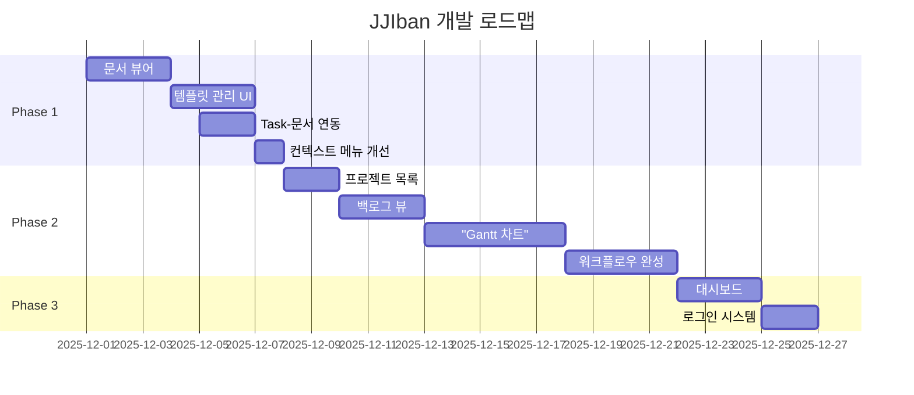

# JJIban 프로젝트 구현 계획

**계획 수립일**: 2025-11-30  
**목표**: PRD 및 설계 문서의 모든 기능 완전 구현  
**기준 문서**: 미구현_기능_분석.md

---

## 📌 전체 로드맵



---

## 🎯 Phase 1: 핵심 기능 구현 (1-2주)

### 목표
LLM 통합의 핵심 가치를 실현하고, Task와 문서가 원활하게 연동되는 환경 구축

---

### Task 1: 문서 뷰어 구현 ⭐⭐⭐⭐⭐
**예상 소요**: 2-3일  
**우선순위**: CRITICAL  
**의존성**: 없음 (독립적 개발 가능)

#### 1.1 Markdown 뷰어 컴포넌트
```typescript
// /frontend/src/features/doc-viewer/ui/MarkdownViewer.tsx
```

**구현 내용**:
- [ ] `react-markdown` + `remark-gfm` 통합
- [ ] 코드 하이라이팅 (`rehype-highlight`)
- [ ] Mermaid 다이어그램 렌더링
- [ ] KaTeX 수식 렌더링 (`remark-math` + `rehype-katex`)
- [ ] 목차(TOC) 자동 생성
- [ ] 다크모드 지원

**필요 패키지**:
```bash
npm install react-markdown remark-gfm rehype-highlight rehype-katex remark-math mermaid
```

#### 1.2 파일 네비게이터
```typescript
// /frontend/src/features/doc-viewer/ui/FileNavigator.tsx
```

**구현 내용**:
- [ ] 트리 뷰 구조 (폴더/파일)
- [ ] 파일 검색 기능
- [ ] 최근 파일 목록
- [ ] 파일 클릭 시 뷰어에 로드

#### 1.3 Document API 연동
```typescript
// /frontend/src/features/doc-viewer/api/documentApi.ts
```

**엔드포인트**:
- `GET /api/issues/:issueId/documents` - 이슈 문서 목록
- `GET /api/documents/content?path=...` - 문서 내용 조회

#### 1.4 Task 상세 화면 통합
- [ ] KanbanBoard에서 카드 클릭 시 이슈 상세 모달/사이드패널 열기
- [ ] 이슈 상세 화면에 문서 뷰어 탭 추가
- [ ] 문서 목록 + 선택한 문서 미리보기

---

### Task 2: 프롬프트 템플릿 관리 UI ⭐⭐⭐⭐⭐
**예상 소요**: 2-3일  
**우선순위**: CRITICAL  
**의존성**: 백엔드 API 이미 구현됨

#### 2.1 템플릿 목록 화면
```typescript
// /frontend/src/features/template-manager/ui/TemplateList.tsx
```

**구현 내용**:
- [ ] 템플릿 목록 테이블
- [ ] 검색 및 필터링 (이름, LLM 타입, 활성화 여부)
- [ ] 생성/수정/삭제 버튼
- [ ] 활성화/비활성화 토글

#### 2.2 템플릿 편집기
```typescript
// /frontend/src/features/template-manager/ui/TemplateEditor.tsx
```

**구현 내용**:
- [ ] 폼 기반 입력
  - 이름, 설명
  - LLM 타입 선택 (claude, gemini, codex)
  - 활성화 컬럼 (multi-select)
  - 활성화 이슈 타입 (multi-select)
- [ ] 프롬프트 텍스트 에디터
  - Syntax highlighting (Handlebars 문법)
  - 변수 자동완성 (`{{task.}}` 입력 시)
- [ ] 변수 정의 섹션 (JSON 편집)

#### 2.3 템플릿 미리보기
```typescript
// /frontend/src/features/template-manager/ui/TemplatePreview.tsx
```

**구현 내용**:
- [ ] 샘플 Task 선택
- [ ] 변수 치환 결과 실시간 표시
- [ ] 테스트 실행 버튼 (실제 터미널로 전송)

#### 2.4 API 연동
```typescript
// /frontend/src/features/template-manager/api/templateApi.ts
```

**엔드포인트**:
- `GET /api/projects/:projectId/templates`
- `POST /api/projects/:projectId/templates`
- `PUT /api/templates/:id`
- `DELETE /api/templates/:id`

---

### Task 3: Task-문서 자동 연동 ⭐⭐⭐⭐
**예상 소요**: 1-2일  
**우선순위**: HIGH  
**의존성**: 백엔드 DocumentService 수정 필요

#### 3.1 Backend - 자동 폴더 생성
```typescript
// /backend/src/document/document.service.ts
```

**구현 내용**:
- [ ] `createTaskFolder(issue: Issue)` 메서드
  - `/docs/tasks/{TASK-ID}/` 폴더 생성
  - 권한 설정 (755)
- [ ] Issue 생성 Hook에서 자동 호출
```typescript
// /backend/src/issue/issue.service.ts
async create(dto: CreateIssueDto) {
  const issue = await this.prisma.issue.create({ ... });
  await this.documentService.createTaskFolder(issue);
  return issue;
}
```

#### 3.2 Backend - 파일명 생성 헬퍼
```typescript
// /backend/src/document/utils/filename.util.ts
```

**구현 내용**:
- [ ] `generateDocumentFilename()` 함수
  - 형식: `{Task ID}-{Task 제목}-{문서유형}-{LLM모델명}-{순번}.md`
  - 예: `Task-001-로그인화면-design-claude4-1.md`
- [ ] 자동 순번 증가 로직

#### 3.3 Frontend - 새 문서 생성 UI
- [ ] 이슈 상세 화면에 "새 문서 생성" 버튼
- [ ] 문서 유형 선택 (design, code-review, test-report)
- [ ] 자동으로 파일명 제안

---

### Task 4: 컨텍스트 메뉴 동적 로딩 ⭐⭐⭐⭐
**예상 소요**: 1일  
**우선순위**: HIGH  
**의존성**: Task 2 (템플릿 관리)와 병렬 가능

#### 4.1 Backend - 컨텍스트 메뉴 API
```typescript
// /backend/src/issue/issue.controller.ts
@Get(':id/context-menu')
async getContextMenu(@Param('id') id: string) {
  return this.issueService.getContextMenu(id);
}
```

**구현 내용**:
- [ ] 이슈의 현재 `status` 확인
- [ ] `visible_columns`에 현재 status가 포함된 템플릿만 필터링
- [ ] `visible_types`에 이슈 타입이 포함된 템플릿만 필터링
- [ ] 활성화된 템플릿만 반환

#### 4.2 Frontend - 동적 메뉴 렌더링
```typescript
// /frontend/src/features/kanban-board/ui/IssueCard.tsx
```

**구현 내용**:
- [ ] 카드 우클릭 시 `/api/issues/:id/context-menu` 호출
- [ ] 응답받은 템플릿 목록으로 메뉴 생성
- [ ] 템플릿 선택 시:
  1. 템플릿 변수 치환
  2. WebSocket으로 터미널 시작 (`terminal:start`)
  3. 프롬프트 자동 전송

---

## 🎯 Phase 2: 관리 기능 확장 (2-3주)

### Task 5: 프로젝트 목록 화면 ⭐⭐⭐
**예상 소요**: 1-2일

#### 구현 내용:
- [ ] `/` 경로에 프로젝트 목록 페이지
- [ ] 프로젝트 카드 레이아웃
- [ ] "새 프로젝트" 생성 모달
- [ ] 프로젝트 선택 → 칸반 보드로 이동

---

### Task 6: 백로그 뷰 ⭐⭐⭐
**예상 소요**: 2-3일

#### 구현 내용:
- [ ] 테이블 형식 이슈 목록
- [ ] 고급 필터링 UI
- [ ] 정렬 기능 (컬럼 헤더 클릭)
- [ ] 벌크 수정 (체크박스 선택 + 일괄 수정)
- [ ] 페이지네이션

---

### Task 7: Gantt 차트 ⭐⭐⭐
**예상 소요**: 4-5일

#### 7.1 라이브러리 선택 및 통합
**권장**: Frappe Gantt (MIT 라이선스, 가볍고 React 통합 용이)

```bash
npm install frappe-gantt
```

#### 7.2 구현 내용:
- [ ] Gantt 차트 컴포넌트
- [ ] 이슈 데이터 → Gantt 형식 변환
- [ ] 드래그로 일정 변경 → API 호출
- [ ] 계층 구조 표시 (Epic > Feature > Story > Task)
- [ ] 줌 레벨 (일/주/월)
- [ ] 필터링 UI

---

### Task 8: 워크플로우 자동화 완성 ⭐⭐⭐⭐⭐
**예상 소요**: 3-4일

#### 8.1 Backend - JobExecutor 구현
```typescript
// /backend/src/workflow/workflow.service.ts
```

**구현 내용**:
- [ ] `executeJob(jobId)` 메인 루프
- [ ] `runStep(step)` 단계별 실행
  - 템플릿 로드
  - 터미널 세션 생성
  - LLM 실행
  - Exit Code 확인
  - 결과 저장
- [ ] `transitionNext(job)` 다음 단계 전환
  - 완전 자동: 즉시 진행
  - 반자동: waiting_approval 상태 전환

#### 8.2 Frontend - WorkflowPanel 개선
```typescript
// /frontend/src/features/workflow/ui/WorkflowPanel.tsx
```

**구현 내용**:
- [ ] 실시간 진행 상태 표시 (프로그레스 바)
- [ ] 단계별 카드 (pending/running/success/failed)
- [ ] 승인 버튼 (반자동 모드)
- [ ] 로그 보기 버튼
- [ ] 중단/재시작 버튼

---

## 🎯 Phase 3: UX 향상 (3-4주)

### Task 9: 대시보드 ⭐⭐
**예상 소요**: 2-3일

#### 구현 내용:
- [ ] 프로젝트 요약 통계
- [ ] 내가 담당한 이슈 목록
- [ ] 최근 활동 타임라인
- [ ] 차트 (진행률, 이슈 타입별 분포)

---

### Task 10: 로그인 시스템 ⭐
**예상 소요**: 1-2일

#### 구현 내용:
- [ ] 로그인 페이지 UI
- [ ] JWT 토큰 저장 (localStorage)
- [ ] PrivateRoute 컴포넌트
- [ ] 자동 로그아웃 (토큰 만료)

---

### Task 11: 마일스톤 관리 ⭐
**예상 소요**: 1-2일

#### 구현 내용:
- [ ] 마일스톤 CRUD
- [ ] 마일스톤별 이슈 그룹핑
- [ ] 진행률 표시

---

### Task 12: 알림 시스템 ⭐
**예상 소요**: 1-2일

#### 구현 내용:
- [ ] 이슈 할당 시 알림
- [ ] 워크플로우 승인 대기 알림
- [ ] 실시간 토스트 알림

---

## 📊 진행 상황 추적

### 체크리스트

#### Phase 1 (핵심 기능)
- [ ] 문서 뷰어
  - [ ] Markdown 렌더링
  - [ ] 파일 네비게이터
  - [ ] API 연동
- [ ] 프롬프트 템플릿 관리
  - [ ] 목록 화면
  - [ ] 편집기
  - [ ] 미리보기
- [ ] Task-문서 자동 연동
  - [ ] 자동 폴더 생성
  - [ ] 파일명 규칙
- [ ] 컨텍스트 메뉴 동적 로딩

#### Phase 2 (관리 기능)
- [ ] 프로젝트 목록
- [ ] 백로그 뷰
- [ ] Gantt 차트
- [ ] 워크플로우 완성

#### Phase 3 (UX 향상)
- [ ] 대시보드
- [ ] 로그인 시스템
- [ ] 마일스톤
- [ ] 알림

---

## 🚀 개발 시작 가이드

### 1단계: 개발 환경 확인
```bash
# 현재 서버 실행 중 확인
# Backend: http://localhost:3000
# Frontend: http://localhost:5173
```

### 2단계: 브랜치 전략
```bash
# 기능별 브랜치 생성
git checkout -b feature/doc-viewer
git checkout -b feature/template-manager
git checkout -b feature/workflow-automation
```

### 3단계: Task 1 착수 (문서 뷰어)
```bash
cd frontend
npm install react-markdown remark-gfm rehype-highlight rehype-katex remark-math mermaid

# 컴포넌트 생성
mkdir -p src/features/doc-viewer/{ui,hooks,api}
touch src/features/doc-viewer/ui/MarkdownViewer.tsx
touch src/features/doc-viewer/ui/FileNavigator.tsx
touch src/features/doc-viewer/api/documentApi.ts
```

---

## 📝 참고 사항

### 코딩 가이드라인
1. **TypeScript 엄격 모드** 준수
2. **Container-Presentational 패턴** 적용
3. **Custom Hook**으로 로직 분리
4. **DTO 검증** 필수 (class-validator)
5. **에러 처리** 표준화

### 테스트 전략
- 각 Feature 완성 시 수동 테스트
- Phase 완료 시 통합 테스트
- 최종 릴리즈 전 E2E 테스트

### 문서화
- 각 Feature 완성 시 README 업데이트
- API 변경 시 03_api_specification.md 업데이트
- 주요 결정사항은 ADR(Architecture Decision Record) 작성

---

**작성자**: Antigravity AI  
**최종 업데이트**: 2025-11-30  
**Next Milestone**: Phase 1 완료 (예상 2주)
