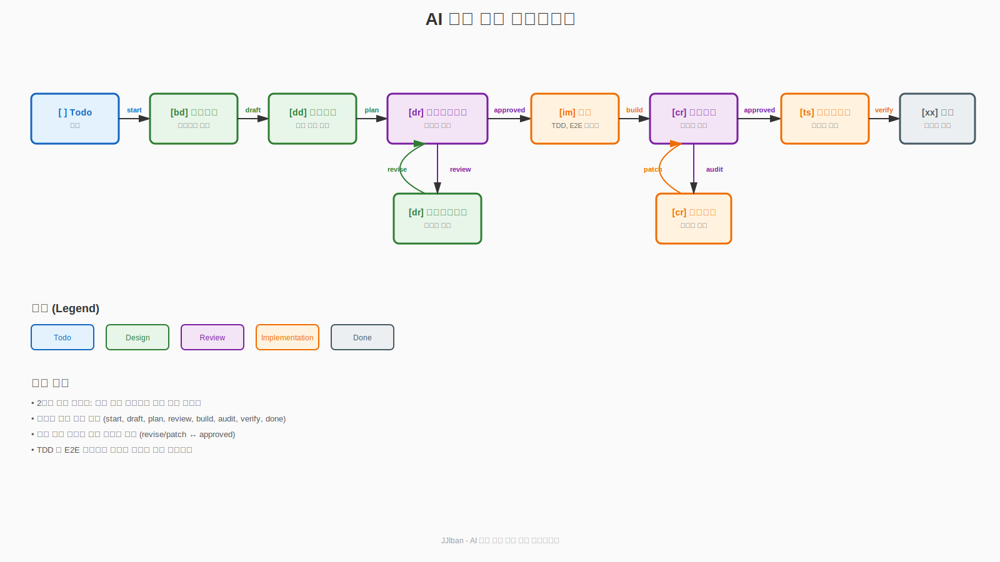

# PRD: jjiban (찌반) - AI-Assisted Development Kanban Tool

## 문서 정보

| 항목 | 내용 |
|------|------|
| 문서 버전 | 1.7 |
| 작성일 | 2024-12-05 |
| 상태 | Draft |
| 최근 변경 | npm CLI 패키지 배포 방식 추가 |

---

## 1. 제품 개요

### 1.1 제품 비전

**"jjiban - LLM과 함께 개발하는 차세대 프로젝트 관리 도구"**

개발팀의 프로젝트 관리와 AI 기반 개발 자동화를 통합한 온프레미스 칸반 도구. 기존 프로젝트 관리 도구(Redmine, OpenProject)의 기능에 LLM CLI(Claude Code, Gemini CLI, 로컬 LLM 등)를 직접 통합하여 **설계, 구현, 리뷰, 테스트 전 과정을 AI와 협업**할 수 있는 환경을 제공합니다.

> **jjiban(찌반)**: 칸반(Kanban)에서 영감을 받은 이름. "찌"는 한국어의 친근한 느낌을 담고 있습니다.

### 1.2 핵심 차별점

| 기존 도구 | jjiban |
|----------|--------|
| 이슈 추적 + 수동 작업 | 이슈 추적 + **LLM 자동화** |
| 외부 터미널에서 작업 | **웹 내장 터미널**에서 LLM 실행 |
| 문서는 별도 관리 | **Task별 문서 자동 연동** |
| 수동 상태 전환 | **워크플로우 기반 자동화** |
| 단계별 수동 실행 | **원클릭 전자동 워크플로우** |

### 1.3 타겟 사용자

- **주 사용자**: 중규모 개발팀 (10-50명)
- **환경**: 온프레미스 배포
- **사용 시나리오**:
  - AI 기반 코드 작성 및 리뷰
  - 자동화된 설계 문서 생성
  - LLM을 활용한 테스트 코드 작성
  - 프로젝트 전체 진행 상황 추적

---

## 2. 핵심 개념 이해

### 2.1 이슈 타입 체계

jjiban은 **4단계 계층 구조**로 프로젝트를 관리합니다.

#### 2.1.1 계층 구조 개요

```
📦 Epic (프로젝트)
│   대규모 기능/목표 (1~24개월 단위)
│   예: "MES 시스템 구축"
│
├── 📋 Feature (Chain)
│   │   출시 가능한 기능 단위
│   │   예: "부재료 관리"
│   │
│   ├── 📖 User Story (Module)
│   │   │   사용자 관점 요구사항
│   │   │   예: "입고 관리"
│   │   │
│   │   ├── ✅ Task (실제 작업 단위)
│   │   │   구체적 개발 작업 - LLM 실행의 핵심 단위
│   │   │   예: "입고 공통 프로시저 구현"
│   │   │
│   │   └── 🐛 Bug
│   │       버그 수정
│   │
│   └── 🔧 Technical Task
│       비기능 작업 (리팩토링, 인프라)

└── 🔬 Spike
    기술 조사/PoC (시간 제한)

🎯 Milestone
    시간 기반 릴리즈 마커
```

#### 2.1.2 실제 사용 예시 (MES 구축)

```
📦 Epic: "MES 구축"
│
├── 📋 Feature: "부재료 관리"
│   │
│   ├── 📖 User Story: "입고 관리"
│   │   │
│   │   ├── ✅ Task: "입고 공통 프로시저"
│   │   ├── ✅ Task: "입고 UI 화면"
│   │   └── 🐛 Bug: "입고 화면 버그 수정"
│   │
│   ├── 📖 User Story: "소모 관리"
│   │   │
│   │   └── ✅ Task: "소모 처리 프로시저"
│   │
│   └── 🔧 Technical Task: "부재료 코드 리팩토링"
│
├── 📋 Feature: "조업 관리"
│   │
│   ├── 📖 User Story: "입측 관리"
│   │   │
│   │   ├── ✅ Task: "PLTCM 입측 UI"
│   │   └── ✅ Task: "투입 공통 모듈"
│   │
│   └── 📖 User Story: "출측 관리"
│       │
│       └── ✅ Task: "검사실적 공통 모듈"
│
└── 📋 Feature: "Portal"

🎯 Milestone: "v2.0 릴리즈"
```

#### 2.1.3 계층별 크기와 역할

| 레벨 | 이슈 타입 | 다른 용어 | 규모 | 역할 |
|------|----------|----------|------|------|
| **Level 1** | Epic | Project | 가장 큼 (1-24개월) | 프로젝트 전체 비전과 목표 |
| **Level 2** | Feature | Chain | 출시 단위 (1-3개월) | 배포 가능한 독립 기능 |
| **Level 3** | User Story | Module | 요구사항 단위 (1-4주) | 사용자 관점의 기능 명세 |
| **Level 4** | Task | UI/NUI | 작업 단위 (1-5일) | **실제 코드 작성 단위** |

> **중요**: Task가 실제로 LLM이 실행되는 단위입니다. 워크플로우(Todo → 설계 → 구현 → 테스트 → 완료)는 Task 레벨에서만 적용됩니다.

#### 2.1.4 이슈 타입별 속성

| 타입 | 필수 필드 | 선택 필드 | LLM 활용 |
|------|----------|----------|----------|
| Epic | 제목, 설명, 목표일 | 담당자, 라벨 | 요구사항 분석, 작업 분해 |
| Feature | 제목, 설명, 상위 Epic | 담당자, 우선순위 | 설계 문서 생성, 테스트 계획 |
| User Story | 제목, 설명, 인수조건 | 스토리 포인트 | Story → Task 자동 분해 |
| **Task** | 제목, 설명, 문서 경로 | 예상 시간, 브랜치명 | **코드 작성, 리뷰, 테스트** |
| Bug | 제목, 재현 방법, 심각도 | 영향 범위 | 버그 분석, 수정 코드 생성 |
| Technical Task | 제목, 설명, 사유 | 영향 범위 | 리팩토링, 성능 개선 |

---

### 2.2 워크플로우 체계

#### 2.2.1 Task 워크플로우 개요

Task는 **9단계 워크플로우**를 거쳐 완료됩니다. 각 단계는 **명령어**로 전환되며, **자동으로 문서가 생성**됩니다.



| 단계 | 상태 기호 | 명령어 | 설명 | 생성/수정 문서 |
|------|----------|--------|------|----------------|
| 1 | `[ ]` Todo | `start` | PRD 작성 (수작업 또는 LLM) | `00-prd.md` |
| 2 | `[bd]` 기본설계 | `draft` | 요구사항 분석, 비즈니스 설계 | `01-basic-design.md` |
| 3 | `[dd]` 상세설계 | `plan` | 기술 스택 제안, 상세 설계 | `02-detail-design.md` (초안) |
| 4 | `[dr]` 상세설계리뷰 | `review` | 설계 검증, 개선점 도출 | `03-detail-design-review-{llm}-{n}.md` |
| 5 | `[dr]` 상세설계개선 | `revise` | **리뷰 피드백 반영, `02-detail-design.md` 직접 수정** | `02-detail-design.md` (수정)<br>`.archive/02-detail-design-v{n}.md` (백업) |
| 6 | `[im]` 구현 | `build` | 코드 작성, TDD, E2E 테스트 | `05-implementation.md`<br>`05-tdd-test-results.md`<br>`05-e2e-test-results.md` |
| 7 | `[cr]` 코드리뷰 | `audit` | 코드-설계 일치성 검증 | `06-code-review-{llm}-{n}.md` |
| 8 | `[cr]` 개선적용 | `patch` | **리뷰 반영, `05-implementation.md` 직접 수정** | `05-implementation.md` (수정)<br>`.archive/05-implementation-v{n}.md` (백업) |
| 9 | `[ts]` 통합테스트 | `verify` | 통합 테스트 실행 | `08-integration-test.md` |
| 10 | `[xx]` 완료 | `done` | 매뉴얼 작성 | `09-manual.md` |

#### 2.2.2 워크플로우 상세 흐름

##### Phase 1: 초기 설계 (Linear Flow)

```
[Todo] --start--> [기본설계] --draft--> [상세설계] --plan--> [상세설계리뷰]
```

- **Todo**: PRD 문서 작성
- **기본설계**: 비즈니스 관점의 설계
- **상세설계**: 기술 스택 및 상세 명세

##### Phase 2: 설계 리뷰 사이클 (Quality Gate #1)

```
                    ┌─────────────────┐
                    │  상세설계리뷰    │ ← LLM이 설계 검증
                    └────┬────────┬───┘
                  review │        │ approved
                    (변경요청)     (승인)
                         │        │
                         ▼        ▼
            ┌────────────────────┐  [구현]
            │ 02-detail-design.md│ ← 원본 파일을 직접 수정
            │    직접 수정       │   (.archive에 백업)
            └────────┬───────────┘
                 revise│
                  (재검토)
                     │
                (승인될 때까지 반복)
```

**핵심**:
- 설계가 승인(`approved`)될 때까지 `review → revise` 사이클 반복
- `revise` 시 **`02-detail-design.md`를 직접 수정** (별도 개선 파일 생성 안 함)
- 수정 전 `.archive/02-detail-design-v{n}.md`로 백업 (선택적)

##### Phase 3: 구현

```
[상세설계리뷰] --approved--> [구현] --build--> [코드리뷰]
```

- TDD 기반 코드 작성 → `05-tdd-test-results.md`
- E2E 테스트 수행 → `05-e2e-test-results.md`
- 구현 문서 자동 생성 → `05-implementation.md`

##### Phase 4: 코드 리뷰 사이클 (Quality Gate #2)

```
                    ┌─────────────┐
                    │  코드리뷰    │ ← LLM이 코드 검증
                    └────┬────┬───┘
                   audit │    │ approved
                   (변경요청)  (승인)
                         │    │
                         ▼    ▼
            ┌────────────────────┐  [통합테스트]
            │05-implementation.md│ ← 원본 파일을 직접 수정
            │    직접 수정       │   (.archive에 백업)
            └────────┬───────────┘
                 patch│
                  (재검토)
                     │
                (승인될 때까지 반복)
```

**핵심**:
- 코드가 승인(`approved`)될 때까지 `audit → patch` 사이클 반복
- `patch` 시 **`05-implementation.md`를 직접 수정** (별도 개선 파일 생성 안 함)
- 수정 전 `.archive/05-implementation-v{n}.md`로 백업 (선택적)

##### Phase 5: 최종 검증 및 완료

```
[코드리뷰] --approved--> [통합테스트] --verify--> [완료]
```

- 통합 테스트 실행
- 사용자/개발자 매뉴얼 작성
- 작업 완료

#### 2.2.3 품질 게이트 (Quality Gates)

워크플로우에는 **2개의 필수 품질 게이트**가 있습니다:

| 게이트 | 위치 | 검증 내용 | 진입 | 탈출 |
|--------|------|----------|------|------|
| **설계 리뷰 게이트** | Phase 2 | 설계 완전성, 일치성, 타당성 | `plan` | `approved` |
| **코드 리뷰 게이트** | Phase 4 | 코드 품질, 설계-구현 일치성 | `build` | `approved` |

**핵심 원칙**:
1. ✅ 모든 작업은 반드시 **2개의 품질 게이트**를 통과
2. ✅ 리뷰 사이클은 **승인될 때까지 무한 반복** 가능
3. ✅ 각 단계는 **명령어로만 전환** (수동 스킵 불가)
4. ✅ LLM이 **자동으로 리뷰 및 개선** 수행
5. ✅ 각 단계마다 **자동으로 문서 생성**

---

### 2.3 문서 관리 체계

#### 2.3.1 하이브리드 방식 (DB + File System)

jjiban은 **데이터베이스**와 **파일 시스템**을 결합하여 프로젝트를 관리합니다.

| 저장소 | 역할 | 관리 대상 | 도구 |
|--------|------|----------|------|
| **SQLite DB** | 메타데이터 & WBS | 이슈 정보, 상태, 담당자, 일정, 계층 관계 | Prisma ORM |
| **File System** | 문서 & 컨텐츠 | PRD, 설계서, 리뷰 문서, 코드, 로그 | Git 버전 관리 |

#### 2.3.2 폴더 구조

```
C:/project/jjiban/
├── projects/                                      # 프로젝트 문서 루트
│   └── {epic-id}-{epic-name}/                     # Epic 폴더
│       ├── epic-prd.md                            # Epic PRD
│       │
│       └── {chain-id}-{chain-name}/               # Chain 폴더
│           ├── chain-prd.md                       # Chain PRD
│           ├── chain-basic-design.md              # Chain 기본설계
│           │
│           └── {module-id}-{module-name}/         # Module 폴더
│               ├── module-prd.md                  # Module PRD
│               ├── module-basic-design.md         # Module 기본설계
│               │
│               └── {task-id}-{task-name}/         # Task 폴더
│                   ├── 00-prd.md                  # Task PRD
│                   ├── 01-basic-design.md         # 기본설계
│                   ├── 02-detail-design.md        # 상세설계 (최신 버전)
│                   ├── 03-detail-design-review-{llm}-{n}.md  # 설계 리뷰
│                   ├── 05-implementation.md       # 구현 코드 설명 (최신 버전)
│                   ├── 05-tdd-test-results.md     # TDD 테스트 결과
│                   ├── 05-e2e-test-results.md     # E2E 테스트 결과
│                   ├── 06-code-review-{llm}-{n}.md  # 코드 리뷰
│                   ├── 08-integration-test.md     # 통합 테스트
│                   ├── 09-manual.md               # 매뉴얼
│                   ├── .archive/                  # 이전 버전 백업 (선택적)
│                   │   ├── 02-detail-design-v1-{timestamp}.md
│                   │   └── 05-implementation-v1-{timestamp}.md
│                   └── logs/
│
├── templates/                                     # 문서 템플릿
│   ├── epic-prd-template.md
│   ├── chain-prd-template.md
│   └── ...
│
└── .jjiban/                                      # 시스템 설정
    ├── config.yaml
    ├── llm-config.yaml
    └── jjiban.db                                 # SQLite 데이터베이스
```

#### 2.3.3 문서 네이밍 규칙

**계층별 문서:**

| 레벨 | 폴더 형식 | PRD 문서 | 기본설계 문서 |
|------|----------|----------|---------------|
| Epic | `{epic-id}-{epic-name}/` | `epic-prd.md` | - |
| Chain | `{chain-id}-{chain-name}/` | `chain-prd.md` | `chain-basic-design.md` |
| Module | `{module-id}-{module-name}/` | `module-prd.md` | `module-basic-design.md` |
| Task | `{task-id}-{task-name}/` | `00-prd.md` | `01-basic-design.md` |

**Task 워크플로우 문서:**

| 번호 | 단계 | 파일명 | 설명 | 버전 관리 |
|------|------|--------|------|-----------|
| `00` | PRD | `00-prd.md` | Task 요구사항 | 단일 버전 |
| `01` | 기본설계 | `01-basic-design.md` | 비즈니스 설계 | 단일 버전 |
| `02` | 상세설계 | `02-detail-design.md` | 기술 명세 (최신 버전) | **직접 수정** + Git |
| `03` | 설계 리뷰 | `03-detail-design-review-{llm}-{n}.md` | LLM별 리뷰 (다중) | 순차 누적 |
| `05` | 구현 | `05-implementation.md` | 코드 설명 (최신 버전) | **직접 수정** + Git |
| `05` | TDD 테스트 | `05-tdd-test-results.md` | TDD 단위 테스트 결과 | 단일 버전 |
| `05` | E2E 테스트 | `05-e2e-test-results.md` | E2E 통합 테스트 결과 | 단일 버전 |
| `06` | 코드 리뷰 | `06-code-review-{llm}-{n}.md` | LLM별 리뷰 (다중) | 순차 누적 |
| `08` | 통합 테스트 | `08-integration-test.md` | 통합 테스트 결과 | 단일 버전 |
| `09` | 매뉴얼 | `09-manual.md` | 사용자 매뉴얼 | 단일 버전 |

**백업 (선택적):**
| 폴더 | 파일 | 용도 |
|------|------|------|
| `.archive/` | `02-detail-design-v{n}-{timestamp}.md` | 상세설계 이전 버전 백업 |
| `.archive/` | `05-implementation-v{n}-{timestamp}.md` | 구현 이전 버전 백업 |

**네이밍 규칙 장점:**
- ✅ 번호 prefix로 파일 정렬 시 워크플로우 순서 유지
- ✅ LLM명과 순번으로 리뷰 다중 버전 관리
- ✅ **Working Copy 방식**: 항상 최신 파일 명확
- ✅ Git + 선택적 `.archive`로 이력 관리
- ✅ 간결하고 직관적

#### 2.3.4 문서 작성 흐름

```
Epic PRD (프로젝트 비전)
  ↓ 상세화 (LLM 활용)
Chain PRD + Chain 기본설계 (Feature 요구사항)
  ↓ 상세화 (LLM 활용)
Module PRD + Module 기본설계 (User Story 명세)
  ↓ 상세화 (LLM 활용)
Task PRD + 워크플로우 실행 (구현)
```

**각 레벨별 역할:**

| 레벨 | 문서 | 목적 | 작성 시점 |
|------|------|------|-----------|
| Epic | `epic-prd.md` | 프로젝트 전체 비전과 범위 | 프로젝트 시작 시 |
| Chain | `chain-prd.md`<br>`chain-basic-design.md` | Feature 요구사항, 아키텍처 | Epic PRD 기반 생성 |
| Module | `module-prd.md`<br>`module-basic-design.md` | User Story 명세, 화면/API 설계 | Chain PRD 기반 생성 |
| Task | `00-prd.md`<br>`01-basic-design.md` | 작업 상세, 구현 기술 | Module PRD 기반 생성 |

#### 2.3.5 WBS 자동 생성 및 DB Merge

**개요**: PRD 문서나 UI/NUI 리스트를 파싱하여 자동으로 WBS를 생성하고 DB에 동기화합니다.

**명령어:**

```bash
# Epic PRD에서 Chain 목록 추출 → DB 생성/업데이트
jjiban wbs sync --epic epic-prd.md

# Chain PRD에서 Module 목록 추출 → DB 생성/업데이트
jjiban wbs sync --chain chain-prd.md

# Module PRD에서 Task 목록 추출 → DB 생성/업데이트
jjiban wbs sync --module module-prd.md

# 전체 프로젝트 동기화
jjiban wbs sync --all --project EPIC-001
```

**문서 파싱 포맷 예시:**

```markdown
# Epic: MES 구축

## Chain 목록
- [ ] CHAIN-001: 부재료 관리 (PL: 홍길동, 2024-01-15 ~ 2024-03-31)
- [ ] CHAIN-002: 조업 관리 (PL: 김철수, 2024-02-01 ~ 2024-06-30)
```

**Merge 전략:**

| 상황 | 동작 | 우선순위 |
|------|------|----------|
| ID가 DB에 없음 | INSERT | 문서 |
| ID가 DB에 있음 | UPDATE | 문서 (이름, 설명) + DB (진행 상태) |
| 문서에 없는 ID | 유지 또는 archived | DB |

---

## 3. 사용자 관점 기능

### 3.1 칸반 보드

#### 3.1.1 화면 구성

```
┌────────────────────────────────────────────────────────────────────────────┐
│ 🏠 jjiban > Project Alpha > 칸반 보드                                      │
├────────────────────────────────────────────────────────────────────────────┤
│ [필터: 담당자 ▼] [타입 ▼] [라벨 ▼]           🔍 검색...      [+ 새 이슈]  │
├────────────────────────────────────────────────────────────────────────────┤
│                                                                            │
│ ┌──────────┐ ┌──────────┐ ┌──────────┐ ┌──────────┐ ┌──────────┐          │
│ │ 상세설계 │ │ 설계리뷰 │ │ 구현     │ │ 코드리뷰 │ │ 완료     │          │
│ │    3     │ │    2     │ │    4     │ │    2     │ │   10     │          │
│ ├──────────┤ ├──────────┤ ├──────────┤ ├──────────┤ ├──────────┤          │
│ │┌────────┐│ │┌────────┐│ │┌────────┐│ │┌────────┐│ │┌────────┐│          │
│ ││TASK-101││ ││TASK-098││ ││TASK-089││ ││TASK-087││ ││TASK-075││          │
│ ││────────││ ││────────││ ││────────││ ││────────││ ││────────││          │
│ ││OAuth   ││ ││결제 API││ ││대시보드││ ││검색    ││ ││인증    ││          │
│ ││구현    ││ ││연동    ││ ││차트    ││ ││기능    ││ ││완료    ││          │
│ ││        ││ ││        ││ ││        ││ ││        ││ ││        ││          │
│ ││✅ Task ││ ││✅ Task ││ ││✅ Task ││ ││✅ Task ││ ││✅ Task ││          │
│ ││👤 홍길동││ ││👤 김철수││ ││👤 홍길동││ ││👤 박민수││ ││👤 이영희││          │
│ │└────────┘│ │└────────┘│ │└────────┘│ │└────────┘│ │└────────┘│          │
│ └──────────┘ └──────────┘ └──────────┘ └──────────┘ └──────────┘          │
│                                                                            │
└────────────────────────────────────────────────────────────────────────────┘
```

#### 3.1.2 주요 기능

- **드래그 앤 드롭**: 카드를 드래그하여 상태 변경
- **필터링**: 담당자, 이슈 타입, 라벨별 필터
- **검색**: 제목, 설명, ID로 검색
- **컨텍스트 메뉴**: 카드 우클릭 → LLM 명령어 실행

#### 3.1.3 카드 컨텍스트 메뉴

```
┌────────────────────────────────┐
│ TASK-101: OAuth 구현           │
├────────────────────────────────┤
│ 🤖 LLM 명령어                  │
│ ├── 설계 문서 초안 생성        │
│ ├── 요구사항 분석              │
│ ├── 기술 스택 제안             │
│ └── 보안 검토 요청             │
├────────────────────────────────┤
│ 📄 문서                        │
│ ├── design.md 열기             │
│ └── 새 문서 생성               │
├────────────────────────────────┤
│ 📋 이동                        │
│ ├── → 설계리뷰                 │
│ └── → 상세설계 (되돌리기)      │
├────────────────────────────────┤
│ ✏️ 편집                        │
│ 🗑️ 삭제                        │
└────────────────────────────────┘
```

---

### 3.2 Gantt 차트

#### 3.2.1 화면 레이아웃

```
┌────────────────────────────────────────────────────────────────────────────────────┐
│ 🏠 jjiban > Project Alpha > Gantt 차트                                             │
├────────────────────────────────────────────────────────────────────────────────────┤
│ [+ 만들기 ▼] [프로젝트 포함 ▼] [기준선 ▼] [필터 ▼]    🔍 검색...    [⬚][🔍+][🔍-] │
├──────────────────────────────────────────┬─────────────────────────────────────────┤
│                                          │          11월 2025        12월 2025     │
│ ID   타입          제목        상태      │ 47  48  49  50  51  01  02  03  04  05  │
├──────────────────────────────────────────┼─────────────────────────────────────────┤
│                                          │                                         │
│ 16  📦 EPIC       ▼ New website  지정됨  │ ████████████████████████████████████    │
│                                          │                                         │
│ 22   📋 FEATURE    Feature carousel      │     ████████                            │
│                                          │                                         │
│ 18   📖 USER STORY  Product tour  New    │         ████████████                    │
│                                          │                                         │
│ 20    ✅ TASK       Wireframes   진행중  │                         ████████        │
│                                          │                                         │
│ 32  🎯 MILESTONE   Release v1.0  New     │                         ◆               │
│                                          │                                         │
└──────────────────────────────────────────┴─────────────────────────────────────────┘
```

#### 3.2.2 주요 기능

| 기능 | 설명 |
|------|------|
| **계층 구조** | Epic → Feature → User Story → Task 펼침/접힘 |
| **타임라인 시각화** | 일정, 진행률, 의존성 표시 |
| **드래그 일정 조정** | 바를 드래그하여 시작/종료일 변경 |
| **필터링** | 타입, 담당자, 상태, 날짜 범위 |
| **내보내기** | PNG, PDF, CSV |

---

### 3.3 Task 상세 및 문서 연동

#### 3.3.1 Task 상세 화면

```
┌────────────────────────────────────────────────────────────────────┐
│ TASK-001: Google OAuth 인증 구현                    [상세설계] ▼   │
├────────────────────────────────────────────────────────────────────┤
│                                                                    │
│  ┌──────────────────────┐  ┌────────────────────────────────────┐ │
│  │ [기본 정보]          │  │ [문서]                        [+]  │ │
│  │                      │  │                                    │ │
│  │ 담당자: 홍길동       │  │  📄 00-prd.md                      │ │
│  │ 상태: 상세설계       │  │  📄 01-basic-design.md             │ │
│  │ 우선순위: High       │  │  📄 02-detail-design.md            │ │
│  │ 브랜치: feature/auth │  │                                    │ │
│  │                      │  │  [문서 미리보기]                   │ │
│  │ [설명]               │  │  ┌──────────────────────────────┐  │ │
│  │ Google OAuth 2.0을   │  │  │ # 상세설계: Google OAuth    │  │ │
│  │ 사용한 소셜 로그인   │  │  │                              │  │ │
│  │ 기능을 구현한다.     │  │  │ ## 1. 개요                   │  │ │
│  │                      │  │  │ Google OAuth 2.0 프로토콜... │  │ │
│  │ [상위 스토리]        │  │  │                              │  │ │
│  │ US-005: 소셜 로그인  │  │  │ ## 2. 시퀀스 다이어그램     │  │ │
│  │                      │  │  │ ```mermaid                   │  │ │
│  └──────────────────────┘  │  │ sequenceDiagram              │  │ │
│                            │  │   User->>+App: Login         │  │ │
│  ┌──────────────────────┐  │  └──────────────────────────────┘  │ │
│  │ [컨텍스트 메뉴]      │  │                                    │ │
│  │                      │  └────────────────────────────────────┘ │
│  │ 🤖 설계 문서 생성    │                                        │
│  │ 🤖 요구사항 분석     │                                        │
│  │ 🤖 기술 스택 제안    │                                        │
│  └──────────────────────┘                                        │
│                                                                    │
│  ┌────────────────────────────────────────────────────────────┐   │
│  │ [LLM 터미널]                                    [전체화면]  │   │
│  │                                                              │   │
│  │ $ claude                                                     │   │
│  │ > 설계 문서를 분석하고 있습니다...                          │   │
│  │ > 02-detail-design.md 파일을 읽었습니다.                    │   │
│  │ >                                                            │   │
│  │ > ## 분석 결과                                               │   │
│  │ > 1. OAuth 플로우가 잘 정의되어 있습니다.                   │   │
│  │ > 2. 토큰 갱신 로직 추가를 권장합니다.                      │   │
│  │                                                              │   │
│  │ [입력창]                                          [전송]    │   │
│  └────────────────────────────────────────────────────────────┘   │
└────────────────────────────────────────────────────────────────────┘
```

#### 3.3.2 문서 연동 방식

1. **Task 생성 시**: `projects/{epic}/{chain}/{module}/{task-id}-{task-name}/` 폴더 자동 생성
2. **워크플로우 단계별**: 해당 단계의 문서가 Task 폴더에 자동 저장
3. **DB 참조**: Task 레코드의 `documentPath` 필드에 폴더 경로 저장
4. **실시간 연동**: 칸반 보드 UI에서 문서 목록 표시 및 뷰어로 미리보기

#### 3.3.3 문서 뷰어 기능

```
[문서 뷰어]
├── Markdown 렌더링
│   ├── GitHub Flavored Markdown
│   ├── 수식 렌더링 (KaTeX)
│   └── 체크리스트 지원
├── 코드 하이라이팅
│   ├── 다중 언어 지원
│   ├── 라인 번호 표시
│   └── 복사 버튼
├── 다이어그램 렌더링
│   ├── Mermaid 지원
│   └── 실시간 미리보기
└── 파일 네비게이션
    ├── 트리 뷰
    ├── 최근 파일
    └── 검색
```

---

### 3.4 LLM 통합 웹 터미널

#### 3.4.1 개요

칸반 카드의 컨텍스트 메뉴에서 LLM 명령어를 선택하면 웹 터미널이 열리고, 미리 등록된 프롬프트 템플릿이 로드되어 LLM CLI가 실행됩니다.

#### 3.4.2 지원 LLM CLI

| LLM | CLI 도구 | 실행 방식 |
|-----|---------|-----------|
| Claude | Claude Code | `claude` |
| Gemini | Gemini CLI | `gemini` |
| OpenAI | Codex CLI | `codex` |

#### 3.4.3 주요 기능

```
[필수 기능]
├── 실시간 출력 스트리밍 (WebSocket)
├── 대화형 입력 지원 (Y/N 확인, 추가 질문)
├── 실행 이력 및 로그 저장
├── 세션 관리 (Task별 독립 세션)
└── 실행 결과 파일 표시

[터미널 UI]
├── 전체화면 / 분할화면 모드
├── 출력 검색 및 필터링
├── 복사/붙여넣기 지원
└── 폰트 크기 및 테마 설정

[실행 결과 파일 표시]
├── LLM이 생성/수정한 파일 목록 자동 감지
├── 파일명 클릭 → 내용 미리보기 패널
├── 파일 diff 표시 (수정된 경우)
└── 파일 저장 경로 표시
```

---

### 3.5 워크플로우 자동화 (Auto-Pilot)

#### 3.5.1 개요

사용자가 "Auto-Workflow"를 시작하면, 시스템이 사전에 정의된 파이프라인에 따라 **[상세설계 → 설계리뷰 → 구현 → 코드리뷰 → 완료]**의 전 과정을 순차적으로 자동 실행합니다.

#### 3.5.2 실행 모드

**1. 완전 자동 (Fully Automated)**
- 각 단계 완료 후 사람의 개입 없이 즉시 다음 단계로 진행
- 에러 발생 시에만 중단

**2. 반자동 (Human-in-the-Loop)**
- 각 단계 완료 후 "승인 대기" 상태로 전환
- 사용자가 결과물(문서/코드)을 확인하고 승인 버튼을 눌러야 다음 단계 진행

---

## 4. 시스템 아키텍처

### 4.1 전체 구조

```
┌─────────────────────────────────────────────────────────────────────┐
│                           Frontend (React)                          │
│  ┌─────────────┐ ┌─────────────┐ ┌─────────────┐ ┌───────────────┐ │
│  │ 칸반 보드   │ │ Task 상세   │ │ 문서 뷰어   │ │ 웹 터미널     │ │
│  │ (DnD)       │ │ (Form)      │ │ (Markdown)  │ │ (xterm.js)    │ │
│  └─────────────┘ └─────────────┘ └─────────────┘ └───────────────┘ │
└─────────────────────────────────────────────────────────────────────┘
                                    │
                                    │ REST API / WebSocket
                                    ▼
┌─────────────────────────────────────────────────────────────────────┐
│                        Backend (Node.js)                            │
│  ┌─────────────┐ ┌─────────────┐ ┌─────────────┐ ┌───────────────┐ │
│  │ Project     │ │ Issue       │ │ Template    │ │ Terminal      │ │
│  │ Service     │ │ Service     │ │ Service     │ │ Service       │ │
│  └─────────────┘ └─────────────┘ └─────────────┘ └───────────────┘ │
│  ┌─────────────┐ ┌─────────────┐ ┌─────────────┐                   │
│  │ Document    │ │ LLM         │ │ Auth        │                   │
│  │ Service     │ │ Executor    │ │ Service     │                   │
│  └─────────────┘ └─────────────┘ └─────────────┘                   │
└─────────────────────────────────────────────────────────────────────┘
                                    │
              ┌─────────────────────┼─────────────────────┐
              ▼                     ▼                     ▼
┌─────────────────────┐ ┌─────────────────────┐ ┌─────────────────────┐
│    SQLite DB        │ │   File System       │ │   LLM CLI           │
│    (메타데이터)      │ │   (문서, 로그)       │ │   (고정 서버)        │
└─────────────────────┘ └─────────────────────┘ └─────────────────────┘
```

---

### 4.2 기술 스택

| 레이어 | 기술 | 비고 |
|--------|------|------|
| **Frontend** | React + TypeScript | SPA |
| UI 컴포넌트 | Ant Design / Shadcn | 칸반: react-beautiful-dnd |
| Gantt 차트 | DHTMLX Gantt / Frappe Gantt | 또는 D3.js |
| 상태 관리 | Zustand / Redux Toolkit | |
| 웹 터미널 | xterm.js | WebSocket 연동 |
| Markdown | react-markdown + remark-gfm | Mermaid: mermaid.js |
| **Backend** | Node.js (Express/Fastify) | 또는 Python (FastAPI) |
| 실시간 통신 | Socket.IO / WebSocket | 터미널 스트리밍 |
| 터미널 백엔드 | node-pty | LLM CLI 실행 |
| **Database** | SQLite (Prisma ORM) | 이슈, 프로젝트 메타데이터 |
| 파일 저장 | 로컬 파일시스템 | 문서, 로그 (Git 버전 관리) |
| 인증 | JWT + bcrypt | 세션 관리 |

---

### 4.3 데이터베이스 스키마 (SQLite + Prisma)

#### 4.3.1 Prisma Schema

```prisma
datasource db {
  provider = "sqlite"
  url      = "file:../.jjiban/jjiban.db"
}

generator client {
  provider = "prisma-client-js"
}

// Epic (프로젝트)
model Epic {
  id          String   @id @default(cuid())
  name        String
  description String?
  prdPath     String?  // epic-prd.md 경로
  startDate   DateTime?
  targetDate  DateTime?
  status      String   @default("active") // active, completed, archived
  createdAt   DateTime @default(now())
  updatedAt   DateTime @updatedAt

  chains      Chain[]
}

// Chain (Feature)
model Chain {
  id              String   @id @default(cuid())
  epicId          String
  name            String
  description     String?
  pl              String?  // Project Leader

  // 문서 경로
  prdPath         String?  // chain-prd.md 경로
  basicDesignPath String?  // chain-basic-design.md 경로

  startDate       DateTime?
  targetDate      DateTime?
  status          String   @default("planning")
  createdAt       DateTime @default(now())
  updatedAt       DateTime @updatedAt

  epic            Epic     @relation(fields: [epicId], references: [id], onDelete: Cascade)
  modules         Module[]
}

// Module (User Story)
model Module {
  id                  String   @id @default(cuid())
  chainId             String
  name                String
  userStory           String?
  assignee            String?
  acceptanceCriteria  String?  // JSON string

  // 문서 경로
  prdPath             String?  // module-prd.md 경로
  basicDesignPath     String?  // module-basic-design.md 경로

  status              String   @default("todo")
  createdAt           DateTime @default(now())
  updatedAt           DateTime @updatedAt

  chain               Chain    @relation(fields: [chainId], references: [id], onDelete: Cascade)
  tasks               Task[]
}

// Task (작업 단위)
model Task {
  id              String   @id @default(cuid())
  moduleId        String
  name            String
  description     String?
  type            String   @default("task") // task, bug, technical-task, spike

  // 워크플로우
  status          String   @default("todo")
  statusSymbol    String   @default("[ ]") // [ ], [bd], [dd], [dr], [im], [cr], [ts], [xx]

  // 담당 및 우선순위
  assignee        String?
  pl              String?
  priority        String   @default("medium") // low, medium, high, critical

  // 일정
  estimatedHours  Int?
  actualHours     Int?
  startDate       DateTime?
  dueDate         DateTime?

  // 문서 및 코드
  branchName      String?
  documentPath    String?  // Task 폴더 경로

  // 태그 및 LLM 이력 (JSON string)
  labels          String?  // JSON string
  llmExecutions   String?  // JSON string

  createdAt       DateTime @default(now())
  updatedAt       DateTime @updatedAt

  module          Module   @relation(fields: [moduleId], references: [id], onDelete: Cascade)
}
```

#### 4.3.2 SQLite 선택 이유

**장점:**
- ✅ 설정 간단: 파일 하나로 완결
- ✅ 백업 용이: `.jjiban/jjiban.db` 파일만 복사
- ✅ Git 친화적: 작은 DB 파일은 Git으로 관리 가능
- ✅ 빠른 시작: PostgreSQL 설치 불필요
- ✅ 타입 안전: Prisma의 모든 장점 활용

**제약사항:**
- 동시 접속: 10-20명까지 권장 (PRD 타겟에 적합)
- 대규모 확장 시: PostgreSQL로 마이그레이션

---

### 4.4 웹 터미널 아키텍처

```
┌──────────────┐     WebSocket      ┌──────────────┐     PTY      ┌──────────────┐
│   Browser    │◄──────────────────►│   Backend    │◄────────────►│   LLM CLI    │
│  (xterm.js)  │   bidirectional    │  (node-pty)  │   stdin/out  │(claude, etc) │
└──────────────┘                    └──────────────┘              └──────────────┘
                                           │
                                           │ 로그 저장
                                           ▼
                                    ┌──────────────┐
                                    │  File System │
                                    │  (세션 로그)  │
                                    └──────────────┘
```

---

## 5. 배포 및 설치

### 5.1 배포 방식

jjiban은 **npm CLI 패키지**로 배포되어 로컬에서 쉽게 설치하고 실행할 수 있습니다.

#### 5.1.1 배포 목표

- ✅ **간편한 설치**: `npm install -g jjiban` 또는 `npx jjiban`
- ✅ **로컬 서버 실행**: Redmine, GitLab처럼 로컬에서 독립 실행
- ✅ **프로젝트 격리**: 프로젝트별 독립적인 데이터 관리
- ✅ **제로 설정**: 데이터베이스, 서버 설정 자동화
- ✅ **크로스 플랫폼**: Windows, macOS, Linux 지원

---

### 5.2 NPM CLI 패키지 구조

#### 5.2.1 전체 구조

```
jjiban/
├── packages/
│   ├── cli/                          # CLI 도구 (배포 대상)
│   │   ├── bin/
│   │   │   └── jjiban.js             # CLI 진입점
│   │   ├── commands/
│   │   │   ├── init.js               # 프로젝트 초기화
│   │   │   ├── start.js              # 서버 시작
│   │   │   ├── stop.js               # 서버 종료
│   │   │   ├── migrate.js            # DB 마이그레이션
│   │   │   ├── status.js             # 서버 상태 확인
│   │   │   └── update.js             # 버전 업데이트 체크
│   │   ├── templates/                # 프로젝트 템플릿
│   │   │   ├── .jjiban/
│   │   │   │   ├── config.json
│   │   │   │   └── llm-config.yaml
│   │   │   ├── projects/
│   │   │   ├── templates/
│   │   │   └── .gitignore
│   │   ├── server/                   # 번들된 백엔드 (빌드 결과)
│   │   │   ├── dist/
│   │   │   │   └── main.js           # 번들된 서버
│   │   │   └── prisma/               # Prisma 스키마
│   │   ├── web/                      # 번들된 프론트엔드 (빌드 결과)
│   │   │   └── dist/                 # React 빌드 결과
│   │   └── package.json              # CLI 패키지 설정
│   │
│   ├── server/                       # 백엔드 소스 (개발용)
│   │   ├── src/
│   │   ├── prisma/
│   │   └── package.json
│   │
│   └── web/                          # 프론트엔드 소스 (개발용)
│       ├── src/
│       └── package.json
│
├── package.json                      # 루트 (monorepo)
└── README.md
```

#### 5.2.2 CLI 패키지 설정

**packages/cli/package.json:**

```json
{
  "name": "jjiban",
  "version": "1.0.0",
  "description": "AI-Assisted Development Kanban Tool",
  "bin": {
    "jjiban": "./bin/jjiban.js"
  },
  "files": [
    "bin",
    "commands",
    "templates",
    "server",
    "web"
  ],
  "keywords": ["kanban", "llm", "ai", "project-management"],
  "repository": {
    "type": "git",
    "url": "https://github.com/yourname/jjiban.git"
  },
  "engines": {
    "node": ">=18.0.0"
  },
  "dependencies": {
    "commander": "^11.0.0",
    "chalk": "^5.3.0",
    "inquirer": "^9.2.0",
    "ora": "^7.0.0"
  }
}
```

---

### 5.3 CLI 명령어 설계

#### 5.3.1 명령어 목록

| 명령어 | 설명 | 예시 |
|--------|------|------|
| `jjiban init <name>` | 새 프로젝트 초기화 | `jjiban init my-project` |
| `jjiban start` | 서버 시작 | `jjiban start -p 3000` |
| `jjiban stop` | 서버 종료 | `jjiban stop` |
| `jjiban migrate` | DB 마이그레이션 | `jjiban migrate` |
| `jjiban status` | 서버 상태 확인 | `jjiban status` |
| `jjiban update` | 업데이트 체크 | `jjiban update` |
| `jjiban --version` | 버전 확인 | `jjiban -v` |
| `jjiban --help` | 도움말 | `jjiban -h` |

#### 5.3.2 명령어 상세

**1. jjiban init \<project-name\>**

프로젝트 초기화 및 기본 구조 생성

```bash
jjiban init my-kanban-project

# 옵션
--port, -p <port>      # 서버 포트 (기본: 3000)
--template, -t <name>  # 템플릿 선택 (기본: default)
```

**실행 과정:**
1. 프로젝트 폴더 생성 (`my-kanban-project/`)
2. 템플릿 복사 (프로젝트 구조, 설정 파일)
3. `.jjiban/` 폴더 생성
4. `config.json`, `llm-config.yaml` 생성
5. SQLite DB 파일 생성 (`.jjiban/jjiban.db`)
6. Prisma 마이그레이션 실행
7. `README.md` 생성

**2. jjiban start**

서버 시작

```bash
jjiban start

# 옵션
--port, -p <port>      # 서버 포트 (기본: 3000)
--daemon, -d           # 백그라운드 실행
--open, -o             # 브라우저 자동 열기
```

**실행 과정:**
1. 설정 파일 읽기 (`.jjiban/config.json`)
2. DB 마이그레이션 실행 (필요시)
3. 백엔드 서버 시작 (Node.js)
4. 프론트엔드 정적 파일 서빙
5. 브라우저 자동 열기 (옵션)

**3. jjiban stop**

서버 종료

```bash
jjiban stop
```

**실행 과정:**
1. PID 파일 읽기 (`.jjiban/server.pid`)
2. 프로세스 종료 (SIGTERM)
3. PID 파일 삭제

**4. jjiban migrate**

DB 마이그레이션 실행

```bash
jjiban migrate

# 옵션
--reset    # DB 리셋 (모든 데이터 삭제)
```

**5. jjiban status**

서버 상태 확인

```bash
jjiban status
```

**출력 예시:**
```
✓ Server is running (PID: 12345)
✓ Port: 3000
✓ Database: .jjiban/jjiban.db (SQLite)
✓ Uptime: 2 hours 34 minutes
```

---

### 5.4 설치 및 사용 방법

#### 5.4.1 전역 설치 방식

```bash
# 1. 전역 설치
npm install -g jjiban

# 2. 프로젝트 생성
jjiban init my-kanban-project

# 3. 프로젝트 이동
cd my-kanban-project

# 4. 서버 시작
jjiban start

# 5. 브라우저 열기
open http://localhost:3000
```

#### 5.4.2 npx 방식 (설치 없이)

```bash
# 1. 프로젝트 생성 (설치 없이)
npx jjiban init my-kanban-project

# 2. 프로젝트 이동
cd my-kanban-project

# 3. 서버 시작
npx jjiban start
```

#### 5.4.3 생성된 프로젝트 구조

```
my-kanban-project/
├── .jjiban/                     # 시스템 설정 및 DB
│   ├── config.json              # 프로젝트 설정
│   ├── llm-config.yaml          # LLM 연결 설정
│   ├── jjiban.db                # SQLite 데이터베이스
│   └── server.pid               # 서버 PID (실행 중일 때)
│
├── projects/                    # 프로젝트 문서 루트
│   └── README.md
│
├── templates/                   # 문서 템플릿
│   ├── epic-prd-template.md
│   ├── chain-prd-template.md
│   └── ...
│
├── package.json                 # npm 스크립트
├── README.md                    # 프로젝트 가이드
└── .gitignore
```

#### 5.4.4 환경 설정

**`.jjiban/config.json`:**

```json
{
  "name": "my-kanban-project",
  "version": "1.0.0",
  "port": 3000,
  "database": {
    "type": "sqlite",
    "path": ".jjiban/jjiban.db"
  },
  "server": {
    "host": "localhost",
    "cors": true
  },
  "features": {
    "terminal": true,
    "llm": true,
    "autoWorkflow": true
  }
}
```

**`.jjiban/llm-config.yaml`:**

```yaml
providers:
  - name: claude
    enabled: true
    apiKey: ${ANTHROPIC_API_KEY}
    model: claude-3-5-sonnet-20241022

  - name: gemini
    enabled: true
    apiKey: ${GOOGLE_API_KEY}
    model: gemini-2.0-flash-exp

defaultProvider: claude
```

---

### 5.5 배포 프로세스

#### 5.5.1 빌드 및 번들링

**1. 프론트엔드 빌드:**

```bash
cd packages/web
npm run build
# 결과: packages/web/dist/
```

**2. 백엔드 빌드:**

```bash
cd packages/server
npm run build
# 결과: packages/server/dist/
```

**3. CLI 패키지 번들링:**

```bash
cd packages/cli

# 프론트엔드 복사
cp -r ../web/dist ./web/

# 백엔드 복사
cp -r ../server/dist ./server/

# Prisma 스키마 복사
cp -r ../server/prisma ./server/

# 패키지 생성
npm pack
# 결과: jjiban-1.0.0.tgz
```

#### 5.5.2 NPM 배포

```bash
cd packages/cli

# 1. npm 로그인
npm login

# 2. 버전 업데이트
npm version patch   # 1.0.0 → 1.0.1
# 또는
npm version minor   # 1.0.0 → 1.1.0
npm version major   # 1.0.0 → 2.0.0

# 3. 배포
npm publish

# 스코프 패키지라면
npm publish --access public
```

#### 5.5.3 배포 체크리스트

**배포 전:**
- [ ] package.json 버전 업데이트
- [ ] CHANGELOG.md 작성
- [ ] README.md 업데이트
- [ ] 프론트엔드/백엔드 빌드 완료
- [ ] 로컬 테스트 (`npm link`)
- [ ] .npmignore 확인
- [ ] LICENSE 파일 확인

**배포 후:**
- [ ] GitHub 릴리즈 생성
- [ ] 태그 푸시 (`git push --tags`)
- [ ] npm 배포 확인
- [ ] 설치 테스트 (`npm install -g jjiban`)
- [ ] 문서 사이트 업데이트

---

### 5.6 Docker 지원 (선택적)

#### 5.6.1 Dockerfile

```dockerfile
FROM node:18-alpine

WORKDIR /app

# jjiban CLI 설치
RUN npm install -g jjiban

# 프로젝트 초기화
RUN jjiban init jjiban-project

WORKDIR /app/jjiban-project

# 포트 노출
EXPOSE 3000

# 볼륨 마운트 포인트
VOLUME ["/app/jjiban-project/.jjiban", "/app/jjiban-project/projects"]

# 서버 시작
CMD ["jjiban", "start"]
```

#### 5.6.2 docker-compose.yml

```yaml
version: '3.8'

services:
  jjiban:
    image: jjiban/jjiban:latest
    ports:
      - "3000:3000"
    volumes:
      - ./data:/app/jjiban-project/.jjiban
      - ./projects:/app/jjiban-project/projects
    environment:
      - NODE_ENV=production
      - ANTHROPIC_API_KEY=${ANTHROPIC_API_KEY}
      - GOOGLE_API_KEY=${GOOGLE_API_KEY}
    restart: unless-stopped
```

#### 5.6.3 Docker 사용법

```bash
# Docker로 실행
docker run -p 3000:3000 \
  -v $(pwd)/data:/app/jjiban-project/.jjiban \
  -v $(pwd)/projects:/app/jjiban-project/projects \
  jjiban/jjiban:latest

# docker-compose로 실행
docker-compose up -d
```

---

### 5.7 업데이트 및 마이그레이션

#### 5.7.1 버전 업데이트

```bash
# 1. 현재 버전 확인
jjiban --version

# 2. 업데이트 체크
jjiban update

# 3. 최신 버전 설치
npm install -g jjiban@latest

# 또는 npx 사용 시 자동 업데이트
npx jjiban@latest start
```

#### 5.7.2 데이터 마이그레이션

버전 업그레이드 시 자동으로 DB 마이그레이션이 실행됩니다.

```bash
# 수동 마이그레이션
jjiban migrate

# DB 리셋 (주의: 모든 데이터 삭제)
jjiban migrate --reset
```

#### 5.7.3 백업 및 복원

```bash
# 백업 (SQLite DB + 문서)
cp -r .jjiban backup-$(date +%Y%m%d)/
cp -r projects backup-$(date +%Y%m%d)/

# 복원
cp -r backup-20241205/.jjiban .
cp -r backup-20241205/projects .
```

---

## 6. 상세 화면 설계

### 6.1 화면 목록

| 화면 | 설명 | 주요 기능 |
|------|------|-----------|
| 로그인 | 사용자 인증 | 로그인, 비밀번호 찾기 |
| 대시보드 | 전체 현황 | 프로젝트 요약, 내 할 일, 최근 활동 |
| 프로젝트 목록 | 프로젝트 관리 | 목록, 생성, 검색 |
| **칸반 보드** | **메인 작업 화면** | 칸반, 필터, 검색 |
| **Gantt 차트** | **일정 시각화** | 타임라인, 계층 구조, 드래그 일정 조정 |
| **Task 상세** | **이슈 상세/편집** | 정보, 문서, 터미널 |
| 백로그 | 이슈 목록 | 테이블 뷰, 필터, 정렬 |
| 마일스톤 | 릴리즈 관리 | 타임라인, 진행률 |
| 템플릿 관리 | 프롬프트 관리 | CRUD, 테스트 |
| 프로젝트 설정 | 프로젝트 구성 | 워크플로우, 경로, LLM |
| 시스템 설정 | 전역 설정 | 사용자, LLM 연결 |

### 6.2 칸반 보드 상세

이미 **3.1 칸반 보드**에서 설명됨

### 6.3 Gantt 차트 상세

이미 **3.2 Gantt 차트**에서 설명됨

### 6.4 Task 상세 화면

이미 **3.3 Task 상세 및 문서 연동**에서 설명됨

---

## 부록

### A. 용어 사전

| 용어 | 의미 |
|------|------|
| **Epic** | 프로젝트 레벨의 대규모 목표 |
| **Chain** | Feature의 다른 이름, 출시 단위 |
| **Module** | User Story의 다른 이름, 사용자 요구사항 |
| **Task** | 실제 작업 단위, LLM 실행 단위 |
| **워크플로우** | Task의 상태 전환 프로세스 (Todo → 설계 → 구현 → 테스트 → 완료) |
| **품질 게이트** | 설계 리뷰, 코드 리뷰 단계 |
| **WBS** | Work Breakdown Structure, 작업 분할 구조 |

### B. 명령어 요약

| 명령어 | 설명 | 대상 상태 |
|--------|------|----------|
| `start` | 기본설계 시작 | Todo → 기본설계 |
| `draft` | 상세설계 시작 | 기본설계 → 상세설계 |
| `plan` | 설계리뷰 시작 | 상세설계 → 설계리뷰 |
| `review` | 설계 변경 요청 | 설계리뷰 → 설계개선 |
| `revise` | 설계 재검토 | 설계개선 → 설계리뷰 |
| `approved` (설계) | 설계 승인 | 설계리뷰 → 구현 |
| `build` | 구현 완료, 코드리뷰 시작 | 구현 → 코드리뷰 |
| `audit` | 코드 변경 요청 | 코드리뷰 → 개선적용 |
| `patch` | 코드 재검토 | 개선적용 → 코드리뷰 |
| `approved` (코드) | 코드 승인 | 코드리뷰 → 통합테스트 |
| `verify` | 통합테스트 완료 | 통합테스트 → 완료 |
| `done` | 작업 종료 | 완료 |

### C. 문서 생성/수정 타이밍

| 단계 | 문서 | 동작 | 타이밍 |
|------|------|------|--------|
| Todo | `00-prd.md` | 생성 | Task 생성 시 (수동 또는 LLM) |
| 기본설계 | `01-basic-design.md` | 생성 | `start` 명령 실행 시 |
| 상세설계 | `02-detail-design.md` | 생성 (초안) | `draft` 명령 실행 시 |
| 설계리뷰 | `03-detail-design-review-{llm}-{n}.md` | 생성 (리뷰 추가) | `plan` 명령 실행 시 |
| 설계개선 | `02-detail-design.md` | **수정 (직접)** | `revise` 명령 실행 시 |
| 설계백업 | `.archive/02-detail-design-v{n}.md` | 백업 (선택적) | `revise` 명령 실행 전 |
| 구현 | `05-implementation.md` | 생성 | `build` 명령 실행 시 |
| TDD 테스트 | `05-tdd-test-results.md` | 생성 | `build` 명령 실행 시 |
| E2E 테스트 | `05-e2e-test-results.md` | 생성 | `build` 명령 실행 시 |
| 코드리뷰 | `06-code-review-{llm}-{n}.md` | 생성 (리뷰 추가) | `build` 명령 완료 시 |
| 개선적용 | `05-implementation.md` | **수정 (직접)** | `patch` 명령 실행 시 |
| 구현백업 | `.archive/05-implementation-v{n}.md` | 백업 (선택적) | `patch` 명령 실행 전 |
| 통합테스트 | `08-integration-test.md` | 생성 | `verify` 명령 실행 시 |
| 완료 | `09-manual.md` | 생성 | `done` 명령 실행 시 |

---

## 변경 이력

| 버전 | 날짜 | 변경 내용 |
|------|------|-----------|
| 1.7 | 2024-12-05 | **배포 방식 추가**: ① npm CLI 패키지 구조, ② 명령어 설계 (init, start, stop, migrate, status), ③ Docker 지원, ④ 배포 프로세스 |
| 1.6 | 2024-12-05 | **워크플로우 개선**: ① TDD/E2E 테스트 결과서 분리, ② Working Copy 방식 도입 (설계/구현 파일 직접 수정), ③ `.archive` 백업 옵션 추가 |
| 1.5 | 2024-12-05 | 문서 구조 재편 - 이해도 개선 (개념 → 사용법 → 구현 순서) |
| 1.4 | 2024-12-05 | 문서 기반 WBS 자동 생성 및 DB Merge 기능 추가 (5.4.4) |
| 1.3 | 2024-12-04 | 워크플로우 다이어그램 상세 설명 추가 |
| 1.2 | 2024-12-03 | SQLite 스키마 및 문서 체계 상세화 |
| 1.1 | 2024-12-02 | 품질 게이트 개념 추가 |
| 1.0 | 2024-12-01 | 초안 작성 |
