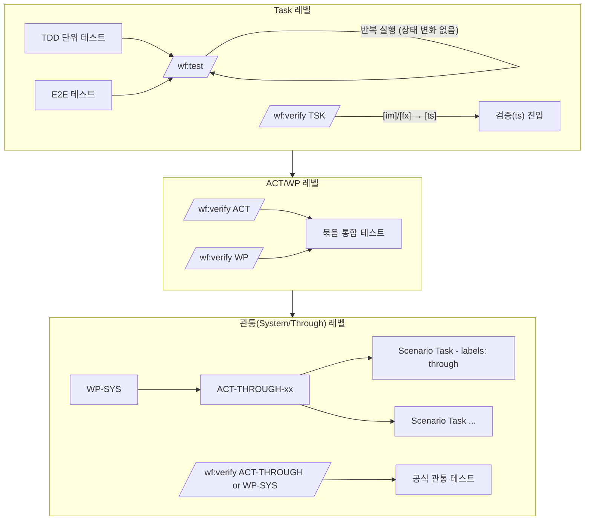
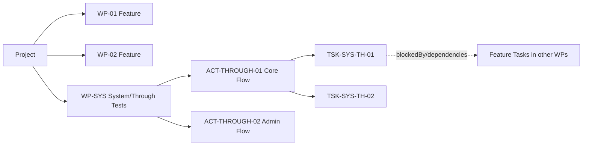
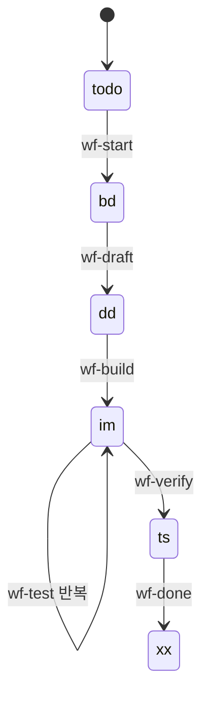
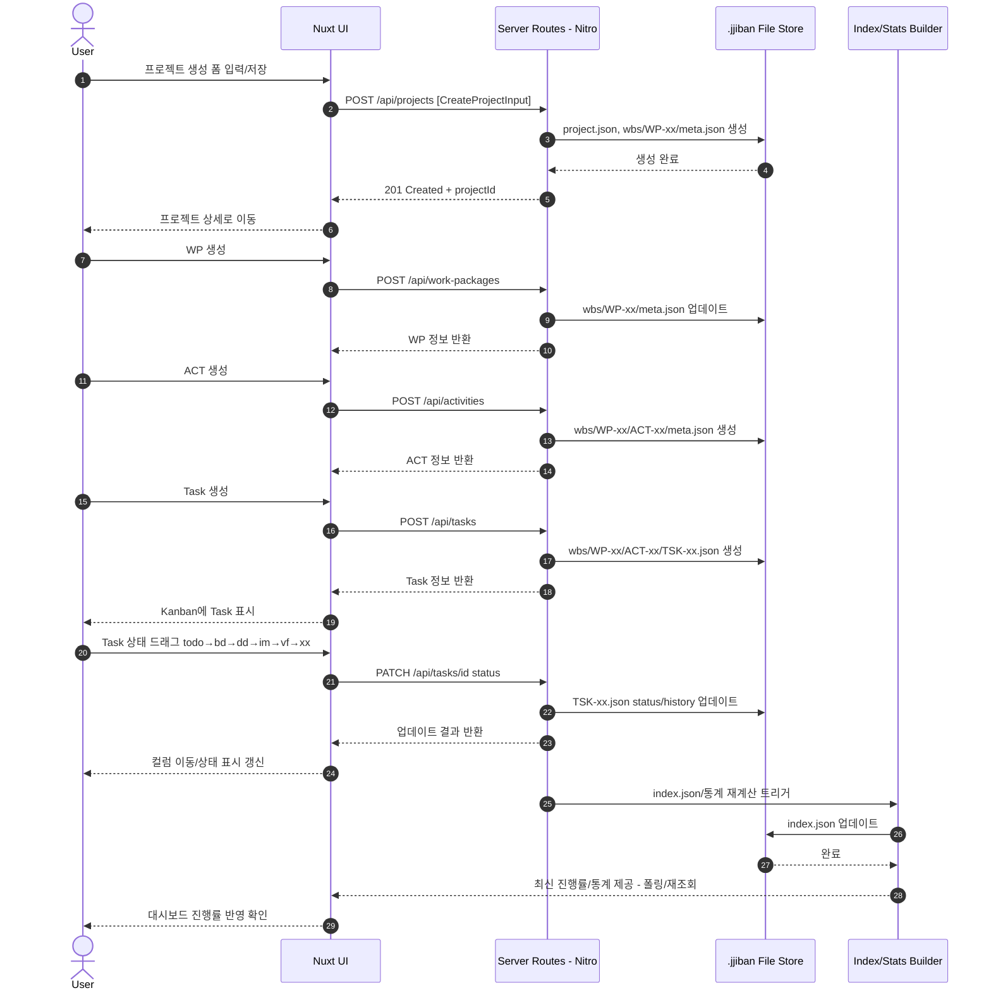

# JJIBAN 관통(프로세스) 테스트 상세 가이드

이 문서는 `.claude/commands_참고/qa/through-test-design.md`에 정리된 설계를 실제 개발·운영 관점에서 **왜 필요한지, 언제/어떻게 수행하는지, 어떤 산출물이 나와야 하는지**를 구체적으로 설명한다.

---

## 1. 왜 “관통 테스트 단계”가 필요한가

jjiban의 개발은 WBS 계층(Project → WP → ACT → Task)과 칸반 상태( Todo → Design → Detail → Implement → Verify → Done )를 기반으로 진행된다.  
현행 워크플로우는 개별 Task의 완성도를 높이는 데 강점이 있지만, **여러 Task가 결합된 “사용자 프로세스 전체”가 끝까지 성립하는지**를 보장하려면 추가 게이트가 필요하다.

### 1.1 Task‑레벨만 검증할 때 생기는 문제
- **결함 발견이 늦다**: 기능 조각은 각각 잘 되는데, 붙이는 순간 깨지는 문제(데이터 흐름/상태 동기화/라우팅/권한)가 마지막에 몰려서 발견된다.
- **원인 추적이 어렵다**: “끝까지 돌려보니 실패”라는 정보만 남고 어느 Task의 결합 문제인지 파악이 늦어진다.
- **회귀(regression)에 취약하다**: 다른 Task를 수정했을 때 전체 흐름이 깨지는 걸 놓치기 쉽다.

### 1.2 관통 테스트의 역할
관통 테스트(Through/System Test)는 **릴리즈/마일스톤 단위로**:
- 핵심 사용자 시나리오가 처음부터 끝까지 성공하는지 검증하고,
- 이전에 통과했던 흐름이 다시 깨지지 않는지 회귀를 막으며,
- “현재 버전이 사용자 관점에서 쓸만한가?”를 최종 확인한다.

이것은 Task‑레벨 검증을 대체하는 것이 아니라 **상위 레벨에서 보완**하는 단계다.

---

## 2. jjiban에서 테스트를 계층화하는 원칙

jjiban 워크플로우는 테스트도 WBS 계층에 맞춰 나눠 수행하는 것이 가장 자연스럽다.

### 2.1 테스트 레벨과 목적
- **TDD(단위)**: 개별 모듈/함수 로직이 맞는지 “빠르게” 확인.
- **E2E(화면/플로우)**: UI‑API‑스토어가 연결된 “기본 동작” 확인.
- **Task‑레벨 통합(verify)**: 해당 기능 Task가 **주변 의존과 붙어 문제없는지** 공식적으로 확인.
- **관통 통합(through)**: 여러 Task/WP가 모여 **업무/사용자 프로세스 전체가 성립하는지** 공식 확인.

### 2.2 “작게 자주, 크게 주기적으로”
실무에서 가장 비용 효율적인 방식은:
- **작은 단위(Task)**에서 자주 테스트해 결함 위치를 좁히고,
- **큰 단위(ACT/WP/관통)**에서 주기적으로 전체 흐름을 재검증하는 것이다.

---

## 3. 테스트 케이스는 언제, 무엇을 기반으로 만드는가

### 3.1 시점
- **상세설계 후반~구현 시작 전**: 통합/관통 케이스 초안 작성.
- **구현 진행 중**: 케이스 구체화 + 자동화(E2E) 전환.
- **마일스톤 전**: 실제 수행 결과를 문서화하여 게이트 통과 판단.

### 3.2 기반 문서
jjiban 문서 번호 체계를 그대로 활용한다.
- `020-detail-design.md`: 기능/흐름/데이터의 상세 정의.
- `025-traceability-matrix.md`: 요구사항(FR/BR) ↔ 테스트 ID 연결.
- `026-test-specification.md`: 테스트 시나리오/케이스 명세.

통합·관통 테스트 케이스는 이 3개에서 **“모듈 간/사용자 간 경계”를 넘는 흐름**을 뽑아 만들면 된다.

---

## 4. `/wf:test`와 `/wf:verify`를 어떻게 써야 하는가

### 4.1 `/wf:test`는 “실험용, 반복용”
- 상태를 바꾸지 않고 **언제든 반복 실행 가능한 품질 피드백 루프**다.
- 구현/리팩터링 중 자주 돌릴수록 좋다.
- 옵션으로 범위를 좁혀 효율적으로 쓴다.
  - `--type tdd`: 백엔드/로직 중심 변경 직후
  - `--type e2e`: UI 플로우/화면 변경 직후
  - `--type all`: 기능 완료 직전 전체 확인

### 4.2 `/wf:verify`는 “공식 게이트”
- “이 Task는 이제 검증 단계로 넘어갈 준비가 됐다”는 **상태 전환을 포함하는 공식 절차**다.
- 실행 전제:
  - development는 `[im]`(Implement 완료)
  - defect는 `[fx]`(Fix 완료)
  - 단위/E2E 통과가 선행되어야 한다.
- 결과물:
  - `070-integration-test.md` 또는 `070-test-results.md`가 Task 폴더에 남아, 이후 회귀 기준점이 된다.

---

## 5. 관통 테스트를 WBS로 표현하는 방법(권장)

새 커맨드/상태를 만들지 않고도 관통 게이트를 구축하는 방식이다.  
핵심은 **“관통 시나리오도 Task로 관리한다”**는 점이다.

### 5.1 전용 WP/ACT 만들기
1. 프로젝트 WBS 아래에 전용 WP 생성
   - 이름: `WP-SYS` 또는 `WP-00 System Test`
   - 목적: 관통/시스템 테스트만 모아두는 “테스트 작업공간”
2. WP‑SYS 아래에 관통 시나리오 ACT 생성
   - 예: `ACT-THROUGH-01 Core Flow`
   - 관통 시나리오를 주제별로 묶는 단위

### 5.2 관통 시나리오 Task 작성 규칙
관통 시나리오 Task는 실제 E2E 자동화/수행 단위다.

필드 규칙:
- `category`: `development`
  - `/wf:test`의 범위에 들어가 자동 E2E 실행 가능.
- `labels`: `["through"]`
  - 관통 시나리오 태스크라는 구분자.
- `blockedBy` 또는 `dependencies`
  - 이 시나리오가 커버하는 기능 Task IDs를 나열.
  - 관통 게이트 실행 조건을 명확히 만든다.

권장 제목 규칙(예):
- `TH-01 프로젝트 생성 → WP 생성 → ACT 생성`
- `TH-02 Task 생성 → 칸반 상태 이동 → 통계 반영`

### 5.3 관통 시나리오 Task 템플릿(예시)
아래는 최소 필드 개념 예시다(실제 JSON 구조에 맞춰 기입).

```json
{
  "id": "TSK-SYS-TH-01",
  "title": "TH-01 프로젝트 생성 → WP/ACT/Task 생성",
  "category": "development",
  "status": "im",
  "labels": ["through"],
  "blockedBy": [
    "TSK-01-01-01",
    "TSK-01-02-01",
    "TSK-01-02-03"
  ]
}
```

---

## 6. 관통 테스트 실행 절차

### 6.1 관통 시나리오 준비 단계
관통 시나리오 Task는 기능이 완성되기 전에도 준비할 수 있다.
1. 시나리오 초안 작성
2. 필요한 `data-testid`, API 엔드포인트, 상태 변화 포인트를 확인
3. Playwright 기반 E2E 자동화 스크립트 작성
4. `/wf:test TSK-SYS-TH-01 --type e2e`로 **반복 실행/보정**

이 단계는 상태 변화가 없고 “자동화 품질을 올리는 기간”이다.

### 6.2 관통 게이트(마일스톤/릴리즈 전)
실행 조건:
- 해당 시나리오 Task의 `blockedBy` 기능 Task들이 모두 Done(`[xx]`)일 것.

실행:
- 범위가 작으면 ACT 단위:
  - `/wf:verify ACT-THROUGH-01`
- 프로젝트 전반이면 WP 단위:
  - `/wf:verify WP-SYS`

의미:
- 시나리오 Task들이 `[im] → [ts]`로 이동하며 “공식 관통 테스트 시작”이 기록된다.
- 각 시나리오 Task 폴더에 `070-integration-test.md`가 생성되어 결과 증적이 남는다.

### 6.3 통과 후 마감
- 시나리오 Task별로 `/wf:done` 처리.
- ACT/WP 관통 요약 문서 `071-through-test.md` 작성.
- 이 결과가 “이번 마일스톤/릴리즈의 공식 품질 기준점”이 된다.

---

## 7. 산출물 기준과 템플릿

### 7.1 시나리오 Task 결과(`070-integration-test.md`)
각 시나리오 Task에 대해 다음이 포함되어야 한다.
- 테스트 환경(OS/브라우저/Node/DB)
- 시나리오 단계별 결과(성공/실패, 스크린샷/로그 경로)
- 발견 결함 목록(재현 단계, 영향 범위)
- 최종 판정(통과/재실행 필요)

### 7.2 ACT/WP 요약(`071-through-test.md`)
권장 구조:
1. 커버한 관통 시나리오 목록
2. 총 통과/실패/스킵 요약
3. 주요 회귀/결함 Top N
4. 품질 게이트 판정(릴리즈 가능/불가, 조건부 가능)
5. 후속 조치(Task/Defect 링크)

이 문서는 “의사결정용 1장 요약”이 목적이다.

---

## 8. jjiban 도메인 기반 관통 시나리오 예

### 예: “프로젝트 관리 핵심 흐름”
1. 프로젝트 생성
2. 프로젝트 상세 진입
3. WP 생성 → WP 목록/상세 확인
4. ACT 생성 → ACT 목록 확인
5. Task 생성 → Task Kanban에 표시 확인
6. Task 상태 이동( todo → bd → dd → im → vf → xx )
7. 대시보드 통계/진행률 반영 확인

이 흐름은 여러 기능 Task를 가로지르므로 관통 시나리오로 적합하다.

---

## 9. 운영 팁과 흔한 함정

### 9.1 팁
- **관통 시나리오는 적게, 핵심만**: 릴리즈 게이트가 되는 핵심 3~7개 프로세스만 유지.
- **시나리오 Task 제목을 “사용자 언어”로**: 누구나 읽고 이해할 수 있게.
- **blockedBy를 꾸준히 갱신**: 커버리지 추적과 실행 조건 관리가 쉬워진다.
- **실패 시 즉시 defect Task 생성**: 관통 실패는 사용자 영향도가 크므로 우선순위를 높게 잡는다.

### 9.2 함정
- “마지막에 한 번만 관통하면 된다”는 생각
  - 문제 위치 추적이 어려워지고 일정 리스크가 커진다.
- 관통 시나리오가 너무 세분화됨
  - 유지비가 폭증하므로 “프로세스 단위”로만 유지.
- PrimeVue/Tailwind 같은 UI 리팩터링 중에 data-testid 누락
  - E2E가 깨지기 쉬우므로 UI 변경 시 테스트 ID 유지 규칙이 필요.

---

## 10. FAQ

**Q1. 관통 테스트는 Task verify를 대체하나?**  
A. 아니다. Task verify는 “조각의 품질”, 관통 테스트는 “전체 프로세스 품질”을 확인한다.

**Q2. 관통 시나리오는 언제부터 만들면 되나?**  
A. 상세설계 후반부터 초안을 만들고, 기능 구현과 함께 자동화를 보정한다.

**Q3. 관통 테스트가 실패하면 무엇을 해야 하나?**  
A. 원인을 기능 Task로 좁혀 defect Task를 생성하고, 수정 후 해당 시나리오 Task를 `/wf:test --type e2e`로 재실행한 뒤 재‑`/wf:verify` 한다.

**Q4. 시나리오 Task의 상태는 어떤 의미인가?**  
A. `[im]`은 “시나리오 준비/자동화 중”, `[ts]`는 “공식 관통 테스트 실행 중(게이트 진입)”, `[xx]`는 “관통 통과 완료”로 해석한다.

---

## 11. 결론

jjiban에서 관통 테스트는 별도의 복잡한 워크플로우 추가 없이도,
- **WP‑SYS / ACT‑THROUGH / 시나리오 Task**
- **현행 `/wf:test` 반복 + `/wf:verify` 공식 게이트**

만으로 안정적으로 운영할 수 있다.  
이 구조는 결함을 조기에 잡고, 릴리즈 품질을 객관적으로 증명하며, 향후 자동화 커맨드(`/wf:through`)로 확장하기도 쉽다.

---

## 12. Mermaid 다이어그램

### 12.1 테스트 계층과 게이트 흐름


### 12.2 WBS에서 관통 테스트가 위치하는 곳


### 12.3 development Task 상태 전환과 명령의 관계


### 12.4 관통 시나리오 예시(프로젝트 생성 → WBS 구성 → 칸반 이동 → 대시보드 반영)


#### 12.4.1 텍스트 관통 시나리오(사람/LLM 공용)

**시나리오 ID**: `TH-01`  
**시나리오 명**: “프로젝트 생성 → WBS 구성(WP/ACT/Task) → Task 상태 흐름 → 대시보드 반영”  
**목적**: jjiban의 핵심 프로세스가 단절 없이 끝까지 수행되고, 데이터/통계가 일관되게 반영되는지 검증한다.  
**커버 범위**:
- 프로젝트 CRUD 중 **Create + Read(상세/목록)**
- WP/ACT/Task **생성 및 트리 구조 반영**
- Task **칸반 상태 전환(todo→bd→dd→im→vf→xx)**
- 대시보드/리스트 **진행률·카운트 재계산(index.json) 반영**

**연관 기능 Task(예시)**:  
`blockedBy`: `TSK-01-01-01`(Project CRUD), `TSK-01-02-01`(WP CRUD), `TSK-01-02-02`(ACT CRUD), `TSK-01-02-03`(Task CRUD/칸반)

**사전 조건(Preconditions)**:
1. 로컬 jjiban 실행 상태(`npx jjiban dev` 또는 `nuxt dev`)이며 API 라우트가 정상 동작한다.
2. 테스트용 `.jjiban/{project}` 저장소에 충돌/락 파일이 없다.
3. 브라우저 캐시/스토리지 초기화 또는 **새 사용자 세션**으로 시작한다.

**테스트 데이터(Test Data)**:
- Project
  - name: `Through Test Project`
  - description: `관통 테스트용 샘플 프로젝트`
  - status: `active`
- WP
  - name: `Core - Issue Management`
  - purpose: `이슈 관리 핵심 기능`
- ACT
  - name: `Task Flow`
  - goal: `Task 생성/상태 흐름 검증`
- Task
  - title: `Sample Task A`
  - category: `development`
  - priority: `medium`
  - estimatedHours: `8`

**시나리오 단계(Steps & Expected Results)**:
| # | Actor | Action | Expected |
|---|-------|--------|----------|
| 1 | User | 대시보드에서 “프로젝트 관리하기” 진입 | 프로젝트 목록 페이지가 로드되고 오류 없음 |
| 2 | User | “새 프로젝트” 생성(위 Test Data) | 프로젝트가 생성되고 상세 페이지로 이동, 목록에 프로젝트 노출 |
| 3 | System | `.jjiban/.../project.json` 및 `wbs/WP-xx/meta.json` 기록 | 파일이 생성/업데이트되고 `createdAt/updatedAt`이 정상 |
| 4 | User | 프로젝트 상세에서 WP 생성(위 WP Data) | WP 카드/목록에 즉시 반영, WP 상세 진입 가능 |
| 5 | System | `wbs/WP-xx/meta.json` 업데이트 | WP 메타가 저장되고 프로젝트 진행률 계산에 포함 |
| 6 | User | WP 상세에서 ACT 생성(위 ACT Data) | ACT가 트리에 반영, ACT 상세 진입 가능 |
| 7 | System | `wbs/WP-xx/ACT-xx/meta.json` 생성 | ACT 메타가 저장되고 연관 WP에 연결됨 |
| 8 | User | ACT 상세에서 Task 생성(위 Task Data) | Task가 Kanban `Todo` 컬럼에 표시 |
| 9 | System | `wbs/WP-xx/ACT-xx/TSK-xx.json` 생성 | Task JSON이 생성되고 기본 필드(category/status/priority 등) 정상 |
|10 | User | Kanban에서 Task를 순차 상태 이동(todo→bd→dd→im→vf→xx) | 각 컬럼으로 이동되며 UI/카운트 즉시 갱신 |
|11 | System | Task 상태/history 갱신 | `status`와 `history[]`가 단계별로 누적 기록 |
|12 | System | index/통계 재계산 트리거 | `index.json` 또는 stats가 최신 값으로 업데이트 |
|13 | User | 대시보드/프로젝트 상세에서 진행률 확인 | Task 완료에 따른 진행률/카운트가 증가, 불일치 없음 |

**증적(Evidence) 수집**:
- 각 주요 단계 후 스크린샷:
  - 프로젝트 생성 완료 화면
  - WP/ACT/Task 생성 직후 화면
  - Kanban 상태가 `xx`로 이동한 화면
  - 대시보드 진행률 반영 화면
- 관련 파일 스냅샷:
  - `project.json`, `wbs/WP-xx/meta.json`, `wbs/WP-xx/ACT-xx/meta.json`, `TSK-xx.json`
  - `index.json` 갱신 전/후 타임스탬프

**통과 기준(Pass Criteria)**:
1. 모든 UI 단계가 오류 없이 수행되고 기대 결과와 일치한다.
2. WBS 파일 구조/메타/Task JSON이 기대 필드로 저장된다.
3. Kanban 상태 흐름과 통계가 **동일한 실체 데이터**를 기반으로 일관되게 반영된다.

**실패 처리(Fail Handling)**:
- 실패 단계의 스크린샷/로그/관련 JSON을 첨부하고,
- 원인 기능 Task로 좁혀 `defect` Task를 생성한 뒤,
- 수정 후 `TH-01`을 `/wf:test --type e2e`로 재실행하고 필요 시 재‑`/wf:verify` 한다.
