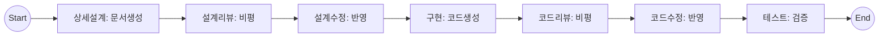

# PRD: jjiban (찌반) - AI-Assisted Development Kanban Tool

## 문서 정보

| 항목 | 내용 |
|------|------|
| 문서 버전 | 1.2 |
| 작성일 | 2024-01-XX |
| 상태 | Draft |

---

## 1. 제품 개요

### 1.1 제품 비전

**"jjiban - LLM과 함께 개발하는 차세대 프로젝트 관리 도구"**

개발팀의 프로젝트 관리와 AI 기반 개발 자동화를 통합한 온프레미스 칸반 도구. 기존 프로젝트 관리 도구(Redmine, OpenProject)의 기능에 LLM CLI(Claude Code, Gemini CLI, Codex, 로컬 LLM 등)를 직접 통합하여 설계, 구현, 리뷰, 테스트 전 과정을 AI와 협업할 수 있는 환경을 제공한다.

> **jjiban(찌반)**: 칸반(Kanban)에서 영감을 받은 이름. "찌"는 한국어의 친근한 느낌을 담고 있다.

### 1.2 핵심 차별점

| 기존 도구 | 본 제품 |
|----------|--------|
| 이슈 추적 + 수동 작업 | 이슈 추적 + LLM 자동화 |
| 외부 터미널에서 작업 | 웹 내장 터미널에서 LLM 실행 |
| 문서는 별도 관리 | Task별 문서 자동 연동 |
| 수동 상태 전환 | 워크플로우 기반 컨텍스트 메뉴 |
| 단계별 수동 실행 | **원클릭 전자동 워크플로우** |

### 1.3 타겟 사용자

- **주 사용자**: 중규모 개발팀 (10-50명)
- **환경**: 온프레미스 배포
- **사용 시나리오**:
  - AI 기반 코드 작성 및 리뷰
  - 자동화된 설계 문서 생성
  - LLM을 활용한 테스트 코드 작성
  - 프로젝트 전체 진행 상황 추적

---

## 2. 이슈 타입 체계

### 2.1 이슈 타입 정의

```
📦 Epic
│   대규모 기능/목표 (1~3개월 단위)
│   예: "사용자 인증 시스템 구축"
│
├── 📋 Feature
│   │   출시 가능한 기능 단위
│   │   예: "소셜 로그인 기능"
│   │
│   ├── 📖 User Story
│   │   │   사용자 관점 요구사항
│   │   │   예: "사용자로서 Google 계정으로 로그인하고 싶다"
│   │   │
│   │   ├── ✅ Task (LLM 실행의 핵심 단위)
│   │   │       구체적 개발 작업
│   │   │       예: "Google OAuth 인증 구현"
│   │   │
│   │   └── 🐛 Bug
│   │           스토리 관련 버그
│   │
│   └── 🔧 Technical Task
│           비기능 작업 (리팩토링, 인프라)
│           예: "레거시 인증 코드 리팩토링"
│
└── 🔬 Spike
        기술 조사/PoC (시간 제한)
        예: "OAuth 2.0 vs SAML 비교 조사"

🎯 Milestone
    시간 기반 릴리즈 마커
    예: "v2.0 릴리즈 (2024-03-01)"
```

### 2.2 이슈 타입별 속성

| 타입 | 필수 필드 | 선택 필드 | LLM 활용 |
|------|----------|----------|---------|
| Epic | 제목, 설명, 목표일 | 담당자, 라벨 | 요구사항 분석, 작업 분해 |
| Feature | 제목, 설명, 상위 Epic | 담당자, 우선순위 | 설계 문서 생성, 테스트 계획 |
| User Story | 제목, 설명, 인수조건 | 스토리 포인트 | Story → Task 자동 분해 |
| Task | 제목, 설명, 문서 경로, 시작일, 종료일 | 예상 시간, 브랜치명 | **코드 작성, 리뷰, 테스트** |
| Technical Task | 제목, 설명, 사유, 시작일, 종료일 | 영향 범위 | 리팩토링, 성능 개선 |
| Spike | 제목, 질문, 시간제한 | 결론 | 기술 조사, PoC |
| Bug | 제목, 재현 방법, 심각도 | 영향 범위 | 버그 분석, 수정 코드 생성 |
| Milestone | 제목, 목표일 | 설명 | 릴리즈 노트 자동 생성 |

---

## 3. 칸반 워크플로우

### 3.1 Task 워크플로우 (핵심)

```
┌─────────────┐    ┌─────────────┐    ┌─────────────┐    ┌─────────────┐
│   상세설계   │ → │  설계리뷰   │ → │설계리뷰적용 │ → │    구현     │
└─────────────┘    └─────────────┘    └─────────────┘    └─────────────┘
                                                               │
┌─────────────┐    ┌─────────────┐    ┌─────────────┐          │
│    완료     │ ← │코드리뷰적용 │ ← │  코드리뷰   │ ←─────────┘
└─────────────┘    └─────────────┘    └─────────────┘
```

### 3.2 컬럼별 컨텍스트 메뉴 (LLM 명령어)

| 컬럼 | 사용 가능한 LLM 명령어 예시 |
|------|---------------------------|
| 상세설계 | 설계 문서 초안 생성, 요구사항 분석, 기술 스택 제안 |
| 설계리뷰 | 설계 리뷰 수행, 개선점 도출, 보안 검토 |
| 설계리뷰적용 | 리뷰 피드백 반영, 설계 문서 업데이트 |
| 구현 | 코드 생성, 단위 테스트 작성, 구현 가이드 |
| 코드리뷰 | 코드 리뷰 수행, 버그 탐지, 리팩토링 제안 |
| 코드리뷰적용 | 리뷰 피드백 반영, 코드 수정 |
| 완료 | 테스트 결과 분석, 문서화 완료 |

### 3.3 상태 전이 규칙

```yaml
transitions:
  상세설계:
    allowed_next: [설계리뷰]
    required_docs: [design.md]
    
  설계리뷰:
    allowed_next: [상세설계, 설계리뷰적용]
    required_docs: [design.md, design-review.md]
    
  설계리뷰적용:
    allowed_next: [설계리뷰, 구현]
    required_docs: [design.md]
    
  구현:
    allowed_next: [코드리뷰]
    required_docs: [design.md]
    
  코드리뷰:
    allowed_next: [구현, 코드리뷰적용]
    required_docs: [code-review.md]
    
  코드리뷰적용:
    allowed_next: [코드리뷰, 완료]
    
  완료:
    allowed_next: []
    required_docs: [test-report.md]
```

---

## 4. 핵심 기능 상세

### 4.1 LLM 통합 웹 터미널

#### 4.1.1 개요

칸반 카드의 컨텍스트 메뉴에서 LLM 명령어를 선택하면 웹 터미널이 열리고, 미리 등록된 프롬프트 템플릿이 로드되어 LLM CLI가 실행된다.

#### 4.1.2 지원 LLM CLI

| LLM | CLI 도구 | 실행 방식 |
|-----|---------|----------|
| Claude | Claude Code | `claude` |
| Gemini | Gemini CLI | `gemini` |
| OpenAI | Codex CLI | `codex` |
| 로컬 LLM | Ollama 등 | `ollama run <model>` |

#### 4.1.3 웹 터미널 기능 요구사항

```
[필수 기능]
├── 실시간 출력 스트리밍 (WebSocket)
├── 대화형 입력 지원 (Y/N 확인, 추가 질문)
├── 실행 이력 및 로그 저장
├── 세션 관리 (Task별 독립 세션)
└── 실행 결과 파일 표시

[터미널 UI]
├── 전체화면 / 분할화면 모드
├── 출력 검색 및 필터링
├── 복사/붙여넣기 지원
└── 폰트 크기 및 테마 설정

[실행 결과 파일 표시]
├── LLM이 생성/수정한 파일 목록 자동 감지
├── 파일명 클릭 → 내용 미리보기 패널
├── 파일 diff 표시 (수정된 경우)
└── 파일 저장 경로 표시
```

#### 4.1.4 실행 플로우

```
[사용자] 칸반 카드 우클릭
    ↓
[시스템] 현재 컬럼에 해당하는 컨텍스트 메뉴 표시
    ↓
[사용자] "코드 리뷰 요청" 선택
    ↓
[시스템] 웹 터미널 열림
    ↓
[시스템] 프롬프트 템플릿 로드 + 변수 치환
    예: "/review {{task.branch}} --files {{task.doc_path}}/design.md"
    ↓
[시스템] LLM CLI 실행 (예: claude)
    ↓
[LLM] 지정된 파일 읽기 → 분석 → 실시간 응답 스트리밍
    ↓
[사용자] 추가 질문/명령 입력 가능
    ↓
[시스템] 대화 이력 저장
    ↓
[시스템] (프롬프트 설정에 따라) 결과를 문서로 자동 저장
    ↓
[시스템] (Auto Mode인 경우) 다음 단계로 자동 전이 및 후속 작업 실행
```

### 4.6 워크플로우 자동화 (Auto-Pilot)

#### 4.6.1 개요
사용자가 "Auto-Workflow"를 시작하면, 시스템이 사전에 정의된 파이프라인에 따라 [상세설계 → 설계리뷰 → 구현 → 코드리뷰 → 완료]의 전 과정을 순차적으로 자동 실행한다.

#### 4.6.2 실행 모드
1. **완전 자동 (Fully Automated)**
   - 각 단계 완료 후 사람의 개입 없이 즉시 다음 단계로 진행.
   - 에러 발생 시에만 중단.
2. **반자동 (Human-in-the-Loop)**
   - 각 단계 완료 후 "승인 대기" 상태로 전환.
   - 사용자가 결과물(문서/코드)을 확인하고 승인 버튼을 눌러야 다음 단계 진행.

#### 4.6.3 자동화 파이프라인 예시


### 4.2 프롬프트 템플릿 관리

#### 4.2.1 템플릿 구조

```yaml
# 예시: 코드 리뷰 요청 템플릿
template:
  id: "code-review-request"
  name: "코드 리뷰 요청"
  description: "LLM에게 코드 리뷰를 요청합니다"
  
  # 표시 조건
  visible_in_columns: ["코드리뷰"]
  visible_for_types: ["Task", "Technical Task", "Bug"]
  
  # 사용할 LLM
  llm: "claude"  # claude | gemini | codex | ollama
  
  # 프롬프트 내용
  prompt: |
    다음 파일들을 리뷰해주세요:
    - 설계 문서: {{task.doc_path}}/design.md
    - 소스 코드: {{project.src_path}}/{{task.branch}}
    
    다음 관점에서 리뷰해주세요:
    1. 설계 문서와의 일치성
    2. 코드 품질 및 가독성
    3. 잠재적 버그
    4. 성능 이슈
    5. 보안 취약점
    
    리뷰 결과를 {{task.doc_path}}/code-review-{{date}}.md 파일로 저장해주세요.
  
  # 자동 출력 설정
  output:
    auto_save: true
    path: "{{task.doc_path}}/code-review-{{date}}.md"
    
  # 변수 정의
  variables:
    - name: "task.doc_path"
      source: "task.document_path"
    - name: "task.branch"
      source: "task.custom_fields.branch_name"
    - name: "project.src_path"
      source: "project.settings.source_path"
    - name: "date"
      source: "system.date"
      format: "YYYY-MM-DD"
```

#### 4.2.2 템플릿 변수

| 변수 카테고리 | 예시 | 설명 |
|-------------|------|------|
| Task 정보 | `{{task.id}}`, `{{task.title}}`, `{{task.description}}` | 현재 Task의 기본 정보 |
| Task 문서 | `{{task.doc_path}}`, `{{task.design_doc}}` | Task 연결 문서 경로 |
| Task 커스텀 | `{{task.custom_fields.branch_name}}` | 사용자 정의 필드 |
| Project 정보 | `{{project.name}}`, `{{project.src_path}}` | 프로젝트 설정 |
| User Story | `{{story.acceptance_criteria}}` | 상위 스토리 정보 |
| 시스템 | `{{system.date}}`, `{{system.user}}` | 시스템 정보 |

#### 4.2.3 템플릿 관리 화면

```
[템플릿 관리]
├── 템플릿 목록
│   ├── 검색 및 필터링
│   ├── 카테고리별 분류
│   └── 활성화/비활성화
├── 템플릿 편집기
│   ├── YAML 직접 편집
│   ├── 비주얼 편집기
│   ├── 변수 자동완성
│   └── 미리보기
└── 템플릿 테스트
    ├── 샘플 Task로 테스트
    └── 변수 치환 결과 확인
```

### 4.3 Task-문서 연동

#### 4.3.1 문서 폴더 구조

```
/project-root
├── /docs
│   ├── /tasks
│   │   ├── /TASK-001
│   │   │   ├── Task-001-로그인화면-design.md
│   │   │   ├── Task-001-로그인화면-design-review-claude4-1.md
│   │   │   ├── Task-001-로그인화면-design-review-gemini2.5-1.md
│   │   │   ├── Task-001-로그인화면-design-review-claude4-2.md
│   │   │   ├── Task-001-로그인화면-code-review-claude4-1.md
│   │   │   ├── Task-001-로그인화면-code-review-codex-1.md
│   │   │   └── Task-001-로그인화면-test-report.md
│   │   └── /TASK-002
│   │       └── ...
│   └── /templates
│       ├── design-template.md
│       └── test-report-template.md
└── /src
    └── ...
```

#### 4.3.2 문서 네이밍 규칙

```
{Task ID}-{Task 제목}-{문서유형}-{LLM모델명}-{순번}.md
```

| 구성요소 | 설명 | 예시 |
|---------|------|------|
| Task ID | 이슈 ID | `Task-001`, `Task-3.1` |
| Task 제목 | 작업명 (공백은 하이픈) | `로그인화면`, `OAuth-인증` |
| 문서유형 | 문서 종류 | `design`, `design-review`, `code-review`, `test-report` |
| LLM모델명 | 리뷰/생성에 사용된 모델 | `claude4`, `gemini2.5`, `codex`, `llama3` |
| 순번 | 동일 조합의 순차 번호 | `1`, `2`, `3` |

**예시:**
```
Task-3.1-로그인화면-design.md                      # 상세설계서
Task-3.1-로그인화면-design-review-gemini2.5-1.md  # Gemini로 1차 설계리뷰
Task-3.1-로그인화면-design-review-claude4-1.md    # Claude로 1차 설계리뷰
Task-3.1-로그인화면-design-review-gemini2.5-2.md  # Gemini로 2차 설계리뷰 (피드백 반영 후)
Task-3.1-로그인화면-code-review-claude4-1.md      # Claude로 코드리뷰
Task-3.1-로그인화면-test-report.md                 # 테스트 결과서
```

#### 4.3.3 자동 파일명 생성

프롬프트 템플릿에서 출력 파일명 자동 생성:

```yaml
output:
  auto_save: true
  path_template: "{{task.doc_path}}/{{task.id}}-{{task.title_slug}}-{{doc_type}}-{{llm.model}}-{{sequence}}.md"
```

시스템이 자동으로:
1. Task 정보에서 ID와 제목 추출
2. 현재 사용 중인 LLM 모델명 삽입
3. 동일 조합의 기존 파일 수를 체크하여 순번 자동 증가

#### 4.3.4 문서 뷰어 기능

```
[문서 뷰어]
├── Markdown 렌더링
│   ├── GitHub Flavored Markdown 지원
│   ├── 수식 렌더링 (KaTeX)
│   └── 체크리스트 지원
├── 코드 하이라이팅
│   ├── 다중 언어 지원
│   ├── 라인 번호 표시
│   └── 복사 버튼
├── 다이어그램 렌더링
│   ├── Mermaid 지원
│   ├── PlantUML 지원 (선택)
│   └── 실시간 미리보기
└── 파일 네비게이션
    ├── 트리 뷰
    ├── 최근 파일
    └── 검색
```

#### 4.3.5 Task 상세 화면 레이아웃

```
┌────────────────────────────────────────────────────────────────────┐
│ TASK-001: Google OAuth 인증 구현                    [상세설계] ▼   │
├────────────────────────────────────────────────────────────────────┤
│                                                                    │
│  ┌──────────────────────┐  ┌────────────────────────────────────┐ │
│  │ [기본 정보]          │  │ [문서]                        [+]  │ │
│  │                      │  │                                    │ │
│  │ 담당자: 홍길동       │  │  📄 design.md                      │ │
│  │ 상태: 상세설계       │  │  📄 design-review-1.md             │ │
│  │ 우선순위: High       │  │  📄 design-review-2.md             │ │
│  │ 브랜치: feature/auth │  │                                    │ │
│  │                      │  │  [문서 미리보기]                   │ │
│  │ [설명]               │  │  ┌──────────────────────────────┐  │ │
│  │ Google OAuth 2.0을   │  │  │ # 상세설계: Google OAuth    │  │ │
│  │ 사용한 소셜 로그인   │  │  │                              │  │ │
│  │ 기능을 구현한다.     │  │  │ ## 1. 개요                   │  │ │
│  │                      │  │  │ Google OAuth 2.0 프로토콜... │  │ │
│  │ [상위 스토리]        │  │  │                              │  │ │
│  │ US-005: 소셜 로그인  │  │  │ ## 2. 시퀀스 다이어그램     │  │ │
│  │                      │  │  │ ```mermaid                   │  │ │
│  └──────────────────────┘  │  │ sequenceDiagram              │  │ │
│                            │  │   User->>+App: Login         │  │ │
│  ┌──────────────────────┐  │  │   App->>+Google: Auth...     │  │ │
│  │ [컨텍스트 메뉴]      │  │  └──────────────────────────────┘  │ │
│  │                      │  │                                    │ │
│  │ 🤖 설계 문서 생성    │  └────────────────────────────────────┘ │
│  │ 🤖 요구사항 분석     │                                        │
│  │ 🤖 기술 스택 제안    │                                        │
│  │ ─────────────────    │                                        │
│  │ 📋 다음 단계로 이동  │                                        │
│  └──────────────────────┘                                        │
│                                                                    │
│  ┌────────────────────────────────────────────────────────────┐   │
│  │ [LLM 터미널]                                    [전체화면]  │   │
│  │                                                              │   │
│  │ $ claude                                                     │   │
│  │ > 설계 문서를 분석하고 있습니다...                          │   │
│  │ > design.md 파일을 읽었습니다.                              │   │
│  │ >                                                            │   │
│  │ > ## 분석 결과                                               │   │
│  │ > 1. OAuth 플로우가 잘 정의되어 있습니다.                   │   │
│  │ > 2. 토큰 갱신 로직 추가를 권장합니다.                      │   │
│  │ > ...                                                        │   │
│  │                                                              │   │
│  │ [입력창]                                          [전송]    │   │
│  └────────────────────────────────────────────────────────────┘   │
└────────────────────────────────────────────────────────────────────┘
```

### 4.4 프로젝트 관리

#### 4.4.1 프로젝트 설정

```yaml
project:
  id: "proj-001"
  name: "AI Kanban Tool"
  key: "AKT"
  
  # 경로 설정
  paths:
    root: "/home/projects/ai-kanban"
    source: "/home/projects/ai-kanban/src"
    docs: "/home/projects/ai-kanban/docs"
    tasks: "/home/projects/ai-kanban/docs/tasks"
  
  # 워크플로우 설정
  workflow:
    columns:
      - name: "상세설계"
        color: "#E3F2FD"
      - name: "설계리뷰"
        color: "#FFF3E0"
      - name: "설계리뷰적용"
        color: "#E8F5E9"
      - name: "구현"
        color: "#F3E5F5"
      - name: "코드리뷰"
        color: "#FFF8E1"
      - name: "코드리뷰적용"
        color: "#E0F7FA"
      - name: "완료"
        color: "#E8EAF6"
  
  # LLM 설정
  llm:
    default: "claude"
    server: "localhost"  # 고정 서버
    
  # 이슈 타입 활성화
  issue_types:
    - Epic
    - Feature
    - User Story
    - Task
    - Technical Task
    - Spike
    - Bug
    - Milestone
```

#### 4.4.2 멀티 프로젝트 지원

```
[프로젝트 목록]
├── 프로젝트 A (AI Kanban Tool)
│   ├── 대시보드
│   ├── 칸반 보드
│   ├── Gantt 차트
│   ├── 백로그
│   ├── 마일스톤
│   └── 설정
├── 프로젝트 B (Mobile App)
│   └── ...
└── [+ 새 프로젝트]
```

### 4.5 Gantt 차트

#### 4.5.1 개요

프로젝트 전체 일정을 시각화하는 Gantt 차트 뷰. 왼쪽 테이블과 오른쪽 타임라인으로 구성되어 이슈의 일정, 진행 상황, 계층 구조를 한눈에 파악할 수 있다.

#### 4.5.2 화면 레이아웃

```
┌────────────────────────────────────────────────────────────────────────────────────┐
│ 🏠 jjiban > Project Alpha > Gantt 차트                                             │
├────────────────────────────────────────────────────────────────────────────────────┤
│ [+ 만들기 ▼] [프로젝트 포함 ▼] [기준선 ▼] [필터 ▼]    🔍 검색...    [⬚][🔍+][🔍-] │
├──────────────────────────────────────────┬─────────────────────────────────────────┤
│                                          │          11월 2025        12월 2025     │
│ ID   타입          제목        상태      │ 47  48  49  50  51  01  02  03  04  05  │
├──────────────────────────────────────────┼─────────────────────────────────────────┤
│                                          │                                         │
│ 16  📦 EPIC       ▼ New website  지정됨  │ ████████████████████████████████████    │
│                                          │                                         │
│ 22   📋 FEATURE    Feature carousel      │     ████████                            │
│                                          │                                         │
│ 18   📖 USER STORY  Product tour  New    │         ████████████                    │
│                                          │                                         │
│ 17   📖 USER STORY  Newsletter    진행중 │             ████████████████            │
│                                          │                                         │
│ 19   📖 USER STORY ▼ Landing page 지정됨 │                     ████████████████    │
│                                          │                                         │
│ 20    ✅ TASK       Wireframes   진행중  │                         ████████        │
│                                          │                                         │
│ 15  🐛 BUG         Password reset 확인됨 │         ██████████                      │
│                                          │                                         │
│ 32  🎯 MILESTONE   Release v1.0  New     │                         ◆               │
│                                          │                                         │
│ 21  📖 USER STORY   Contact form 지정됨  │                             ████████    │
│                                          │                                         │
│ 34  🎯 MILESTONE   Release v1.1  New     │                                 ◆       │
│                                          │                                         │
└──────────────────────────────────────────┴─────────────────────────────────────────┘
```

#### 4.5.3 테이블 영역 (왼쪽)

**컬럼 구성:**

| 컬럼 | 설명 | 정렬/필터 |
|------|------|----------|
| ID | 이슈 번호 | 정렬 가능 |
| 타입 | 이슈 타입 (아이콘 + 색상) | 필터 가능 |
| 제목 | 이슈 제목 (계층 표시) | 검색 가능 |
| 상태 | 현재 상태 | 필터 가능 |
| 시작 날짜 | 계획 시작일 | 정렬 가능 |
| 완료 날짜 | 계획 완료일 | 정렬 가능 |
| 담당자 | 할당된 사용자 | 필터 가능 |

**계층 구조 표시:**
```
▼ Epic (펼침)
    ▼ Feature (펼침)
        User Story
            Task
    ▶ Feature (접힘)
```

#### 4.5.4 타임라인 영역 (오른쪽)

**바(Bar) 스타일:**

| 이슈 타입 | 바 색상 | 바 형태 |
|----------|--------|--------|
| Epic | 보라색 (#9C27B0) | 굵은 바 |
| Feature | 남색 (#3F51B5) | 중간 바 |
| User Story | 파란색 (#2196F3) | 기본 바 |
| Task | 회색 (#607D8B) | 기본 바 |
| Technical Task | 청록색 (#00BCD4) | 기본 바 |
| Bug | 빨간색 (#F44336) | 기본 바 |
| Milestone | 초록색 (#4CAF50) | 다이아몬드 ◆ |
| Spike | 주황색 (#FF9800) | 기본 바 |

**진행률 표시:**
```
████████░░░░░░░░  50% 완료
████████████████  100% 완료
░░░░░░░░░░░░░░░░  0% 시작 전
```

#### 4.5.5 기능 요구사항

```
[필수 기능]
├── 줌 인/아웃 (일/주/월 단위)
├── 가로 스크롤 (타임라인 이동)
├── 계층 펼침/접힘
├── 드래그로 일정 변경
├── 바 클릭 → 이슈 상세 팝업
└── 오늘 날짜 표시선

[필터/검색]
├── 이슈 타입별 필터
├── 담당자별 필터
├── 상태별 필터
├── 날짜 범위 필터
└── 텍스트 검색

[내보내기]
├── PNG 이미지
├── PDF
└── CSV (일정 데이터)

[향후 확장 가능]
└── 의존성 화살표 (Task A → Task B 연결선)
```

#### 4.5.6 인터랙션

| 액션 | 동작 |
|------|------|
| 바 클릭 | 이슈 상세 사이드 패널 열기 |
| 바 더블클릭 | 이슈 상세 페이지로 이동 |
| 바 드래그 (좌우) | 시작/종료일 변경 |
| 바 끝 드래그 | 기간 늘리기/줄이기 |
| 행 클릭 | 해당 이슈 선택 (하이라이트) |
| 펼침 아이콘 클릭 | 하위 이슈 펼침/접힘 |
| 마우스 휠 + Ctrl | 줌 인/아웃 |

---

## 5. 시스템 아키텍처

### 5.1 전체 구조

```
┌─────────────────────────────────────────────────────────────────────┐
│                           Frontend (React)                          │
│  ┌─────────────┐ ┌─────────────┐ ┌─────────────┐ ┌───────────────┐ │
│  │ 칸반 보드   │ │ Task 상세   │ │ 문서 뷰어   │ │ 웹 터미널     │ │
│  │ (DnD)       │ │ (Form)      │ │ (Markdown)  │ │ (xterm.js)    │ │
│  └─────────────┘ └─────────────┘ └─────────────┘ └───────────────┘ │
└─────────────────────────────────────────────────────────────────────┘
                                    │
                                    │ REST API / WebSocket
                                    ▼
┌─────────────────────────────────────────────────────────────────────┐
│                        Backend (Node.js/Python)                     │
│  ┌─────────────┐ ┌─────────────┐ ┌─────────────┐ ┌───────────────┐ │
│  │ Project     │ │ Issue       │ │ Template    │ │ Terminal      │ │
│  │ Service     │ │ Service     │ │ Service     │ │ Service       │ │
│  └─────────────┘ └─────────────┘ └─────────────┘ └───────────────┘ │
│  ┌─────────────┐ ┌─────────────┐ ┌─────────────┐                   │
│  │ Document    │ │ LLM         │ │ Auth        │                   │
│  │ Service     │ │ Executor    │ │ Service     │                   │
│  └─────────────┘ └─────────────┘ └─────────────┘                   │
└─────────────────────────────────────────────────────────────────────┘
                                    │
              ┌─────────────────────┼─────────────────────┐
              ▼                     ▼                     ▼
┌─────────────────────┐ ┌─────────────────────┐ ┌─────────────────────┐
│    PostgreSQL       │ │   File System       │ │   LLM CLI           │
│    (메타데이터)      │ │   (문서, 로그)       │ │   (고정 서버)        │
└─────────────────────┘ └─────────────────────┘ └─────────────────────┘
```

### 5.2 기술 스택 (권장)

| 레이어 | 기술 | 비고 |
|--------|------|------|
| Frontend | React + TypeScript | SPA |
| UI 컴포넌트 | Ant Design / Shadcn | 칸반: react-beautiful-dnd |
| Gantt 차트 | DHTMLX Gantt / Frappe Gantt | 또는 자체 구현 (D3.js) |
| 상태 관리 | Zustand / Redux Toolkit | |
| 웹 터미널 | xterm.js | WebSocket 연동 |
| Markdown | react-markdown + remark-gfm | Mermaid: mermaid.js |
| Backend | Node.js (Express/Fastify) 또는 Python (FastAPI) | |
| 실시간 통신 | Socket.IO / WebSocket | 터미널 스트리밍 |
| 터미널 백엔드 | node-pty / Python pty | LLM CLI 실행 |
| Database | PostgreSQL | 이슈, 프로젝트 메타데이터 |
| 파일 저장 | 로컬 파일시스템 | 문서, 로그 |
| 인증 | JWT + bcrypt | 세션 관리 |

### 5.3 웹 터미널 아키텍처

```
┌──────────────┐     WebSocket      ┌──────────────┐     PTY      ┌──────────────┐
│   Browser    │◄──────────────────►│   Backend    │◄────────────►│   LLM CLI    │
│  (xterm.js)  │   bidirectional    │  (node-pty)  │   stdin/out  │(claude, etc) │
└──────────────┘                    └──────────────┘              └──────────────┘
                                           │
                                           │ 로그 저장
                                           ▼
                                    ┌──────────────┐
                                    │  File System │
                                    │  (세션 로그)  │
                                    └──────────────┘
```

---

## 6. 화면 설계

### 6.1 화면 목록

| 화면 | 설명 | 주요 기능 |
|------|------|----------|
| 로그인 | 사용자 인증 | 로그인, 비밀번호 찾기 |
| 대시보드 | 전체 현황 | 프로젝트 요약, 내 할 일, 최근 활동 |
| 프로젝트 목록 | 프로젝트 관리 | 목록, 생성, 검색 |
| 칸반 보드 | 메인 작업 화면 | 칸반, 필터, 검색 |
| Gantt 차트 | 일정 시각화 | 타임라인, 계층 구조, 드래그 일정 조정 |
| Task 상세 | 이슈 상세/편집 | 정보, 문서, 터미널 |
| 백로그 | 이슈 목록 | 테이블 뷰, 필터, 정렬 |
| 마일스톤 | 릴리즈 관리 | 타임라인, 진행률 |
| 템플릿 관리 | 프롬프트 관리 | CRUD, 테스트 |
| 프로젝트 설정 | 프로젝트 구성 | 워크플로우, 경로, LLM |
| 시스템 설정 | 전역 설정 | 사용자, LLM 연결 |

### 6.2 칸반 보드 화면

```
┌────────────────────────────────────────────────────────────────────────────┐
│ 🏠 AI Kanban > Project Alpha > 칸반 보드                                   │
├────────────────────────────────────────────────────────────────────────────┤
│ [필터: 담당자 ▼] [타입 ▼] [라벨 ▼]           🔍 검색...      [+ 새 이슈]  │
├────────────────────────────────────────────────────────────────────────────┤
│                                                                            │
│ ┌──────────┐ ┌──────────┐ ┌──────────┐ ┌──────────┐ ┌──────────┐          │
│ │ 상세설계 │ │ 설계리뷰 │ │설계리뷰  │ │   구현   │ │ 코드리뷰 │ ...      │
│ │    3     │ │    2     │ │  적용 1  │ │    4     │ │    2     │          │
│ ├──────────┤ ├──────────┤ ├──────────┤ ├──────────┤ ├──────────┤          │
│ │┌────────┐│ │┌────────┐│ │┌────────┐│ │┌────────┐│ │┌────────┐│          │
│ ││AKT-101 ││ ││AKT-098 ││ ││AKT-095 ││ ││AKT-089 ││ ││AKT-087 ││          │
│ ││────────││ ││────────││ ││────────││ ││────────││ ││────────││          │
│ ││OAuth   ││ ││결제 API││ ││알림    ││ ││대시보드││ ││검색    ││          │
│ ││구현    ││ ││연동    ││ ││시스템  ││ ││차트    ││ ││기능    ││          │
│ ││        ││ ││        ││ ││        ││ ││        ││ ││        ││          │
│ ││✅ Task ││ ││✅ Task ││ ││✅ Task ││ ││✅ Task ││ ││✅ Task ││          │
│ ││👤 홍길동││ ││👤 김철수││ ││👤 이영희││ ││👤 홍길동││ ││👤 박민수││          │
│ │└────────┘│ │└────────┘│ │└────────┘│ │└────────┘│ │└────────┘│          │
│ │          │ │          │ │          │ │          │ │          │          │
│ │┌────────┐│ │┌────────┐│ │          │ │┌────────┐│ │┌────────┐│          │
│ ││AKT-102 ││ ││AKT-099 ││ │          │ ││AKT-090 ││ ││AKT-088 ││          │
│ ││...     ││ ││...     ││ │          │ ││...     ││ ││...     ││          │
│ │└────────┘│ │└────────┘│ │          │ │└────────┘│ │└────────┘│          │
│ │          │ │          │ │          │ │          │ │          │          │
│ │ [+]      │ │ [+]      │ │ [+]      │ │ [+]      │ │ [+]      │          │
│ └──────────┘ └──────────┘ └──────────┘ └──────────┘ └──────────┘          │
│                                                                            │
└────────────────────────────────────────────────────────────────────────────┘
```

### 6.3 카드 컨텍스트 메뉴

```
┌────────────────────────────────┐
│ AKT-101: OAuth 구현            │
├────────────────────────────────┤
│ 🤖 LLM 명령어                  │
│ ├── 설계 문서 초안 생성        │
│ ├── 요구사항 분석              │
│ ├── 기술 스택 제안             │
│ └── 보안 검토 요청             │
├────────────────────────────────┤
│ 📄 문서                        │
│ ├── design.md 열기             │
│ └── 새 문서 생성               │
├────────────────────────────────┤
│ 📋 이동                        │
│ ├── → 설계리뷰                 │
│ └── → 상세설계 (되돌리기)      │
├────────────────────────────────┤
│ ✏️ 편집                        │
│ 🗑️ 삭제                        │
└────────────────────────────────┘
```

---

## 7. 데이터 모델

### 7.1 ERD (주요 엔티티)

```
┌─────────────────┐       ┌─────────────────┐       ┌─────────────────┐
│    Project      │       │     Issue       │       │    IssueType    │
├─────────────────┤       ├─────────────────┤       ├─────────────────┤
│ id              │──┐    │ id              │    ┌──│ id              │
│ name            │  │    │ project_id      │────┘  │ name            │
│ key             │  └───►│ type_id         │◄──────│ icon            │
│ description     │       │ parent_id       │───┐   │ color           │
│ root_path       │       │ title           │   │   └─────────────────┘
│ source_path     │       │ description     │   │
│ docs_path       │       │ status          │   │   ┌─────────────────┐
│ created_at      │       │ assignee_id     │   └──►│     Issue       │
└─────────────────┘       │ doc_path        │       │   (parent)      │
                          │ branch_name     │       └─────────────────┘
                          │ created_at      │
                          │ updated_at      │
                          └─────────────────┘
                                  │
                                  │
         ┌────────────────────────┼────────────────────────┐
         ▼                        ▼                        ▼
┌─────────────────┐    ┌─────────────────┐    ┌─────────────────┐
│ PromptTemplate  │    │  TerminalLog    │    │   Attachment    │
├─────────────────┤    ├─────────────────┤    ├─────────────────┤
│ id              │    │ id              │    │ id              │
│ name            │    │ issue_id        │    │ issue_id        │
│ description     │    │ template_id     │    │ file_name       │
│ prompt          │    │ user_id         │    │ file_path       │
│ llm_type        │    │ input           │    │ file_type       │
│ visible_columns │    │ output          │    │ created_at      │
│ visible_types   │    │ started_at      │    └─────────────────┘
│ output_path     │    │ ended_at        │
│ variables       │    │ status          │
│ created_at      │    └─────────────────┘
└─────────────────┘
```

### 7.2 주요 테이블 스키마

```sql
-- 프로젝트
CREATE TABLE projects (
    id UUID PRIMARY KEY DEFAULT gen_random_uuid(),
    name VARCHAR(255) NOT NULL,
    key VARCHAR(10) NOT NULL UNIQUE,
    description TEXT,
    root_path VARCHAR(500),
    source_path VARCHAR(500),
    docs_path VARCHAR(500),
    settings JSONB DEFAULT '{}',
    created_at TIMESTAMP DEFAULT CURRENT_TIMESTAMP,
    updated_at TIMESTAMP DEFAULT CURRENT_TIMESTAMP
);

-- 이슈
CREATE TABLE issues (
    id UUID PRIMARY KEY DEFAULT gen_random_uuid(),
    project_id UUID REFERENCES projects(id),
    type VARCHAR(50) NOT NULL, -- Epic, Feature, User Story, Task, etc.
    parent_id UUID REFERENCES issues(id),
    title VARCHAR(500) NOT NULL,
    description TEXT,
    status VARCHAR(50) NOT NULL,
    assignee_id UUID REFERENCES users(id),
    doc_path VARCHAR(500),
    branch_name VARCHAR(255),
    priority VARCHAR(20) DEFAULT 'medium',
    start_date DATE,                    -- Gantt 시작일
    end_date DATE,                      -- Gantt 종료일
    progress INTEGER DEFAULT 0,         -- 진행률 (0-100)
    custom_fields JSONB DEFAULT '{}',
    created_at TIMESTAMP DEFAULT CURRENT_TIMESTAMP,
    updated_at TIMESTAMP DEFAULT CURRENT_TIMESTAMP
);

-- 프롬프트 템플릿
CREATE TABLE prompt_templates (
    id UUID PRIMARY KEY DEFAULT gen_random_uuid(),
    project_id UUID REFERENCES projects(id),
    name VARCHAR(255) NOT NULL,
    description TEXT,
    prompt TEXT NOT NULL,
    llm_type VARCHAR(50) NOT NULL,
    visible_columns TEXT[], -- ARRAY
    visible_types TEXT[],   -- ARRAY
    output_config JSONB DEFAULT '{}',
    variables JSONB DEFAULT '{}',
    is_active BOOLEAN DEFAULT true,
    created_at TIMESTAMP DEFAULT CURRENT_TIMESTAMP
);

-- 터미널 로그
CREATE TABLE terminal_logs (
    id UUID PRIMARY KEY DEFAULT gen_random_uuid(),
    issue_id UUID REFERENCES issues(id),
    template_id UUID REFERENCES prompt_templates(id),
    user_id UUID REFERENCES users(id),
    session_id VARCHAR(100),
    input_log TEXT,
    output_log TEXT,
    status VARCHAR(20), -- running, completed, failed
    started_at TIMESTAMP DEFAULT CURRENT_TIMESTAMP,
    ended_at TIMESTAMP
);
```

---

## 8. API 설계

### 8.1 REST API 엔드포인트

```
# 프로젝트
GET    /api/projects                 # 프로젝트 목록
POST   /api/projects                 # 프로젝트 생성
GET    /api/projects/:id             # 프로젝트 상세
PUT    /api/projects/:id             # 프로젝트 수정
DELETE /api/projects/:id             # 프로젝트 삭제

# 이슈
GET    /api/projects/:id/issues      # 이슈 목록 (필터, 페이징)
POST   /api/projects/:id/issues      # 이슈 생성
GET    /api/issues/:id               # 이슈 상세
PUT    /api/issues/:id               # 이슈 수정
DELETE /api/issues/:id               # 이슈 삭제
PATCH  /api/issues/:id/status        # 상태 변경
GET    /api/issues/:id/children      # 하위 이슈 목록

# 칸반
GET    /api/projects/:id/board       # 칸반 보드 데이터
PATCH  /api/issues/:id/move          # 카드 이동

# Gantt 차트
GET    /api/projects/:id/gantt       # Gantt 차트 데이터 (계층 포함)
PATCH  /api/issues/:id/schedule      # 일정 변경 (시작일, 종료일)

# 문서
GET    /api/issues/:id/documents     # 이슈 문서 목록
GET    /api/documents                # 문서 내용 조회 (path 쿼리)
POST   /api/documents                # 문서 생성

# 프롬프트 템플릿
GET    /api/projects/:id/templates   # 템플릿 목록
POST   /api/projects/:id/templates   # 템플릿 생성
PUT    /api/templates/:id            # 템플릿 수정
DELETE /api/templates/:id            # 템플릿 삭제
GET    /api/issues/:id/context-menu  # 컨텍스트 메뉴 (현재 상태 기반)

# 터미널 세션
POST   /api/terminal/sessions        # 세션 생성
GET    /api/terminal/sessions/:id    # 세션 정보
GET    /api/issues/:id/terminal-logs # 터미널 로그 목록
GET    /api/terminal/logs/:id        # 로그 상세
```

### 8.2 WebSocket 이벤트

```javascript
// 클라이언트 → 서버
socket.emit('terminal:start', { 
  issueId, 
  templateId,
  variables: {} 
});
socket.emit('terminal:input', { sessionId, data });
socket.emit('terminal:resize', { sessionId, cols, rows });
socket.emit('terminal:stop', { sessionId });

// 서버 → 클라이언트
socket.on('terminal:output', { sessionId, data });
socket.on('terminal:started', { sessionId });
socket.on('terminal:ended', { sessionId, exitCode });
socket.on('terminal:error', { sessionId, error });

// 칸반 실시간 업데이트
socket.on('board:issue-moved', { issueId, fromStatus, toStatus });
socket.on('board:issue-updated', { issue });
```

---

## 9. 비기능 요구사항

### 9.1 성능

| 항목 | 목표 |
|------|------|
| 페이지 로드 | < 2초 |
| API 응답 | < 500ms |
| 칸반 드래그앤드롭 | < 100ms 반응 |
| 터미널 지연 | < 50ms |
| 동시 사용자 | 50명 이상 |

### 9.2 보안

- HTTPS 필수
- JWT 기반 인증
- 비밀번호 bcrypt 해싱
- SQL Injection 방지
- XSS 방지
- CSRF 토큰
- LLM 명령어 실행 서버 격리

### 9.3 확장성

- Stateless 백엔드 (수평 확장 가능)
- 데이터베이스 인덱스 최적화
- 파일 저장소 분리 가능

### 9.4 가용성

- 정기 백업 (DB, 문서)
- 로그 로테이션
- 헬스체크 엔드포인트

---

## 10. 개발 로드맵

### Phase 1: MVP (8주)

```
Week 1-2: 기반 구축
├── 프로젝트 셋업 (Frontend + Backend)
├── 데이터베이스 스키마
├── 기본 인증 (로그인/로그아웃)
└── 프로젝트 CRUD

Week 3-4: 칸반 기본
├── 이슈 CRUD
├── 칸반 보드 UI
├── 드래그앤드롭
└── 상태 전이

Week 5-6: LLM 터미널
├── 웹 터미널 UI (xterm.js)
├── WebSocket 연동
├── PTY 백엔드
└── 기본 LLM CLI 실행

Week 7-8: 통합 및 테스트
├── 컨텍스트 메뉴 연동
├── 기본 프롬프트 템플릿
├── 통합 테스트
└── 버그 수정
```

### Phase 2: 핵심 기능 (6주)

```
Week 9-10: 문서 연동
├── Task-문서 폴더 연결
├── Markdown 뷰어
├── 코드 하이라이팅
└── Mermaid 다이어그램

Week 11-12: 템플릿 고도화
├── 템플릿 관리 UI
├── 변수 시스템
├── 자동 출력 저장
└── 템플릿 테스트

Week 13-14: 이슈 계층
├── Epic/Feature/Story/Task 계층
├── 백로그 뷰
├── 마일스톤
└── 필터 및 검색
```

### Phase 3: 완성도 (4주)

```
Week 15-16: UX 개선
├── 대시보드
├── 알림 시스템
├── 단축키
└── 모바일 반응형

Week 17-18: 안정화
├── 성능 최적화
├── 보안 강화
├── 문서화
└── 배포 가이드
```

---

## 11. 부록

### 11.1 용어 정의

| 용어 | 정의 |
|------|------|
| jjiban | 본 제품의 이름. 칸반(Kanban)에서 영감을 받음 |
| Task | 칸반 보드에서 관리되는 최소 작업 단위 |
| 프롬프트 템플릿 | LLM 실행 시 사용되는 미리 정의된 명령어 |
| 컨텍스트 메뉴 | 카드 우클릭 시 나타나는 LLM 명령어 목록 |
| 웹 터미널 | 브라우저에서 LLM CLI를 실행하는 인터페이스 |
| Gantt 차트 | 프로젝트 일정을 타임라인으로 시각화한 차트 |

### 11.2 참고 자료

- OpenProject: https://www.openproject.org/
- Redmine: https://www.redmine.org/
- Claude Code: https://claude.ai/code
- xterm.js: https://xtermjs.org/
- react-beautiful-dnd: https://github.com/atlassian/react-beautiful-dnd
- DHTMLX Gantt: https://dhtmlx.com/docs/products/dhtmlxGantt/
- Frappe Gantt: https://frappe.io/gantt

---

## 12. 변경 이력

| 버전 | 날짜 | 작성자 | 변경 내용 |
|------|------|--------|----------|
| 1.0 | 2024-01-XX | - | 최초 작성 |
| 1.1 | 2024-01-XX | - | 제품명 "jjiban" 확정, 문서 네이밍 규칙 추가, Gantt 차트 기능 추가, LLM 실행 결과 파일 표시 기능 구체화 |
| 1.2 | 2024-01-XX | - | Summary Task 이슈 타입 제거, 이슈에 시작일/종료일/진행률 필드 추가, 의존성 기능은 향후 확장으로 분류 |
