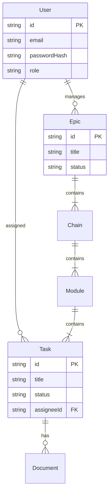

# Module 기본설계: Database Schema & ORM

## 문서 정보

| 항목 | 내용 |
|------|------|
| Module ID | MODULE-jjiban-01-03 |
| 관련 PRD | module-prd.md |
| 문서 버전 | 1.0 |
| 작성일 | 2025-12-06 |
| 상태 | Draft |

---

## 1. 아키텍처 개요

### 1.1 ERD (Entity Relationship Diagram)



---

## 2. 데이터 모델 (Prisma Schema)

### 2.1 User & Auth
```prisma
model User {
  id            String    @id @default(cuid())
  email         String    @unique
  passwordHash  String
  name          String?
  role          String    @default("VIEWER") // ADMIN, PM, DEV, VIEWER
  createdAt     DateTime  @default(now())
  
  assignedTasks Task[]    @relation("Assignee")
  epics         Epic[]
}
```

### 2.2 Project Structure
```prisma
model Epic {
  id          String   @id @default(cuid())
  title       String
  description String?
  status      String   @default("ACTIVE")
  chains      Chain[]
  ownerId     String?
  owner       User?    @relation(fields: [ownerId], references: [id])
}

model Chain {
  id      String   @id @default(cuid())
  epic    Epic     @relation(fields: [epicId], references: [id])
  epicId  String
  modules Module[]
}

model Module {
  id      String   @id @default(cuid())
  chain   Chain    @relation(fields: [chainId], references: [id])
  chainId String
  tasks   Task[]
}

model Task {
  id          String    @id @default(cuid())
  module      Module    @relation(fields: [moduleId], references: [id])
  moduleId    String
  title       String
  status      String    // TODO, DOING, DONE ...
  assignee    User?     @relation("Assignee", fields: [assigneeId], references: [id])
  assigneeId  String?
}
```

---

## 3. 구현 가이드

### 3.1 파일 구조

```
packages/server/
├── prisma/
│   ├── schema.prisma
│   └── seed.ts
└── src/
    ├── config/
    │   └── database.ts (Prisma Client Singleton)
    └── services/
        └── ...
```

### 3.2 주요 구현 포인트
- **Prisma Client Singleton**: Next.js나 Express 환경에서 핫 리로딩 시 커넥션 고갈을 막기 위해 싱글톤 패턴을 사용한다.
- **Better-SQLite3**: Native 바인딩을 사용하여 성능을 최적화한다.

---

## 4. 테스트 전략

### 4.1 스키마 테스트
- 단위 테스트에서 인메모리 SQLite DB를 사용하여 모델 간 관계 및 제약조건(Data Integrity)을 검증한다.

---

## 5. 변경 이력

| 버전 | 날짜 | 변경 내용 |
|------|------|-----------|
| 1.0 | 2025-12-06 | 초안 작성 |
