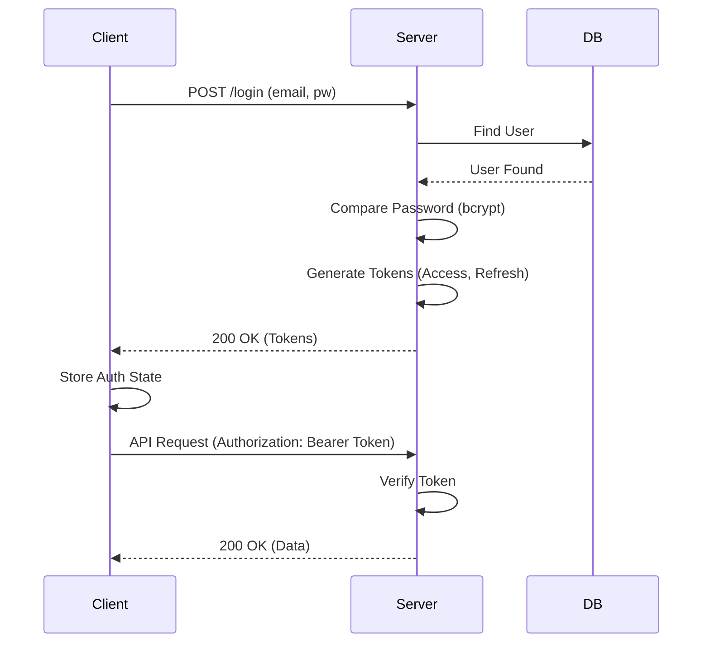

# Module 기본설계: User Management & Authentication

## 문서 정보

| 항목 | 내용 |
|------|------|
| Module ID | MODULE-jjiban-01-04 |
| 관련 PRD | module-prd.md |
| 문서 버전 | 1.0 |
| 작성일 | 2025-12-06 |
| 상태 | Draft |

---

## 1. 아키텍처 개요

### 1.1 인증 시퀀스



---

## 2. 데이터 모델

### 2.1 User Entity (Prisma)
- **id**: CUID
- **email**: Unique Index
- **passwordHash**: String (bcrypt result)
- **role**: Enum (ADMIN, PM, DEV, VIEWER)

---

## 3. UI/UX 설계

### 3.1 로그인 페이지
- 단순하고 깔끔한 중앙 카드 형태 레이아웃
- 배경은 브랜드 컬러 혹은 추상적 패턴
- "기억하기" 체크박스 제공 (로컬 스토리지 연동)

---

## 4. 구현 가이드

### 4.1 Frontend Security
- **AccessToken**: 메모리(Zustand Store)에 저장 권장.
- **RefreshToken**: HttpOnly Cookie에 저장 권장 (보안상).
- 그러나 로컬 DB 앱 특성상 편의를 위해 일단 `localStorage`에 저장할 수도 있음 (TRD 보안 정책 확인 필요).
  - *TRD*: `localStorage` 허용 여부 명시 안됨. 보안 강화 시 쿠키 사용.

### 4.2 Backend Middleware `auth.ts`
```typescript
const auth = (req, res, next) => {
  const token = req.headers.authorization?.split(' ')[1];
  if (!token) return res.status(401).send('Unauthorized');
  
  try {
    const user = verifyToken(token);
    req.user = user;
    next();
  } catch (err) {
    res.status(403).send('Invalid Token');
  }
};
```

---

## 5. 테스트 전략

### 5.1 시나리오 테스트
1. 잘못된 비밀번호로 로그인 시도 -> 401 에러
2. 정상 로그인 -> 토큰 발급 및 리다이렉트
3. 만료된 토큰으로 API 요청 -> 401 -> Refresh -> 재요청 성공

---

## 6. 변경 이력

| 버전 | 날짜 | 변경 내용 |
|------|------|-----------|
| 1.0 | 2025-12-06 | 초안 작성 |
