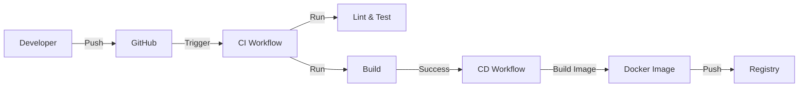

# Module 기본설계: DevOps & Infrastructure

## 문서 정보

| 항목 | 내용 |
|------|------|
| Module ID | MODULE-jjiban-01-07 |
| 관련 PRD | module-prd.md |
| 문서 버전 | 1.0 |
| 작성일 | 2025-12-06 |
| 상태 | Draft |

---

## 1. 아키텍처 개요

### 1.1 CI/CD Flow


---

## 2. 구현 가이드

### 2.1 Dockerfile 예시 (Backend)
```dockerfile
FROM node:20-alpine AS builder
WORKDIR /app
COPY . .
RUN pnpm install && pnpm build

FROM node:20-alpine AS runner
WORKDIR /app
COPY --from=builder /app/dist ./dist
CMD ["node", "dist/main.js"]
```

---

## 3. 변경 이력

| 버전 | 날짜 | 변경 내용 |
|------|------|-----------|
| 1.0 | 2025-12-06 | 초안 작성 |
