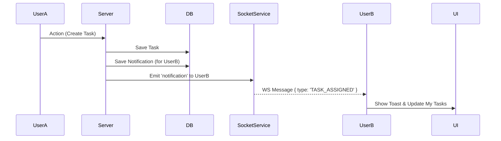

# Module 기본설계: Real-time Collaboration & Notification

## 문서 정보

| 항목 | 내용 |
|------|------|
| Module ID | MODULE-jjiban-01-08 |
| 관련 PRD | module-prd.md |
| 문서 버전 | 1.0 |
| 작성일 | 2025-12-06 |
| 상태 | Draft |

---

## 1. 아키텍처 개요

### 1.1 Event Flow



---

## 2. 데이터 모델

### 2.1 Notification Entity (Prisma)
```prisma
model Notification {
  id        String   @id @default(cuid())
  userId    String
  type      String   // TASK_ASSIGN, MENTION, SYSTEM
  message   String
  link      String?
  read      Boolean  @default(false)
  createdAt DateTime @default(now())
  
  user      User     @relation(fields: [userId], references: [id])
}
```

---

## 3. API 설계

### 3.1 Socket Events
- `C -> S`: `join_room`, `leave_room`
- `S -> C`: `notification`, `presence_update`

---

## 4. 변경 이력

| 버전 | 날짜 | 변경 내용 |
|------|------|-----------|
| 1.0 | 2025-12-06 | 초안 작성 |
